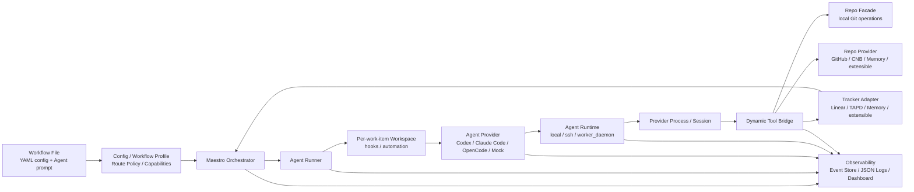

# Maestro

[](https://github.com/joosure/Maestro)
[](https://github.com/joosure/Maestro)
[](https://github.com/openai/symphony)

[English](./README.md) | [简体中文](./README.zh-CN.md) | [繁體中文](./README.zh-TW.md) | [日本語](./README.ja.md) | [한국어](./README.ko.md) | [Español](./README.es.md) | [Português (Brasil)](./README.pt-BR.md) | [Deutsch](./README.de.md) | [Français](./README.fr.md) | [Русский](./README.ru.md) | [Bahasa Indonesia](./README.id.md)

## Die Steuerungsebene für autonome Engineering Agents.

Maestro macht deinen Issue Tracker zur Ausführungsschicht für KI Agents: Es verteilt Arbeit, verwaltet Runtimes, koordiniert Provider, verfolgt Evidence und macht agentic engineering im Teammaßstab betreibbar.

Es ist kein weiterer Coding Agent.

Es ist die Orchestrierungsplattform, mit der Codex, Claude Code, OpenCode und künftige Agents aus echten Projektsystemen, echten Repositories, echten Workflows und echten operativen Grenzen heraus arbeiten können.

> **Symphony hat das Muster bewiesen. Maestro baut die Plattform.**

---

## Warum Maestro

OpenAI Symphony brachte eine starke Idee ein: **Verwalte die Arbeit, nicht die Agent Sessions**.

Statt Ingenieurinnen und Ingenieure einzelne Coding-Agent-Chats überwachen zu lassen, zeigte Symphony, dass Projektmanagementsysteme wie Linear zum Einstiegspunkt für autonome Coding-Arbeit werden können.

Maestro führt dieses Muster weiter.

Es verallgemeinert die ursprüngliche `Linear + Codex` Referenzimplementierung zu einer **tracker-driven, provider-neutral Orchestrierungsplattform** für moderne Engineering Workflows.

Praktisch hilft Maestro Teams beim Übergang von:

```text
human-managed agent chats
```

zu:

```text
tracker-driven agent operations
```

Dieser Unterschied ist wichtig. Demos können mit einem Agent, einem Issue und einem Repository funktionieren. Produktionsteams brauchen scheduling, isolation, credential control, quota awareness, evidence, logs, reviews, state transitions und failure recovery.

Maestro ist für diese zweite Welt gebaut.

---

## Was Maestro macht

Maestro koordiniert den vollständigen Lebenszyklus einer agentic engineering task:

```text
Ticket / Story / Issue
        ↓
Workflow Profile
        ↓
Agent Provider
        ↓
Runtime / Workspace / Tool Bridge
        ↓
Repo / Pull Request / Review / Evidence
        ↓
Tracker State Update / Audit Trail
```

Es verbindet Arbeitssysteme, Agent Provider, Codeplattformen, Runtime-Umgebungen und Observability zu einer Betriebsschicht.

| Schicht | Was Maestro bereitstellt |
| --- | --- |
| Tracker | Linear, TAPD, Memory und erweiterbare Adapter für Jira, YouTrack, Feishu Project, GitHub Issues und mehr |
| Agent Provider | Codex, Claude Code, OpenCode und erweiterbare Provider für künftige CLI- oder Remote Agents |
| Repo | Provider-neutrale Git-Operationen wie clone, branch, commit, diff und push |
| Repo Provider | GitHub, CNB, Memory und erweiterbare Unterstützung für GitLab, Gitea, Bitbucket und Gerrit |
| Workflow | Wiederverwendbare Profiles für coding delivery, requirement analysis, refinement, review routing und triage |
| Runtime | Local, SSH und Worker Daemon execution modes |
| Tool Bridge | Provider-neutrale dynamic tools, die Agents bereitgestellt werden |
| Governance | Accounts, credential store, lease, quota polling, redaction und human gates |
| Observability | Structured events, JSON logs, event store, dashboard drilldown und production evidence |

---

## Welches Problem Maestro löst

Coding Agents werden leistungsfähiger. Leistungsfähige Agents werden aber nicht automatisch zu verlässlichen Engineering-Systemen.

| Ohne Maestro | Mit Maestro |
| --- | --- |
| Agent-Arbeit passiert in isolierten Chat Sessions | Arbeit wird aus echten Trackern dispatcht und mit echten Issues verknüpft |
| Jeder Provider hat ein eigenes Session Model | Provider werden durch einen gemeinsamen Lifecycle Contract gekapselt |
| Agent Output ist schwer auditierbar | Diffs, PRs, tool calls, logs, state transitions und evidence werden erfasst |
| Teams sind an einen Tracker oder eine Codeplattform gebunden | Tracker und Repo Provider sind adapter-based |
| Workflows sind in Scripts hardcoded | Workflow Profile definiert policy, state, routing und deliverables |
| Credentials und Quotas sind ad hoc | Accounts, leases, quota polling und redaction werden Plattformanliegen |
| Skalierung verlangt manuelle Session-Überwachung | Worker Daemon ermöglicht capacity-aware execution und operational control |

Maestros These ist einfach:

> **Die Zukunft ist nicht ein perfekter Coding Agent. Die Zukunft ist eine Betriebsschicht, die viele Agents über echte Engineering Workflows hinweg schedule, observe und govern kann.**

---

## Designprinzipien

### 1. Tracker sind die Steuerungsebene

Teams arbeiten bereits in Projektmanagementsystemen. Maestro versteckt Arbeit nicht in einer privaten Queue. Es macht Linear, TAPD, Memory und künftige Tracker zur Dispatch-Oberfläche für autonome Arbeit.

### 2. Agents sind Ausführungseinheiten

Codex, Claude Code, OpenCode und künftige Agents werden als austauschbare Provider behandelt. Maestro standardisiert den Lifecycle, den die Orchestrierungsschicht braucht: session creation, turn execution, tool-call capture, evidence collection, quota awareness und cleanup.

### 3. Workflow Profiles kodieren Geschäftsabsicht

Coding, requirement analysis, refinement, review routing und triage sind unterschiedliche Workflows. Maestro macht Profiles zu first-class Objekten, damit Teams definieren können, wann dispatch, wait oder stop gilt, welche evidence nötig ist und wann ein Mensch übernehmen muss.

### 4. Evidence schlägt Behauptungen

"Done" reicht nicht. Maestro bevorzugt prüfbare artifacts: branch, commit, diff, PR, review note, CI result, tracker comment, tool call, event und log.

### 5. Adapter verhindern Plattform-Lock-in

Jedes externe System tritt durch einen Contract ein. Der Orchestrator darf nicht zu einem Haufen Branches werden, die an einen einzelnen Provider gebunden sind. Neue Integrationen sollten über adapters, contract tests, smoke tests und explicit capability discovery eintreten.

---

## Architektur



### Primäre Grenzen

| Grenze | Verantwortung |
| --- | --- |
| `Workflow File` | Liefert Runtime-Konfiguration per YAML front matter und den Agent prompt über den Markdown-Body |
| `Workflow Profile` | Definiert route policy, capabilities, completion contract, stop conditions und human gates |
| `Tracker Adapter` | Liest candidate work items, synchronisiert state, schreibt comments und stellt tracker typed tools bereit |
| `Orchestrator` | Übernimmt polling, reconciliation, scheduling, retry, runtime state tracking und terminal cleanup |
| `Agent Runner` | Erstellt den Workspace für ein work item, führt hooks aus, startet und steuert die Agent session |
| `Workspace` | Isoliert runtime directory, workspace automation, repository copy und local evidence je work item |
| `Agent Provider` | Startet, steuert, streamt, stoppt und räumt Codex / Claude Code / OpenCode / Mock sessions auf |
| `Agent Runtime` | Platziert den provider process in local, SSH oder Worker Daemon und löst sandbox / executor context auf |
| `Repo` | Provider-neutrale lokale Git-Operationen: clone, branch, commit, diff, push |
| `Repo Provider` | Codeplattform-Fähigkeiten für GitHub, CNB, Memory und Erweiterungen: PR / MR, reviews, checks, merge, comments, status updates |
| `Dynamic Tool Bridge` | Bündelt Tracker-, Repo- und Repo-Provider-Fähigkeiten zu session-scoped provider-neutral tools |
| `Observability` | Structured events, JSON logs, event store, redaction, dashboard, evidence, audit trail |

---

## Workflow Profiles

Maestro ist nicht auf "Code aus einem Issue schreiben" beschränkt. Es kann mehrere Engineering Workflows mit derselben Plattformschicht orchestrieren.

| Profile | Zweck | Typische Evidence |
| --- | --- | --- |
| `coding_pr_delivery` | Ein work item in Codeänderungen und einen PR umwandeln | branch, commit, diff, PR, CI result, review note |
| `requirement_analysis` | Eine Anforderung in strukturierte Analyse umwandeln | scope, risks, impact, acceptance criteria, task breakdown |
| `requirement_refinement` | Unklarheiten vor der Implementierung erkennen | clarification questions, blockers, assumptions, refined acceptance criteria |
| `review_routing` | Reviews an passende Personen oder Agents routen | reviewer suggestions, risk tags, checklist |
| `triage` | Work items klassifizieren und routen | priority, owner, type, risk, next state |

Hier wird Maestro mehr als ein Automatisierungsscript. Ein Profile ist die operative Definition dessen, was ein Agent tun soll, was er nicht tun darf, welche evidence er liefern muss und wann ein Mensch übernehmen soll.

---

## Beispielhafte Konfigurationsform

Die aktuelle Implementierung nutzt YAML front matter in einer Workflow-Markdown-Datei für Runtime-Konfiguration; der Markdown-Body ist der Agent prompt. Dieses Beispiel zeigt die aktuellen Feldpositionen der Kerndimensionen, ist aber keine vollständige ausführbare Konfiguration:

```yaml
workflow:
  profile:
    kind: coding_pr_delivery  # coding_pr_delivery | requirement_analysis | requirement_refinement | review_routing | triage
tracker:
  kind: linear                # linear | tapd | memory
repo:
  provider:
    kind: github              # github | cnb | memory
agent_provider:
  kind: codex                 # codex | claude_code | opencode | mock
agent_runtime:
  placement: local            # local | ssh | worker_daemon
```

Ein Production Deployment kann diese Dimensionen unabhängig kombinieren. Beispiele:

```text
TAPD + Claude Code + CNB + Worker Daemon + requirement_analysis
Linear + Codex + GitHub + Local Runtime + coding_pr_delivery
Memory + Mock Agent + Memory Repo Provider + Contract Tests
```

---

## Schnellstart

Repository klonen:

```bash
git clone https://github.com/joosure/Maestro.git
cd Maestro
```

Bereite zuerst die im Repository fixierte Erlang / Elixir Toolchain vor. `mise` wird empfohlen; die Versionen sind in `elixir/mise.toml` fixiert:

```bash
cd elixir
mise trust
mise install
cd ..
```

Dependencies installieren und Test Suite ausführen. Wenn die `mise` Toolchain in der aktuellen Shell aktiv ist, kannst du `make` direkt verwenden:

```bash
make -C elixir deps
make -C elixir test
```

Alternativ kannst du aus `elixir/` heraus `mise exec -- mix setup` und `mise exec -- mix test` ausführen.

### Workflow Template ausprobieren

Baue die CLI und starte den lokalen memory/mock Workflow aus `elixir/`:

```bash
make -C elixir build
cd elixir
./bin/symphony \
  --i-understand-that-this-will-be-running-without-the-usual-guardrails \
  --template memory/no_repo/mock \
  --port 4000
```

Das startet den Service mit dem Template `memory/no_repo/mock` und stellt das optionale Dashboard/API unter `http://localhost:4000` bereit. Es nutzt den Memory-Tracker, den Memory-Repo-Provider und den Mock-Agent-Provider, daher sind keine Linear-, GitHub-, Codex-, Claude-Code-, OpenCode- oder CNB-Credentials erforderlich.

Wenn du einen echten Tracker, ein Repository und eine Agent Runtime verbinden willst, konfiguriere zuerst die nötigen Credentials und wechsle dann das Template:

```bash
export LINEAR_API_KEY=...
export LINEAR_PROJECT_SLUG=...
export SOURCE_REPO_URL=https://github.com/owner/repo.git
export SOURCE_REPO_BASE_BRANCH=main
export SOURCE_REPO_PROVIDER_REPOSITORY=owner/repo

command -v codex
gh auth status

./bin/symphony \
  --i-understand-that-this-will-be-running-without-the-usual-guardrails \
  --template linear/github/codex \
  --port 4000
```

`SOURCE_REPO_BRANCH_WORK_PREFIX` und `SOURCE_REPO_PROVIDER_REQUIRED_PR_LABEL` sind optional. `SYMPHONY_WORKSPACE_ROOT` kann im lokalen Schnellstart weggelassen werden; bevor du einen echten Tracker, ein echtes Repository oder eine vollständige Flow-Validierung anschließt, setze es explizit auf eine isolierte Workspace-Root, damit Workspaces nicht in lokale Entwicklerpfade fallen und schwer zu bereinigen sind. Lies [workflow template aliases](./elixir/priv/workflow_templates/README.md) und [runtime configuration](./elixir/README.md), bevor du einen echten Tracker oder ein echtes Repository verbindest.

Vor dem Öffnen eines Pull Requests dieselben lokalen Gates ausführen, die CI nutzt:

```bash
make -C elixir all
make -C elixir secret-scan
```

`make -C elixir secret-scan` führt `gitleaks`, `trufflehog` und
`detect-secrets` über `scripts/secret-scan.sh` aus. CI führt dasselbe Gate bei pushes nach `main` und pull requests aus.

Gehe bei lokalen Experimenten zuerst den risikoärmsten Weg:

- Setze `tracker.kind: memory` und `repo.provider.kind: memory`, wenn du Orchestrierung ohne externe Credentials prüfen willst.
- Nutze fake oder simulated agent adapters nur in Tests oder Extension-Arbeit über die adapter registry; die integrierten Agent Provider sind `codex`, `claude_code` und `opencode`.
- Wechsle erst zu Linear/TAPD, GitHub/CNB oder destructive smoke tests, wenn der memory path stabil ist.

> Das öffentliche Branding verwendet **Maestro**. Frühe Versionen können noch module names, CLI entrypoints oder environment variables aus `symphony` enthalten. Behandle sie als compatibility names, während project branding und platform boundaries stabilisiert werden.

---

## Erweiterungsmodell

Maestro soll durch Contracts wachsen, nicht durch hardcoded branches.

### Tracker Adapter hinzufügen

Implementiere den tracker contract für:

- listing candidate work items;
- reading title, description, labels, state, owner und metadata;
- claiming oder locking work;
- writing comments and evidence;
- mapping states from each provider into Maestro's workflow model;
- passing contract tests and live smoke tests.

### Agent Provider hinzufügen

Implementiere den provider contract für:

- session creation;
- prompt and context injection;
- turn execution;
- streaming events;
- tool-call capture;
- evidence extraction;
- cancellation and cleanup;
- capability reporting wie sandbox, tools, approval, quota und context window.

### Repo Provider hinzufügen

Implementiere den repo-provider contract für:

- PR / MR creation;
- review comments;
- checks and statuses;
- merge gates;
- branch protection detection;
- evidence links;
- idempotent updates.

### Workflow Profile hinzufügen

Definiere:

- trigger states;
- dispatch policy;
- input context;
- agent instructions;
- allowed tools;
- required evidence;
- stop conditions;
- human approval gates;
- tracker transitions.

---

## Observability and Evidence

Maestro behandelt observability als Teil des Produkts, nicht als nachträgliche Ergänzung.

Jeder run sollte erklärbar sein durch:

- dispatch decision;
- workflow profile;
- selected provider;
- runtime and worker;
- session and turn history;
- tool calls;
- stdout / stderr / structured event stream;
- workspace and repository changes;
- PR or review artifacts;
- tracker comments and state changes;
- redacted logs;
- final evidence summary.

So wird Maestro nicht nur für Automatisierung nützlich, sondern auch für evaluation, debugging, governance und production rollout.

---

## Projektstatus

Maestro befindet sich in active platformization.

Es eignet sich für:

- Untersuchung von tracker-driven agent orchestration;
- Aufbau von adapter prototypes;
- Validierung von workflow profiles;
- Ausführung von memory-provider oder local test loops;
- Experimente mit real providers in kontrollierten Umgebungen.

Es sollte gehärtet werden vor:

- unrestricted production execution;
- destructive repository operations;
- high-privilege credentials;
- multi-tenant worker pools;
- unattended merge or deploy automation.

Die Leitregel lautet:

> **Mutig automatisieren. Sorgfältig gaten. Evidence bewahren.**

---

## Für wen Maestro gedacht ist

Maestro ist nützlich für:

- engineering teams, die Codex, Claude Code, OpenCode oder künftige coding agents evaluieren;
- platform teams, die interne AI engineering infrastructure aufbauen;
- DevTools teams, die agent operations workflows erstellen;
- product and engineering organizations, die Agents aus bestehenden Trackern arbeiten lassen wollen;
- researchers, die agent reliability, evidence und orchestration untersuchen;
- open-source maintainers, die strukturierte agent-driven contribution flows wollen.

---

## Attribution

Maestro begann als Fork von [OpenAI Symphony](https://github.com/openai/symphony). Die ursprüngliche Symphony reference implementation fokussiert Linear-driven Codex orchestration. Maestro erweitert diese Idee zu einer breiteren Plattformarchitektur über trackers, agent providers, repository providers, workflow profiles, runtimes, tools und evidence hinweg.

---

## Repository

- GitHub: <https://github.com/joosure/Maestro>
- Origin project: <https://github.com/openai/symphony>

---

## Lizenz

Maestro steht unter der GNU Affero General Public License version 3 (AGPL-3.0-only). Teile, die von OpenAI Symphony abgeleitet sind, behalten die Apache-2.0-Anforderungen an attribution und notice. Prüfe `LICENSE`, `NOTICE`, `LICENSES/Apache-2.0.txt`, `MODIFICATIONS.md`, `SOURCE.md` und `THIRD_PARTY_LICENSES.md`, bevor Maestro verwendet oder verteilt wird.
