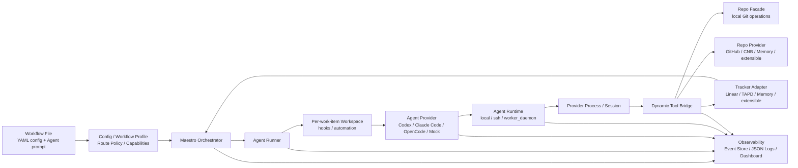

# Maestro

[](https://github.com/joosure/Maestro)
[](https://github.com/joosure/Maestro)
[](https://github.com/openai/symphony)

[English](./README.md) | [简体中文](./README.zh-CN.md) | [繁體中文](./README.zh-TW.md) | [日本語](./README.ja.md) | [한국어](./README.ko.md) | [Español](./README.es.md) | [Português (Brasil)](./README.pt-BR.md) | [Deutsch](./README.de.md) | [Français](./README.fr.md) | [Русский](./README.ru.md) | [Bahasa Indonesia](./README.id.md)

## El plano de control para agentes de ingeniería autónomos.

Maestro convierte tu issue tracker en una capa de ejecución para agentes de IA: despacha trabajo, gestiona runtimes, coordina providers, rastrea evidence y hace que la ingeniería con agentes sea operable a escala de equipo.

No es otro coding agent.

Es la plataforma de orquestación que permite que Codex, Claude Code, OpenCode y futuros agentes trabajen desde sistemas reales de proyecto, repositorios reales, workflows reales y restricciones operativas reales.

> **Symphony demostró el patrón. Maestro construye la plataforma.**

---

## Por qué Maestro

OpenAI Symphony introdujo una idea potente: **gestionar el trabajo, no las sesiones de agentes**.

En vez de pedir a los ingenieros que supervisen coding agents chat por chat, Symphony mostró que sistemas de gestión de proyectos como Linear pueden convertirse en el punto de entrada para trabajo de coding autónomo.

Maestro lleva ese patrón más lejos.

Generaliza la implementación de referencia original `Linear + Codex` en una **plataforma de orquestación tracker-driven y provider-neutral** para workflows modernos de ingeniería.

En la práctica, Maestro ayuda a los equipos a pasar de:

```text
human-managed agent chats
```

a:

```text
tracker-driven agent operations
```

Esa diferencia importa. Las demos pueden funcionar con un agente, un issue y un repositorio. Los equipos de producción necesitan scheduling, isolation, credential control, quota awareness, evidence, logs, reviews, state transitions y failure recovery.

Maestro está construido para ese segundo mundo.

---

## Qué hace Maestro

Maestro coordina todo el ciclo de vida de una tarea de ingeniería agentic:

```text
Ticket / Story / Issue
        ↓
Workflow Profile
        ↓
Agent Provider
        ↓
Runtime / Workspace / Tool Bridge
        ↓
Repo / Pull Request / Review / Evidence
        ↓
Tracker State Update / Audit Trail
```

Conecta sistemas de trabajo, agent providers, plataformas de código, entornos runtime y observability en una sola capa operativa.

| Capa | Qué aporta Maestro |
| --- | --- |
| Tracker | Linear, TAPD, Memory y adapters extensibles para Jira, YouTrack, Feishu Project, GitHub Issues y más |
| Agent Provider | Codex, Claude Code, OpenCode y providers extensibles para futuros agentes CLI o remotos |
| Repo | Operaciones Git provider-neutral como clone, branch, commit, diff y push |
| Repo Provider | GitHub, CNB, Memory y soporte extensible para GitLab, Gitea, Bitbucket y Gerrit |
| Workflow | Profiles reutilizables para coding delivery, requirement analysis, refinement, review routing y triage |
| Runtime | Modos de ejecución Local, SSH y Worker Daemon |
| Tool Bridge | Herramientas dinámicas provider-neutral expuestas a agentes |
| Governance | Accounts, credential store, lease, quota polling, redaction y human gates |
| Observability | Structured events, JSON logs, event store, dashboard drilldown y production evidence |

---

## El problema que resuelve Maestro

Los coding agents son cada vez más potentes. Pero un agente potente no se convierte automáticamente en un sistema de ingeniería confiable.

| Sin Maestro | Con Maestro |
| --- | --- |
| El trabajo del agente ocurre en sesiones de chat aisladas | El trabajo se despacha desde trackers reales y se vincula a issues reales |
| Cada provider tiene su propio modelo de sesión | Los providers se envuelven con un lifecycle contract compartido |
| Es difícil auditar la salida del agente | Se capturan diffs, PRs, tool calls, logs, state transitions y evidence |
| Los equipos quedan atados a un tracker o plataforma de código | Trackers y repo providers están basados en adapters |
| Los workflows quedan hardcodeados en scripts | Workflow Profile define policy, state, routing y deliverables |
| Credenciales y cuotas son ad hoc | Accounts, leases, quota polling y redaction pasan a ser concerns de plataforma |
| Escalar exige supervisar sesiones manualmente | Worker Daemon permite ejecución capacity-aware y control operativo |

La tesis de Maestro es simple:

> **El futuro no es un coding agent perfecto. El futuro es una capa operativa que puede schedule, observe y govern muchos agentes sobre workflows reales de ingeniería.**

---

## Principios de diseño

### 1. Los trackers son el plano de control

Los equipos ya trabajan en sistemas de gestión de proyectos. Maestro no esconde el trabajo en una cola privada. Permite que Linear, TAPD, Memory y futuros trackers sean la superficie de dispatch para trabajo autónomo.

### 2. Los agentes son unidades de ejecución

Codex, Claude Code, OpenCode y futuros agentes se tratan como providers reemplazables. Maestro estandariza el lifecycle que necesita la capa de orquestación: session creation, turn execution, tool-call capture, evidence collection, quota awareness y cleanup.

### 3. Workflow Profiles codifican intención de negocio

Coding, requirement analysis, refinement, review routing y triage son workflows distintos. Maestro hace que los profiles sean first-class para definir cuándo dispatch, wait o stop, qué evidence se requiere y cuándo debe intervenir una persona.

### 4. Evidence antes que claims

"Done" no basta. Maestro prioriza artifacts auditables: branch, commit, diff, PR, review note, CI result, tracker comment, tool call, event y log.

### 5. Los adapters evitan lock-in

Todo sistema externo entra mediante un contract. El orchestrator no debe convertirse en una pila de branches ligada a un solo provider. Las nuevas integraciones deben llegar mediante adapters, contract tests, smoke tests y capability discovery explícito.

---

## Arquitectura



### Límites principales

| Límite | Responsabilidad |
| --- | --- |
| `Workflow File` | Proporciona configuración runtime mediante YAML front matter y el Agent prompt mediante el cuerpo Markdown |
| `Workflow Profile` | Define route policy, capabilities, completion contract, stop conditions y human gates |
| `Tracker Adapter` | Lee candidate work items, sincroniza state, escribe comments y expone tracker typed tools |
| `Orchestrator` | Gestiona polling, reconciliation, scheduling, retry, runtime state tracking y terminal cleanup |
| `Agent Runner` | Crea el workspace para un work item, ejecuta hooks, inicia y conduce la Agent session |
| `Workspace` | Aísla el runtime directory de cada work item, workspace automation, repository copy y local evidence |
| `Agent Provider` | Start, drive, stream, stop y cleanup de sesiones Codex / Claude Code / OpenCode / Mock |
| `Agent Runtime` | Coloca el provider process en local, SSH o Worker Daemon y resuelve sandbox / executor context |
| `Repo` | Operaciones Git locales provider-neutral: clone, branch, commit, diff, push |
| `Repo Provider` | Capacidades de plataformas de código para GitHub, CNB, Memory y extensiones: PR / MR, reviews, checks, merge, comments, status updates |
| `Dynamic Tool Bridge` | Agrega capacidades de Tracker, Repo y Repo Provider en tools provider-neutral limitadas a la sesión |
| `Observability` | Structured events, JSON logs, event store, redaction, dashboard, evidence, audit trail |

---

## Workflow Profiles

Maestro no se limita a "escribir código desde un issue". Puede orquestar múltiples workflows de ingeniería con la misma capa de plataforma.

| Profile | Propósito | Evidence típica |
| --- | --- | --- |
| `coding_pr_delivery` | Convertir un work item en cambios de código y un PR | branch, commit, diff, PR, CI result, review note |
| `requirement_analysis` | Convertir un requirement en análisis estructurado | scope, risks, impact, acceptance criteria, task breakdown |
| `requirement_refinement` | Detectar ambigüedad antes de implementar | clarification questions, blockers, assumptions, refined acceptance criteria |
| `review_routing` | Enrutar reviews a las personas o agentes correctos | reviewer suggestions, risk tags, checklist |
| `triage` | Clasificar y enrutar work items | priority, owner, type, risk, next state |

Aquí es donde Maestro deja de ser un script de automatización. Un profile es la definición operativa de qué debe hacer el agente, qué no debe hacer, qué evidence debe producir y cuándo debe devolver el control a una persona.

---

## Ejemplo de forma de configuración

La implementación actual usa YAML front matter en un archivo Markdown de workflow para la configuración runtime, mientras que el cuerpo Markdown es el Agent prompt. Este ejemplo muestra las ubicaciones actuales de los campos centrales; no es una configuración completa ejecutable:

```yaml
workflow:
  profile:
    kind: coding_pr_delivery  # coding_pr_delivery | requirement_analysis | requirement_refinement | review_routing | triage
tracker:
  kind: linear                # linear | tapd | memory
repo:
  provider:
    kind: github              # github | cnb | memory
agent_provider:
  kind: codex                 # codex | claude_code | opencode | mock
agent_runtime:
  placement: local            # local | ssh | worker_daemon
```

Un deployment de producción puede combinar esas dimensiones de forma independiente. Por ejemplo:

```text
TAPD + Claude Code + CNB + Worker Daemon + requirement_analysis
Linear + Codex + GitHub + Local Runtime + coding_pr_delivery
Memory + Mock Agent + Memory Repo Provider + Contract Tests
```

---

## Inicio rápido

Clona el repositorio:

```bash
git clone https://github.com/joosure/Maestro.git
cd Maestro
```

Prepara primero la toolchain Erlang / Elixir fijada en el repositorio. Se recomienda `mise`; las versiones están fijadas en `elixir/mise.toml`:

```bash
cd elixir
mise trust
mise install
cd ..
```

Instala dependencias y ejecuta la suite de tests. Si el shell actual tiene activa la toolchain de `mise`, puedes usar `make` directamente:

```bash
make -C elixir deps
make -C elixir test
```

También puedes ejecutar `mise exec -- mix setup` y `mise exec -- mix test` desde `elixir/`.

### Probar un workflow template

Construye la CLI y arranca el workflow local memory/mock desde `elixir/`:

```bash
make -C elixir build
cd elixir
./bin/symphony \
  --i-understand-that-this-will-be-running-without-the-usual-guardrails \
  --template memory/no_repo/mock \
  --port 4000
```

Esto inicia el servicio con el template `memory/no_repo/mock` y expone el dashboard/API opcional en `http://localhost:4000`. Usa el tracker en memoria, el repo provider en memoria y el mock agent provider, por lo que no requiere credenciales de Linear, GitHub, Codex, Claude Code, OpenCode ni CNB.

Para conectar un tracker, repositorio y agent runtime reales, configura primero las credenciales requeridas y cambia el template:

```bash
export LINEAR_API_KEY=...
export LINEAR_PROJECT_SLUG=...
export SOURCE_REPO_URL=https://github.com/owner/repo.git
export SOURCE_REPO_BASE_BRANCH=main
export SOURCE_REPO_PROVIDER_REPOSITORY=owner/repo

command -v codex
gh auth status

./bin/symphony \
  --i-understand-that-this-will-be-running-without-the-usual-guardrails \
  --template linear/github/codex \
  --port 4000
```

`SOURCE_REPO_BRANCH_WORK_PREFIX` y `SOURCE_REPO_PROVIDER_REQUIRED_PR_LABEL` son opcionales. `SYMPHONY_WORKSPACE_ROOT` puede omitirse en el quick start local; antes de conectar un tracker real, un repositorio real o validar el flujo completo, configúralo explícitamente en una raíz de workspace aislada para evitar que los workspaces caigan en rutas locales del desarrollador y sean difíciles de limpiar. Revisa [workflow template aliases](./elixir/priv/workflow_templates/README.md) y [runtime configuration](./elixir/README.md) antes de conectar un tracker o repositorio real.

Antes de abrir un pull request, ejecuta los mismos gates locales que usa CI:

```bash
make -C elixir all
make -C elixir secret-scan
```

`make -C elixir secret-scan` ejecuta `gitleaks`, `trufflehog` y
`detect-secrets` mediante `scripts/secret-scan.sh`. CI ejecuta el mismo gate en pushes a `main` y pull requests.

Para experimentación local, avanza por la ruta de menor riesgo:

- Configura `tracker.kind: memory` y `repo.provider.kind: memory` cuando quieras validar la orquestación sin credenciales externas.
- Usa fake o simulated agent adapters solo en tests o trabajo de extensión mediante el adapter registry; los agent providers integrados son `codex`, `claude_code` y `opencode`.
- Pasa a Linear/TAPD, GitHub/CNB o destructive smoke tests solo cuando la ruta memory esté estable.

> El branding público usa **Maestro**. Las versiones tempranas pueden seguir incluyendo module names, CLI entrypoints o environment variables heredadas de `symphony`. Trátalas como nombres de compatibilidad mientras el branding del proyecto y los límites de plataforma se estabilizan.

---

## Modelo de extensión

Maestro está diseñado para crecer mediante contracts en lugar de branches hardcodeados.

### Añadir un Tracker Adapter

Implementa el tracker contract para:

- listar candidate work items;
- leer title, description, labels, state, owner y metadata;
- claim o lock de work;
- escribir comments y evidence;
- mapear estados de cada provider al workflow model de Maestro;
- pasar contract tests y live smoke tests.

### Añadir un Agent Provider

Implementa el provider contract para:

- session creation;
- prompt and context injection;
- turn execution;
- streaming events;
- tool-call capture;
- evidence extraction;
- cancellation and cleanup;
- capability reporting como sandbox, tools, approval, quota y context window.

### Añadir un Repo Provider

Implementa el repo-provider contract para:

- PR / MR creation;
- review comments;
- checks and statuses;
- merge gates;
- branch protection detection;
- evidence links;
- idempotent updates.

### Añadir un Workflow Profile

Define:

- trigger states;
- dispatch policy;
- input context;
- agent instructions;
- allowed tools;
- required evidence;
- stop conditions;
- human approval gates;
- tracker transitions.

---

## Observability and Evidence

Maestro trata observability como parte del producto, no como un añadido posterior.

Cada run debería poder explicarse con:

- dispatch decision;
- workflow profile;
- selected provider;
- runtime and worker;
- session and turn history;
- tool calls;
- stdout / stderr / structured event stream;
- workspace and repository changes;
- PR or review artifacts;
- tracker comments and state changes;
- redacted logs;
- final evidence summary.

Esto hace que Maestro sea útil no solo para automatización, sino también para evaluación, debugging, governance y production rollout.

---

## Estado del proyecto

Maestro está en active platformization.

Es adecuado para:

- estudiar tracker-driven agent orchestration;
- construir adapter prototypes;
- validar workflow profiles;
- ejecutar memory-provider o local test loops;
- experimentar con providers reales en entornos controlados.

Debe endurecerse antes de:

- unrestricted production execution;
- destructive repository operations;
- high-privilege credentials;
- multi-tenant worker pools;
- unattended merge or deploy automation.

La regla guía es:

> **Automatiza con ambición. Aplica gates con cuidado. Preserva evidence.**

---

## Para quién es Maestro

Maestro es útil para:

- engineering teams que evalúan Codex, Claude Code, OpenCode o futuros coding agents;
- platform teams que construyen infraestructura interna de AI engineering;
- DevTools teams que crean agent operations workflows;
- organizaciones de producto e ingeniería que quieren que agentes trabajen desde trackers existentes;
- researchers que estudian agent reliability, evidence y orchestration;
- open-source maintainers que quieren contribution flows estructurados y agent-driven.

---

## Attribution

Maestro comenzó como un fork de [OpenAI Symphony](https://github.com/openai/symphony). La implementación de referencia original de Symphony se centra en orchestration de Codex dirigida por Linear. Maestro amplía esa idea hacia una arquitectura de plataforma más amplia que cubre trackers, agent providers, repository providers, workflow profiles, runtimes, tools y evidence.

---

## Repositorio

- GitHub: <https://github.com/joosure/Maestro>
- Origin project: <https://github.com/openai/symphony>

---

## Licencia

Maestro se licencia bajo la GNU Affero General Public License version 3 (AGPL-3.0-only). Las partes derivadas de OpenAI Symphony conservan los requisitos de attribution y notice de Apache-2.0. Revisa `LICENSE`, `NOTICE`, `LICENSES/Apache-2.0.txt`, `MODIFICATIONS.md`, `SOURCE.md` y `THIRD_PARTY_LICENSES.md` antes de usar o distribuir Maestro.
