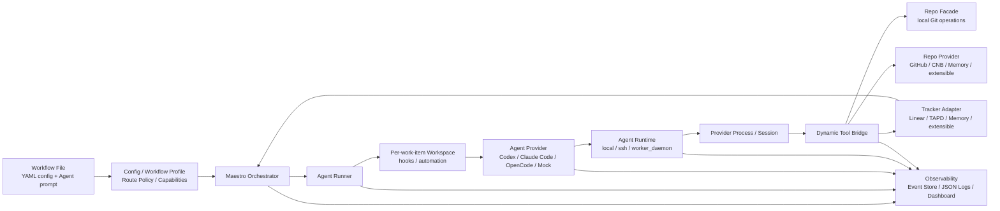

# Maestro

[](https://github.com/joosure/Maestro)
[](https://github.com/joosure/Maestro)
[](https://github.com/openai/symphony)

[English](./README.md) | [简体中文](./README.zh-CN.md) | [繁體中文](./README.zh-TW.md) | [日本語](./README.ja.md) | [한국어](./README.ko.md) | [Español](./README.es.md) | [Português (Brasil)](./README.pt-BR.md) | [Deutsch](./README.de.md) | [Français](./README.fr.md) | [Русский](./README.ru.md) | [Bahasa Indonesia](./README.id.md)

## Le plan de contrôle pour les agents d'ingénierie autonomes.

Maestro transforme votre issue tracker en couche d'exécution pour agents IA : il distribue le travail, gère les runtimes, coordonne les providers, suit les evidence et rend l'agentic engineering opérable à l'échelle d'une équipe.

Ce n'est pas un autre coding agent.

C'est la plateforme d'orchestration qui permet à Codex, Claude Code, OpenCode et aux futurs agents de travailler depuis de vrais systèmes projet, de vrais dépôts, de vrais workflows et de vraies contraintes opérationnelles.

> **Symphony a prouvé le modèle. Maestro construit la plateforme.**

---

## Pourquoi Maestro

OpenAI Symphony a introduit une idée forte : **gérer le travail, pas les sessions d'agents**.

Au lieu de demander aux ingénieurs de superviser des coding agents chat par chat, Symphony a montré que les systèmes de gestion de projet comme Linear peuvent devenir le point d'entrée du travail de coding autonome.

Maestro pousse ce modèle plus loin.

Il généralise l'implémentation de référence originale `Linear + Codex` en une **plateforme d'orchestration tracker-driven et provider-neutral** pour les workflows d'ingénierie modernes.

Concrètement, Maestro aide les équipes à passer de :

```text
human-managed agent chats
```

à :

```text
tracker-driven agent operations
```

Cette différence compte. Les démos peuvent réussir avec un agent, une issue et un dépôt. Les équipes de production ont besoin de scheduling, isolation, credential control, quota awareness, evidence, logs, reviews, state transitions et failure recovery.

Maestro est conçu pour ce second monde.

---

## Ce que fait Maestro

Maestro coordonne tout le cycle de vie d'une agentic engineering task :

```text
Ticket / Story / Issue
        ↓
Workflow Profile
        ↓
Agent Provider
        ↓
Runtime / Workspace / Tool Bridge
        ↓
Repo / Pull Request / Review / Evidence
        ↓
Tracker State Update / Audit Trail
```

Il connecte systèmes de travail, agent providers, plateformes de code, environnements runtime et observability en une seule couche opérationnelle.

| Couche | Ce que Maestro fournit |
| --- | --- |
| Tracker | Linear, TAPD, Memory et des adapters extensibles pour Jira, YouTrack, Feishu Project, GitHub Issues et plus |
| Agent Provider | Codex, Claude Code, OpenCode et des providers extensibles pour futurs agents CLI ou distants |
| Repo | Opérations Git provider-neutral comme clone, branch, commit, diff et push |
| Repo Provider | GitHub, CNB, Memory et support extensible pour GitLab, Gitea, Bitbucket et Gerrit |
| Workflow | Profiles réutilisables pour coding delivery, requirement analysis, refinement, review routing et triage |
| Runtime | Modes d'exécution Local, SSH et Worker Daemon |
| Tool Bridge | Dynamic tools provider-neutral exposés aux agents |
| Governance | Accounts, credential store, lease, quota polling, redaction et human gates |
| Observability | Structured events, JSON logs, event store, dashboard drilldown et production evidence |

---

## Le problème que résout Maestro

Les coding agents deviennent puissants. Mais des agents puissants ne deviennent pas automatiquement des systèmes d'ingénierie fiables.

| Sans Maestro | Avec Maestro |
| --- | --- |
| Le travail agent se passe dans des sessions de chat isolées | Le travail est dispatché depuis de vrais trackers et lié à de vraies issues |
| Chaque provider a son propre session model | Les providers sont enveloppés par un lifecycle contract partagé |
| La sortie agent est difficile à auditer | Diffs, PRs, tool calls, logs, state transitions et evidence sont capturés |
| Les équipes sont verrouillées sur un tracker ou une plateforme de code | Trackers et repo providers sont adapter-based |
| Les workflows sont hardcodés dans des scripts | Workflow Profile définit policy, state, routing et deliverables |
| Credentials et quotas sont ad hoc | Accounts, leases, quota polling et redaction deviennent des sujets de plateforme |
| Passer à l'échelle exige de superviser manuellement les sessions | Worker Daemon permet capacity-aware execution et operational control |

La thèse de Maestro est simple :

> **L'avenir n'est pas un coding agent parfait. L'avenir est une couche opérationnelle capable de schedule, observe et govern plusieurs agents à travers de vrais workflows d'ingénierie.**

---

## Principes de conception

### 1. Les trackers sont le plan de contrôle

Les équipes travaillent déjà dans des systèmes de gestion de projet. Maestro ne cache pas le travail dans une file privée. Il permet à Linear, TAPD, Memory et aux futurs trackers de devenir la surface de dispatch du travail autonome.

### 2. Les agents sont des unités d'exécution

Codex, Claude Code, OpenCode et les futurs agents sont traités comme des providers remplaçables. Maestro standardise le lifecycle dont la couche d'orchestration a besoin : session creation, turn execution, tool-call capture, evidence collection, quota awareness et cleanup.

### 3. Les Workflow Profiles codent l'intention métier

Coding, requirement analysis, refinement, review routing et triage sont des workflows différents. Maestro rend les profiles first-class afin que les équipes définissent quand dispatch, wait ou stop, quelles evidence sont requises et quand un humain doit reprendre la main.

### 4. Evidence avant les déclarations

"Done" ne suffit pas. Maestro privilégie des artifacts auditables : branch, commit, diff, PR, review note, CI result, tracker comment, tool call, event et log.

### 5. Les adapters évitent le lock-in

Tout système externe entre par un contract. L'orchestrator ne doit pas devenir une pile de branches liées à un seul provider. Les nouvelles intégrations doivent arriver via adapters, contract tests, smoke tests et explicit capability discovery.

---

## Architecture



### Frontières principales

| Frontière | Responsabilité |
| --- | --- |
| `Workflow File` | Fournit la configuration runtime via YAML front matter et le Agent prompt via le corps Markdown |
| `Workflow Profile` | Définit route policy, capabilities, completion contract, stop conditions et human gates |
| `Tracker Adapter` | Lit les candidate work items, synchronise state, écrit comments et expose des tracker typed tools |
| `Orchestrator` | Gère polling, reconciliation, scheduling, retry, runtime state tracking et terminal cleanup |
| `Agent Runner` | Crée le workspace pour un work item, exécute les hooks, démarre et pilote la Agent session |
| `Workspace` | Isole le runtime directory de chaque work item, workspace automation, repository copy et local evidence |
| `Agent Provider` | Start, drive, stream, stop et cleanup des sessions Codex / Claude Code / OpenCode / Mock |
| `Agent Runtime` | Place le provider process en local, SSH ou Worker Daemon et résout le sandbox / executor context |
| `Repo` | Opérations Git locales provider-neutral : clone, branch, commit, diff, push |
| `Repo Provider` | Capacités de plateformes de code pour GitHub, CNB, Memory et extensions : PR / MR, reviews, checks, merge, comments, status updates |
| `Dynamic Tool Bridge` | Agrège les capacités Tracker, Repo et Repo Provider en tools provider-neutral limités à la session |
| `Observability` | Structured events, JSON logs, event store, redaction, dashboard, evidence, audit trail |

---

## Workflow Profiles

Maestro ne se limite pas à "écrire du code depuis une issue". Il peut orchestrer plusieurs workflows d'ingénierie avec la même couche de plateforme.

| Profile | Objectif | Evidence typique |
| --- | --- | --- |
| `coding_pr_delivery` | Convertir un work item en changements de code et PR | branch, commit, diff, PR, CI result, review note |
| `requirement_analysis` | Transformer une requirement en analyse structurée | scope, risks, impact, acceptance criteria, task breakdown |
| `requirement_refinement` | Identifier l'ambiguïté avant l'implémentation | clarification questions, blockers, assumptions, refined acceptance criteria |
| `review_routing` | Router les reviews vers les bonnes personnes ou agents | reviewer suggestions, risk tags, checklist |
| `triage` | Classer et router les work items | priority, owner, type, risk, next state |

C'est là que Maestro devient plus qu'un script d'automatisation. Un profile est la définition opérationnelle de ce que l'agent doit faire, ne doit pas faire, quelles evidence il doit produire et quand il doit rendre la main à un humain.

---

## Exemple de forme de configuration

L'implémentation actuelle utilise le YAML front matter d'un fichier Markdown de workflow pour la configuration runtime, tandis que le corps Markdown sert de Agent prompt. Cet exemple montre les emplacements actuels des champs centraux ; ce n'est pas une configuration complète exécutable :

```yaml
workflow:
  profile:
    kind: coding_pr_delivery  # coding_pr_delivery | requirement_analysis | requirement_refinement | review_routing | triage
tracker:
  kind: linear                # linear | tapd | memory
repo:
  provider:
    kind: github              # github | cnb | memory
agent_provider:
  kind: codex                 # codex | claude_code | opencode | mock
agent_runtime:
  placement: local            # local | ssh | worker_daemon
```

Un deployment de production peut varier ces dimensions indépendamment. Par exemple :

```text
TAPD + Claude Code + CNB + Worker Daemon + requirement_analysis
Linear + Codex + GitHub + Local Runtime + coding_pr_delivery
Memory + Mock Agent + Memory Repo Provider + Contract Tests
```

---

## Démarrage rapide

Clonez le dépôt :

```bash
git clone https://github.com/joosure/Maestro.git
cd Maestro
```

Préparez d'abord la toolchain Erlang / Elixir fixée par le dépôt. `mise` est recommandé ; les versions sont fixées dans `elixir/mise.toml` :

```bash
cd elixir
mise trust
mise install
cd ..
```

Installez les dépendances et exécutez la suite de tests. Si le shell courant a la toolchain `mise` active, vous pouvez utiliser `make` directement :

```bash
make -C elixir deps
make -C elixir test
```

Vous pouvez aussi exécuter `mise exec -- mix setup` et `mise exec -- mix test` depuis `elixir/`.

### Essayer un workflow template

Construisez la CLI et démarrez le workflow local memory/mock depuis `elixir/` :

```bash
make -C elixir build
cd elixir
./bin/symphony \
  --i-understand-that-this-will-be-running-without-the-usual-guardrails \
  --template memory/no_repo/mock \
  --port 4000
```

Cette commande démarre le service avec le template `memory/no_repo/mock` et expose le dashboard/API optionnel sur `http://localhost:4000`. Elle utilise le tracker mémoire, le repo provider mémoire et le mock agent provider, donc aucune credential Linear, GitHub, Codex, Claude Code, OpenCode ou CNB n'est requise.

Pour connecter un vrai tracker, dépôt et agent runtime, configurez d'abord les credentials requis puis changez de template :

```bash
export LINEAR_API_KEY=...
export LINEAR_PROJECT_SLUG=...
export SOURCE_REPO_URL=https://github.com/owner/repo.git
export SOURCE_REPO_BASE_BRANCH=main
export SOURCE_REPO_PROVIDER_REPOSITORY=owner/repo

command -v codex
gh auth status

./bin/symphony \
  --i-understand-that-this-will-be-running-without-the-usual-guardrails \
  --template linear/github/codex \
  --port 4000
```

`SOURCE_REPO_BRANCH_WORK_PREFIX` et `SOURCE_REPO_PROVIDER_REQUIRED_PR_LABEL` sont optionnels. `SYMPHONY_WORKSPACE_ROOT` peut être omis pour le démarrage rapide local ; avant de connecter un vrai tracker, un vrai dépôt ou de valider le flux complet, définissez-le explicitement vers une racine de workspace isolée afin d'éviter que les workspaces se retrouvent dans des chemins locaux de développement difficiles à nettoyer. Consultez [workflow template aliases](./elixir/priv/workflow_templates/README.md) et [runtime configuration](./elixir/README.md) avant de connecter un vrai tracker ou dépôt.

Avant d'ouvrir une pull request, exécutez les mêmes gates locaux que CI :

```bash
make -C elixir all
make -C elixir secret-scan
```

`make -C elixir secret-scan` lance `gitleaks`, `trufflehog` et
`detect-secrets` via `scripts/secret-scan.sh`. CI lance le même gate sur les pushes vers `main` et les pull requests.

Pour l'expérimentation locale, avancez par le chemin le moins risqué :

- Configurez `tracker.kind: memory` et `repo.provider.kind: memory` pour valider l'orchestration sans identifiants externes.
- Utilisez des fake ou simulated agent adapters uniquement dans les tests ou le travail d'extension via l'adapter registry ; les agent providers intégrés sont `codex`, `claude_code` et `opencode`.
- Passez à Linear/TAPD, GitHub/CNB ou aux destructive smoke tests seulement lorsque le chemin memory est stable.

> Le branding public utilise **Maestro**. Les versions initiales peuvent encore contenir des module names, CLI entrypoints ou environment variables hérités de `symphony`. Traitez-les comme des compatibility names pendant que le branding du projet et les platform boundaries se stabilisent.

---

## Modèle d'extension

Maestro est conçu pour grandir par contracts plutôt que par branches hardcodées.

### Ajouter un Tracker Adapter

Implémentez le tracker contract pour :

- listing candidate work items ;
- reading title, description, labels, state, owner et metadata ;
- claiming or locking work ;
- writing comments and evidence ;
- mapper les états de chaque provider dans le workflow model de Maestro ;
- passing contract tests and live smoke tests.

### Ajouter un Agent Provider

Implémentez le provider contract pour :

- session creation ;
- prompt and context injection ;
- turn execution ;
- streaming events ;
- tool-call capture ;
- evidence extraction ;
- cancellation and cleanup ;
- capability reporting comme sandbox, tools, approval, quota et context window.

### Ajouter un Repo Provider

Implémentez le repo-provider contract pour :

- PR / MR creation ;
- review comments ;
- checks and statuses ;
- merge gates ;
- branch protection detection ;
- evidence links ;
- idempotent updates.

### Ajouter un Workflow Profile

Définissez :

- trigger states ;
- dispatch policy ;
- input context ;
- agent instructions ;
- allowed tools ;
- required evidence ;
- stop conditions ;
- human approval gates ;
- tracker transitions.

---

## Observability and Evidence

Maestro traite observability comme une partie du produit, pas comme une réflexion après coup.

Chaque run devrait être explicable par :

- dispatch decision ;
- workflow profile ;
- selected provider ;
- runtime and worker ;
- session and turn history ;
- tool calls ;
- stdout / stderr / structured event stream ;
- workspace and repository changes ;
- PR or review artifacts ;
- tracker comments and state changes ;
- redacted logs ;
- final evidence summary.

Cela rend Maestro utile non seulement pour l'automatisation, mais aussi pour l'évaluation, debugging, governance et production rollout.

---

## État du projet

Maestro est en active platformization.

Il convient pour :

- étudier tracker-driven agent orchestration ;
- construire des adapter prototypes ;
- valider des workflow profiles ;
- exécuter des boucles memory-provider ou local test ;
- expérimenter avec de vrais providers dans des environnements contrôlés.

Il doit être renforcé avant :

- unrestricted production execution ;
- destructive repository operations ;
- high-privilege credentials ;
- multi-tenant worker pools ;
- unattended merge or deploy automation.

La règle directrice :

> **Automatiser avec ambition. Poser des gates avec prudence. Préserver evidence.**

---

## À qui s'adresse Maestro

Maestro est utile pour :

- les engineering teams qui évaluent Codex, Claude Code, OpenCode ou de futurs coding agents ;
- les platform teams qui construisent une AI engineering infrastructure interne ;
- les DevTools teams qui créent des agent operations workflows ;
- les organisations produit et ingénierie qui veulent que les agents travaillent depuis les trackers existants ;
- les researchers qui étudient agent reliability, evidence et orchestration ;
- les open-source maintainers qui veulent des contribution flows structurés et agent-driven.

---

## Attribution

Maestro a commencé comme un fork de [OpenAI Symphony](https://github.com/openai/symphony). L'implémentation de référence originale de Symphony se concentre sur Linear-driven Codex orchestration. Maestro étend cette idée vers une architecture de plateforme plus large couvrant trackers, agent providers, repository providers, workflow profiles, runtimes, tools et evidence.

---

## Dépôt

- GitHub: <https://github.com/joosure/Maestro>
- Origin project: <https://github.com/openai/symphony>

---

## Licence

Maestro est sous licence GNU Affero General Public License version 3 (AGPL-3.0-only). Les parties dérivées d'OpenAI Symphony conservent les exigences d'attribution et de notice d'Apache-2.0. Consultez `LICENSE`, `NOTICE`, `LICENSES/Apache-2.0.txt`, `MODIFICATIONS.md`, `SOURCE.md` et `THIRD_PARTY_LICENSES.md` avant d'utiliser ou de distribuer Maestro.
