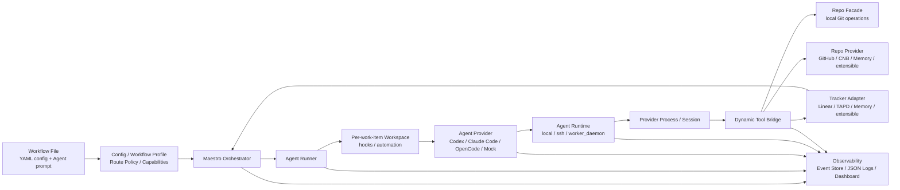

# Maestro

[](https://github.com/joosure/Maestro)
[](https://github.com/joosure/Maestro)
[](https://github.com/openai/symphony)

[English](./README.md) | [简体中文](./README.zh-CN.md) | [繁體中文](./README.zh-TW.md) | [日本語](./README.ja.md) | [한국어](./README.ko.md) | [Español](./README.es.md) | [Português (Brasil)](./README.pt-BR.md) | [Deutsch](./README.de.md) | [Français](./README.fr.md) | [Русский](./README.ru.md) | [Bahasa Indonesia](./README.id.md)

## Control plane untuk autonomous engineering agents.

Maestro mengubah issue tracker menjadi layer eksekusi untuk AI agents: mendispatch pekerjaan, mengelola runtimes, mengoordinasikan providers, melacak evidence, dan membuat agentic engineering dapat dioperasikan pada skala tim.

Maestro bukan coding agent lain.

Maestro adalah orchestration platform yang memungkinkan Codex, Claude Code, OpenCode, dan agent masa depan bekerja dari project systems nyata, repositories nyata, workflows nyata, dan batasan operasional nyata.

> **Symphony membuktikan polanya. Maestro membangun platformnya.**

---

## Mengapa Maestro

OpenAI Symphony memperkenalkan gagasan kuat: **kelola pekerjaannya, bukan sesi agent satu per satu**.

Alih-alih meminta engineer mengawasi coding agents chat demi chat, Symphony menunjukkan bahwa project-management systems seperti Linear dapat menjadi entry point untuk autonomous coding work.

Maestro membawa pola itu lebih jauh.

Maestro menggeneralisasi reference implementation `Linear + Codex` menjadi **tracker-driven, provider-neutral orchestration platform** untuk engineering workflows modern.

Secara praktis, Maestro membantu tim berpindah dari:

```text
human-managed agent chats
```

menjadi:

```text
tracker-driven agent operations
```

Perbedaan ini penting. Demo dapat berhasil dengan satu agent, satu issue, dan satu repository. Tim produksi membutuhkan scheduling, isolation, credential control, quota awareness, evidence, logs, reviews, state transitions, dan failure recovery.

Maestro dibangun untuk dunia kedua itu.

---

## Apa yang dilakukan Maestro

Maestro mengoordinasikan seluruh lifecycle dari agentic engineering task:

```text
Ticket / Story / Issue
        ↓
Workflow Profile
        ↓
Agent Provider
        ↓
Runtime / Workspace / Tool Bridge
        ↓
Repo / Pull Request / Review / Evidence
        ↓
Tracker State Update / Audit Trail
```

Maestro menghubungkan work systems, agent providers, code platforms, runtime environments, dan observability menjadi satu operating layer.

| Layer | Yang disediakan Maestro |
| --- | --- |
| Tracker | Linear, TAPD, Memory, dan adapters yang dapat diperluas untuk Jira, YouTrack, Feishu Project, GitHub Issues, dan lainnya |
| Agent Provider | Codex, Claude Code, OpenCode, dan providers yang dapat diperluas untuk CLI atau remote agents masa depan |
| Repo | Operasi Git provider-neutral seperti clone, branch, commit, diff, dan push |
| Repo Provider | GitHub, CNB, Memory, dan dukungan extensible untuk GitLab, Gitea, Bitbucket, dan Gerrit |
| Workflow | Profiles yang dapat digunakan ulang untuk coding delivery, requirement analysis, refinement, review routing, dan triage |
| Runtime | Mode eksekusi Local, SSH, dan Worker Daemon |
| Tool Bridge | Dynamic tools provider-neutral yang diekspos ke agents |
| Governance | Accounts, credential store, lease, quota polling, redaction, dan human gates |
| Observability | Structured events, JSON logs, event store, dashboard drilldown, dan production evidence |

---

## Masalah yang diselesaikan Maestro

Coding agents semakin kuat. Namun agent yang kuat tidak otomatis menjadi engineering system yang andal.

| Tanpa Maestro | Dengan Maestro |
| --- | --- |
| Agent work terjadi di chat sessions yang terisolasi | Work didispatch dari trackers nyata dan dikaitkan dengan issues nyata |
| Setiap provider memiliki session model sendiri | Providers dibungkus oleh shared lifecycle contract |
| Agent output sulit diaudit | Diffs, PRs, tool calls, logs, state transitions, dan evidence ditangkap |
| Tim terkunci pada satu tracker atau code platform | Trackers dan repo providers berbasis adapter |
| Workflows hardcoded dalam scripts | Workflow Profile mendefinisikan policy, state, routing, dan deliverables |
| Credentials dan quotas bersifat ad hoc | Accounts, leases, quota polling, dan redaction menjadi platform concerns |
| Skalabilitas membutuhkan pengawasan manual atas sessions | Worker Daemon memungkinkan capacity-aware execution dan operational control |

Tesis Maestro sederhana:

> **Masa depan bukan satu coding agent sempurna. Masa depan adalah operating layer yang dapat schedule, observe, dan govern banyak agents di seluruh engineering workflows nyata.**

---

## Prinsip desain

### 1. Trackers adalah control plane

Tim sudah bekerja di atas project-management systems. Maestro tidak menyembunyikan work dalam private queue. Maestro membuat Linear, TAPD, Memory, dan trackers masa depan menjadi dispatch surface untuk autonomous work.

### 2. Agents adalah unit eksekusi

Codex, Claude Code, OpenCode, dan agents masa depan diperlakukan sebagai providers yang dapat diganti. Maestro menstandarkan lifecycle yang dibutuhkan orchestration layer: session creation, turn execution, tool-call capture, evidence collection, quota awareness, dan cleanup.

### 3. Workflow Profiles menyandikan intensi bisnis

Coding, requirement analysis, refinement, review routing, dan triage adalah workflows berbeda. Maestro menjadikan profiles first-class agar tim dapat menentukan kapan dispatch, wait, stop, evidence apa yang wajib ada, dan kapan manusia harus mengambil alih.

### 4. Evidence mengalahkan klaim

"Done" saja tidak cukup. Maestro memprioritaskan artifacts yang dapat diperiksa: branch, commit, diff, PR, review note, CI result, tracker comment, tool call, event, dan log.

### 5. Adapters mencegah platform lock-in

Setiap external system masuk melalui contract. Orchestrator tidak boleh menjadi tumpukan branches yang terikat pada satu provider. Integrasi baru harus masuk melalui adapters, contract tests, smoke tests, dan explicit capability discovery.

---

## Arsitektur



### Batas utama

| Boundary | Responsibility |
| --- | --- |
| `Workflow File` | Menyediakan konfigurasi runtime melalui YAML front matter dan Agent prompt melalui body Markdown |
| `Workflow Profile` | Mendefinisikan route policy, capabilities, completion contract, stop conditions, dan human gates |
| `Tracker Adapter` | Membaca candidate work items, menyinkronkan state, menulis comments, dan mengekspos tracker typed tools |
| `Orchestrator` | Menangani polling, reconciliation, scheduling, retry, runtime state tracking, dan terminal cleanup |
| `Agent Runner` | Membuat workspace untuk satu work item, menjalankan hooks, memulai, dan mengendalikan Agent session |
| `Workspace` | Mengisolasi runtime directory, workspace automation, repository copy, dan local evidence untuk tiap work item |
| `Agent Provider` | Start, drive, stream, stop, dan cleanup sesi Codex / Claude Code / OpenCode / Mock |
| `Agent Runtime` | Menempatkan provider process pada local, SSH, atau Worker Daemon dan menyelesaikan sandbox / executor context |
| `Repo` | Operasi Git lokal provider-neutral: clone, branch, commit, diff, push |
| `Repo Provider` | Kapabilitas code platform untuk GitHub, CNB, Memory, dan extension: PR / MR, reviews, checks, merge, comments, status updates |
| `Dynamic Tool Bridge` | Menggabungkan kapabilitas Tracker, Repo, dan Repo Provider menjadi tools provider-neutral untuk satu session |
| `Observability` | Structured events, JSON logs, event store, redaction, dashboard, evidence, audit trail |

---

## Workflow Profiles

Maestro tidak terbatas pada "menulis kode dari issue". Maestro dapat mengorkestrasi banyak engineering workflows dengan platform layer yang sama.

| Profile | Tujuan | Evidence umum |
| --- | --- | --- |
| `coding_pr_delivery` | Mengubah work item menjadi code changes dan PR | branch, commit, diff, PR, CI result, review note |
| `requirement_analysis` | Mengubah requirement menjadi structured analysis | scope, risks, impact, acceptance criteria, task breakdown |
| `requirement_refinement` | Mengidentifikasi ambiguity sebelum implementation | clarification questions, blockers, assumptions, refined acceptance criteria |
| `review_routing` | Mengarahkan reviews ke orang atau agents yang tepat | reviewer suggestions, risk tags, checklist |
| `triage` | Mengklasifikasi dan mengarahkan work items | priority, owner, type, risk, next state |

Di sinilah Maestro menjadi lebih dari automation script. Profile adalah operational definition tentang apa yang harus dilakukan agent, apa yang tidak boleh dilakukan, evidence apa yang harus dibuat, dan kapan manusia harus mengambil alih.

---

## Contoh bentuk konfigurasi

Implementasi saat ini memakai YAML front matter di workflow Markdown file untuk konfigurasi runtime, sementara body Markdown menjadi Agent prompt. Contoh ini menunjukkan lokasi field inti saat ini; ini bukan konfigurasi lengkap yang bisa langsung dijalankan:

```yaml
workflow:
  profile:
    kind: coding_pr_delivery  # coding_pr_delivery | requirement_analysis | requirement_refinement | review_routing | triage
tracker:
  kind: linear                # linear | tapd | memory
repo:
  provider:
    kind: github              # github | cnb | memory
agent_provider:
  kind: codex                 # codex | claude_code | opencode | mock
agent_runtime:
  placement: local            # local | ssh | worker_daemon
```

Production deployment dapat mengombinasikan dimensi itu secara independen. Contoh:

```text
TAPD + Claude Code + CNB + Worker Daemon + requirement_analysis
Linear + Codex + GitHub + Local Runtime + coding_pr_delivery
Memory + Mock Agent + Memory Repo Provider + Contract Tests
```

---

## Mulai cepat

Clone repository:

```bash
git clone https://github.com/joosure/Maestro.git
cd Maestro
```

Siapkan dulu toolchain Erlang / Elixir yang dipatok oleh repository. `mise` direkomendasikan; versi dipatok di `elixir/mise.toml`:

```bash
cd elixir
mise trust
mise install
cd ..
```

Instal dependencies dan jalankan test suite. Jika shell saat ini sudah mengaktifkan toolchain `mise`, kamu bisa memakai `make` langsung:

```bash
make -C elixir deps
make -C elixir test
```

Kamu juga bisa menjalankan `mise exec -- mix setup` dan `mise exec -- mix test` dari `elixir/`.

### Coba workflow template

Build CLI dan jalankan workflow lokal memory/mock dari `elixir/`:

```bash
make -C elixir build
cd elixir
./bin/symphony \
  --i-understand-that-this-will-be-running-without-the-usual-guardrails \
  --template memory/no_repo/mock \
  --port 4000
```

Perintah ini menjalankan service dengan template `memory/no_repo/mock` dan mengekspos dashboard/API opsional di `http://localhost:4000`. Template ini memakai tracker memori, repo provider memori, dan mock agent provider, jadi tidak membutuhkan credential Linear, GitHub, Codex, Claude Code, OpenCode, atau CNB.

Untuk menghubungkan tracker, repository, dan agent runtime nyata, atur credential yang diperlukan lebih dulu lalu ganti template:

```bash
export LINEAR_API_KEY=...
export LINEAR_PROJECT_SLUG=...
export SOURCE_REPO_URL=https://github.com/owner/repo.git
export SOURCE_REPO_BASE_BRANCH=main
export SOURCE_REPO_PROVIDER_REPOSITORY=owner/repo

command -v codex
gh auth status

./bin/symphony \
  --i-understand-that-this-will-be-running-without-the-usual-guardrails \
  --template linear/github/codex \
  --port 4000
```

`SOURCE_REPO_BRANCH_WORK_PREFIX` dan `SOURCE_REPO_PROVIDER_REQUIRED_PR_LABEL` bersifat opsional. `SYMPHONY_WORKSPACE_ROOT` boleh dihilangkan pada quick start lokal; sebelum menghubungkan tracker nyata, repository nyata, atau memvalidasi flow lengkap, setel secara eksplisit ke workspace root yang terisolasi agar workspaces tidak jatuh ke path lokal developer dan sulit dibersihkan. Baca [workflow template aliases](./elixir/priv/workflow_templates/README.md) dan [runtime configuration](./elixir/README.md) sebelum menghubungkan tracker atau repository nyata.

Sebelum membuka pull request, jalankan local gates yang sama dengan CI:

```bash
make -C elixir all
make -C elixir secret-scan
```

`make -C elixir secret-scan` menjalankan `gitleaks`, `trufflehog`, dan
`detect-secrets` melalui `scripts/secret-scan.sh`. CI menjalankan gate yang sama pada pushes ke `main` dan pull requests.

Untuk local experimentation, mulai dari jalur dengan risiko paling rendah:

- Konfigurasikan `tracker.kind: memory` dan `repo.provider.kind: memory` saat ingin memvalidasi orchestration tanpa credentials eksternal.
- Gunakan fake atau simulated agent adapters hanya untuk tests atau pekerjaan extension melalui adapter registry; agent providers bawaan adalah `codex`, `claude_code`, dan `opencode`.
- Pindah ke Linear/TAPD, GitHub/CNB, atau destructive smoke tests hanya setelah memory path stabil.

> Branding publik menggunakan **Maestro**. Versi awal mungkin masih memuat module names, CLI entrypoints, atau environment variables yang diwarisi dari `symphony`. Perlakukan itu sebagai compatibility names selama project branding dan platform boundaries terus distabilkan.

---

## Model ekstensi

Maestro dirancang untuk tumbuh melalui contracts, bukan hardcoded branches.

### Menambahkan Tracker Adapter

Implementasikan tracker contract untuk:

- listing candidate work items;
- reading title, description, labels, state, owner, dan metadata;
- claiming atau locking work;
- writing comments and evidence;
- mapping states dari tiap provider into Maestro's workflow model;
- passing contract tests and live smoke tests.

### Menambahkan Agent Provider

Implementasikan provider contract untuk:

- session creation;
- prompt and context injection;
- turn execution;
- streaming events;
- tool-call capture;
- evidence extraction;
- cancellation and cleanup;
- capability reporting seperti sandbox, tools, approval, quota, dan context window.

### Menambahkan Repo Provider

Implementasikan repo-provider contract untuk:

- PR / MR creation;
- review comments;
- checks and statuses;
- merge gates;
- branch protection detection;
- evidence links;
- idempotent updates.

### Menambahkan Workflow Profile

Definisikan:

- trigger states;
- dispatch policy;
- input context;
- agent instructions;
- allowed tools;
- required evidence;
- stop conditions;
- human approval gates;
- tracker transitions.

---

## Observability and Evidence

Maestro memperlakukan observability sebagai bagian dari produk, bukan tambahan belakangan.

Setiap run harus dapat dijelaskan melalui:

- dispatch decision;
- workflow profile;
- selected provider;
- runtime and worker;
- session and turn history;
- tool calls;
- stdout / stderr / structured event stream;
- workspace and repository changes;
- PR or review artifacts;
- tracker comments and state changes;
- redacted logs;
- final evidence summary.

Ini membuat Maestro berguna bukan hanya untuk automation, tetapi juga evaluation, debugging, governance, dan production rollout.

---

## Status proyek

Maestro sedang berada dalam active platformization.

Cocok untuk:

- mempelajari tracker-driven agent orchestration;
- membangun adapter prototypes;
- memvalidasi workflow profiles;
- menjalankan memory-provider atau local test loops;
- bereksperimen dengan real providers di controlled environments.

Perlu diperkuat sebelum:

- unrestricted production execution;
- destructive repository operations;
- high-privilege credentials;
- multi-tenant worker pools;
- unattended merge or deploy automation.

Aturan panduannya:

> **Automate boldly. Gate carefully. Preserve evidence.**

---

## Untuk siapa Maestro

Maestro berguna untuk:

- engineering teams yang mengevaluasi Codex, Claude Code, OpenCode, atau coding agents masa depan;
- platform teams yang membangun internal AI engineering infrastructure;
- DevTools teams yang membuat agent operations workflows;
- product and engineering organizations yang ingin agents bekerja dari trackers yang sudah ada;
- researchers yang mempelajari agent reliability, evidence, dan orchestration;
- open-source maintainers yang menginginkan structured agent-driven contribution flows.

---

## Attribution

Maestro dimulai sebagai fork dari [OpenAI Symphony](https://github.com/openai/symphony). Reference implementation Symphony asli berfokus pada Linear-driven Codex orchestration. Maestro memperluas ide itu menjadi platform architecture yang lebih luas meliputi trackers, agent providers, repository providers, workflow profiles, runtimes, tools, dan evidence.

---

## Repository

- GitHub: <https://github.com/joosure/Maestro>
- Origin project: <https://github.com/openai/symphony>

---

## Lisensi

Maestro dilisensikan di bawah GNU Affero General Public License version 3 (AGPL-3.0-only). Bagian yang berasal dari OpenAI Symphony tetap mempertahankan persyaratan attribution dan notice Apache-2.0. Tinjau `LICENSE`, `NOTICE`, `LICENSES/Apache-2.0.txt`, `MODIFICATIONS.md`, `SOURCE.md`, dan `THIRD_PARTY_LICENSES.md` sebelum menggunakan atau mendistribusikan Maestro.
