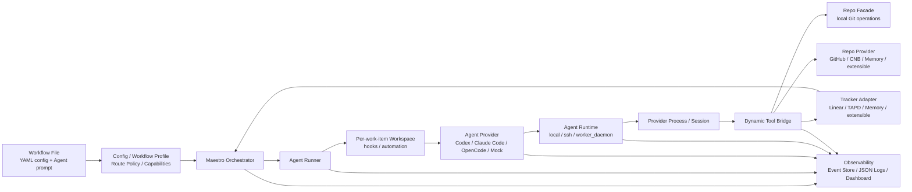

# Maestro

[](https://github.com/joosure/Maestro)
[](https://github.com/joosure/Maestro)
[](https://github.com/openai/symphony)

[English](./README.md) | [简体中文](./README.zh-CN.md) | [繁體中文](./README.zh-TW.md) | [日本語](./README.ja.md) | [한국어](./README.ko.md) | [Español](./README.es.md) | [Português (Brasil)](./README.pt-BR.md) | [Deutsch](./README.de.md) | [Français](./README.fr.md) | [Русский](./README.ru.md) | [Bahasa Indonesia](./README.id.md)

## 自律型エンジニアリング Agent のコントロールプレーン。

Maestro は issue tracker を AI Agent の実行レイヤーに変えます。作業の dispatch、runtime 管理、provider coordination、evidence tracking を担い、agentic engineering をチーム規模で運用可能にします。

これは新しい coding agent ではありません。

Codex、Claude Code、OpenCode、そして将来の agent が、実際の project system、repository、workflow、運用制約の中で働けるようにする orchestration platform です。

> **Symphony はこのパターンを証明しました。Maestro はそのプラットフォームを作ります。**

---

## Maestro が必要な理由

OpenAI Symphony は強力な考え方を示しました。**Agent session ではなく作業を管理する**、という考え方です。

エンジニアが coding agent のチャットを一つずつ監督する代わりに、Symphony は Linear のような project-management system が autonomous coding work の入口になれることを示しました。

Maestro はそのパターンをさらに進めます。

元の `Linear + Codex` reference implementation を、現代的な engineering workflow のための **tracker-driven、provider-neutral orchestration platform** に一般化します。

実務上、Maestro はチームを次の状態から：

```text
human-managed agent chats
```

次の状態へ移行させます：

```text
tracker-driven agent operations
```

この違いは重要です。デモは単一 agent、単一 issue、単一 repository で成功します。Production team には scheduling、isolation、credential control、quota awareness、evidence、logs、reviews、state transitions、failure recovery が必要です。

Maestro はその第二の世界のために作られています。

---

## Maestro が行うこと

Maestro は agentic engineering task の lifecycle 全体を調整します：

```text
Ticket / Story / Issue
        ↓
Workflow Profile
        ↓
Agent Provider
        ↓
Runtime / Workspace / Tool Bridge
        ↓
Repo / Pull Request / Review / Evidence
        ↓
Tracker State Update / Audit Trail
```

Work system、agent provider、code platform、runtime environment、observability を一つの operating layer に接続します。

| Layer | Maestro が提供するもの |
| --- | --- |
| Tracker | Linear、TAPD、Memory、および Jira、YouTrack、Feishu Project、GitHub Issues などへの拡張 adapter |
| Agent Provider | Codex、Claude Code、OpenCode、および将来の CLI / remote agent provider |
| Repo | clone、branch、commit、diff、push などの provider-neutral Git operations |
| Repo Provider | GitHub、CNB、Memory、および GitLab、Gitea、Bitbucket、Gerrit への拡張 |
| Workflow | coding delivery、requirement analysis、refinement、review routing、triage の再利用可能 profile |
| Runtime | Local、SSH、Worker Daemon execution modes |
| Tool Bridge | Agent に公開される provider-neutral dynamic tools |
| Governance | accounts、credential store、lease、quota polling、redaction、human gates |
| Observability | structured events、JSON logs、event store、dashboard drilldown、production evidence |

---

## Maestro が解決する問題

Coding agent は強力になっています。しかし、強力な agent が自動的に信頼できる engineering system になるわけではありません。

| Maestro なし | Maestro あり |
| --- | --- |
| Agent work が孤立した chat session で発生する | 作業は実際の tracker から dispatch され、実際の issue に紐づく |
| Provider ごとに session model が異なる | Provider は共有 lifecycle contract で包まれる |
| Agent output を audit しにくい | diff、PR、tool call、log、state transition、evidence が記録される |
| チームが一つの tracker や code platform に固定される | Tracker と repo provider は adapter-based |
| Workflow が script に hardcode される | Workflow Profile が policy、state、routing、deliverables を定義する |
| Credential と quota が ad hoc | Accounts、leases、quota polling、redaction が platform concern になる |
| Scale するには session を手動監督する必要がある | Worker Daemon が capacity-aware execution と operational control を可能にする |

Maestro の thesis は単純です：

> **未来は一つの完璧な coding agent ではありません。未来は実際の engineering workflow 全体で多数の agent を schedule、observe、govern できる operating layer です。**

---

## Core Design Principles

### 1. Trackers are the control plane

チームはすでに project-management system 上で動いています。Maestro は作業を private queue に隠しません。Linear、TAPD、Memory、将来の trackers を autonomous work の dispatch surface にします。

### 2. Agents are execution units

Codex、Claude Code、OpenCode、将来の agent は replaceable provider として扱われます。Maestro は orchestration layer が必要とする lifecycle、つまり session creation、turn execution、tool-call capture、evidence collection、quota awareness、cleanup を標準化します。

### 3. Workflow Profiles encode business intent

Coding、requirement analysis、refinement、review routing、triage は別々の workflow です。Maestro は profile を first-class にし、いつ dispatch するか、いつ wait するか、いつ stop するか、どの evidence が必要か、いつ human takeover が必要かを定義できるようにします。

### 4. Evidence beats claims

「完了しました」だけでは不十分です。Maestro は branch、commit、diff、PR、review note、CI result、tracker comment、tool call、event、log といった監査可能な artifacts を重視します。

### 5. Adapters prevent platform lock-in

すべての外部 system は contract を通して入ります。Orchestrator は特定 provider 向けの分岐ロジックの集合になってはいけません。新しい integration は adapter、contract test、smoke test、explicit capability discovery を通して追加します。

---

## Architecture



### Primary Boundaries

| Boundary | Responsibility |
| --- | --- |
| `Workflow File` | YAML front matter で runtime configuration を提供し、Markdown body で Agent prompt を提供 |
| `Workflow Profile` | route policy、capabilities、completion contract、stop conditions、human gates を定義 |
| `Tracker Adapter` | candidate work items を読み取り、state を同期し、comments を書き込み、tracker typed tools を公開 |
| `Orchestrator` | polling、reconciliation、scheduling、retry、runtime state tracking、terminal cleanup |
| `Agent Runner` | 単一 work item の workspace を作成し、hooks を実行し、Agent session を開始・駆動 |
| `Workspace` | 各 work item の runtime directory、workspace automation、repository copy、local evidence を隔離 |
| `Agent Provider` | Codex / Claude Code / OpenCode / Mock session の start、drive、stream、stop、cleanup |
| `Agent Runtime` | provider process を local、SSH、Worker Daemon に配置し、sandbox / executor context を解決 |
| `Repo` | provider-neutral な local Git operations：clone、branch、commit、diff、push |
| `Repo Provider` | GitHub、CNB、Memory などの code platform capabilities：PR / MR、review、checks、merge、comments、status updates |
| `Dynamic Tool Bridge` | Tracker、Repo、Repo Provider capabilities を session-scoped provider-neutral tools に集約 |
| `Observability` | structured events、JSON logs、event store、redaction、dashboard、evidence、audit trail |

---

## Workflow Profiles

Maestro は「issue から code を書く」だけに限定されません。同じ platform layer で複数の engineering workflow を orchestrate できます。

| Profile | Purpose | Typical Evidence |
| --- | --- | --- |
| `coding_pr_delivery` | work item を code changes と PR に変換する | branch、commit、diff、PR、CI result、review note |
| `requirement_analysis` | requirement を structured analysis に変換する | scope、risks、impact、acceptance criteria、task breakdown |
| `requirement_refinement` | implementation 前に ambiguity を特定する | clarification questions、blockers、assumptions、refined acceptance criteria |
| `review_routing` | review を適切な人または agent に route する | reviewer suggestions、risk tags、checklist |
| `triage` | work item を分類して route する | priority、owner、type、risk、next state |

ここで Maestro は automation script 以上のものになります。Profile は agent が何をすべきか、何をしてはいけないか、どの evidence を出すべきか、いつ human に戻すべきかの operational definition です。

---

## Example Configuration Shape

現在の実装では、workflow Markdown file の YAML front matter が runtime configuration を提供し、Markdown body が Agent prompt になります。以下は現在の field location を示す shape example であり、完全な runnable configuration ではありません：

```yaml
workflow:
  profile:
    kind: coding_pr_delivery  # coding_pr_delivery | requirement_analysis | requirement_refinement | review_routing | triage
tracker:
  kind: linear                # linear | tapd | memory
repo:
  provider:
    kind: github              # github | cnb | memory
agent_provider:
  kind: codex                 # codex | claude_code | opencode | mock
agent_runtime:
  placement: local            # local | ssh | worker_daemon
```

Production deployment ではこれらの次元を独立して組み合わせられます。例：

```text
TAPD + Claude Code + CNB + Worker Daemon + requirement_analysis
Linear + Codex + GitHub + Local Runtime + coding_pr_delivery
Memory + Mock Agent + Memory Repo Provider + Contract Tests
```

---

## Quick Start

Repository を clone します：

```bash
git clone https://github.com/joosure/Maestro.git
cd Maestro
```

まず repository で固定された Erlang / Elixir toolchain を準備します。`mise` の利用を推奨します。version は `elixir/mise.toml` で固定されています：

```bash
cd elixir
mise trust
mise install
cd ..
```

依存関係をインストールし、test suite を実行します。現在の shell で `mise` toolchain が有効なら、`make` を直接使えます：

```bash
make -C elixir deps
make -C elixir test
```

`elixir/` から `mise exec -- mix setup` と `mise exec -- mix test` を実行することもできます。

### Workflow template を試す

CLI を build し、`elixir/` からローカル memory/mock workflow を起動します：

```bash
make -C elixir build
cd elixir
./bin/symphony \
  --i-understand-that-this-will-be-running-without-the-usual-guardrails \
  --template memory/no_repo/mock \
  --port 4000
```

これは `memory/no_repo/mock` template で service を起動し、任意の dashboard/API を `http://localhost:4000` に公開します。Memory tracker、memory repo provider、mock agent provider を使うため、Linear、GitHub、Codex、Claude Code、OpenCode、CNB の credentials は不要です。

実際の tracker、repository、agent runtime に接続する場合は、必要な credentials を先に設定してから template を切り替えます：

```bash
export LINEAR_API_KEY=...
export LINEAR_PROJECT_SLUG=...
export SOURCE_REPO_URL=https://github.com/owner/repo.git
export SOURCE_REPO_BASE_BRANCH=main
export SOURCE_REPO_PROVIDER_REPOSITORY=owner/repo

command -v codex
gh auth status

./bin/symphony \
  --i-understand-that-this-will-be-running-without-the-usual-guardrails \
  --template linear/github/codex \
  --port 4000
```

`SOURCE_REPO_BRANCH_WORK_PREFIX` と `SOURCE_REPO_PROVIDER_REQUIRED_PR_LABEL` は optional です。`SYMPHONY_WORKSPACE_ROOT` は local quick start では省略できますが、real tracker、real repository、または full-flow validation に接続する前には、隔離された workspace root に明示設定することを推奨します。これにより workspace が local developer path に作られて cleanup しづらくなることを避けられます。Real tracker や repository に接続する前に、[workflow template aliases](./elixir/priv/workflow_templates/README.md) と [runtime configuration](./elixir/README.md) を確認してください。

Pull request を開く前に、CI と同じ local gates を実行してください：

```bash
make -C elixir all
make -C elixir secret-scan
```

`make -C elixir secret-scan` は `scripts/secret-scan.sh` 経由で
`gitleaks`、`trufflehog`、`detect-secrets` を実行します。CI も `main` への push と pull requests で同じ gate を実行します。

Local experimentation は、リスクの低い順に進めてください：

- 外部 credentials なしで orchestration を検証したい場合は、`tracker.kind: memory` と `repo.provider.kind: memory` を設定します。
- fake / simulated agent adapter は adapter registry 経由で tests または extension work にのみ使います。内蔵 agent providers は `codex`、`claude_code`、`opencode` です。
- memory path が安定してから、Linear/TAPD、GitHub/CNB、または destructive smoke tests に進みます。

> 公開ブランドには **Maestro** を使います。初期版には `symphony` から継承された module names、CLI entrypoints、environment variables が残っている場合があります。Project branding と platform boundaries が安定するまでは compatibility names として扱ってください。

---

## Extension Model

Maestro は hardcoded branch ではなく contract を通して成長するように設計されています。

### Add a Tracker Adapter

次の tracker contract を実装します：

- candidate work items の listing；
- title、description、labels、state、owner、metadata の reading；
- work の claiming または locking；
- comments と evidence の writing；
- 特定 provider の states を Maestro workflow model に mapping；
- contract tests と live smoke tests の passing。

### Add an Agent Provider

次の provider contract を実装します：

- session creation；
- prompt and context injection；
- turn execution；
- streaming events；
- tool-call capture；
- evidence extraction；
- cancellation and cleanup；
- sandbox、tools、approval、quota、context window などの capability reporting。

### Add a Repo Provider

次の repo-provider contract を実装します：

- PR / MR creation；
- review comments；
- checks and statuses；
- merge gates；
- branch protection detection；
- evidence links；
- idempotent updates。

### Add a Workflow Profile

定義するもの：

- trigger states；
- dispatch policy；
- input context；
- agent instructions；
- allowed tools；
- required evidence；
- stop conditions；
- human approval gates；
- tracker transitions。

---

## Observability and Evidence

Maestro は observability を後付けではなく product の一部として扱います。

各 run は次の情報で説明できるべきです：

- dispatch decision；
- workflow profile；
- selected provider；
- runtime and worker；
- session and turn history；
- tool calls；
- stdout / stderr / structured event stream；
- workspace and repository changes；
- PR or review artifacts；
- tracker comments and state changes；
- redacted logs；
- final evidence summary。

これにより Maestro は automation だけでなく、evaluation、debugging、governance、production rollout にも役立ちます。

---

## Project Status

Maestro は active platformization の段階です。

適している用途：

- tracker-driven agent orchestration の研究；
- adapter prototypes の構築；
- workflow profiles の検証；
- memory-provider または local test loops の実行；
- controlled environment での real providers 実験。

本格利用前に hardening が必要な領域：

- unrestricted production execution；
- destructive repository operations；
- high-privilege credentials；
- multi-tenant worker pools；
- unattended merge or deploy automation。

Guiding rule：

> **大胆に自動化し、慎重に gate し、evidence を残す。**

---

## Who Maestro Is For

Maestro は次の人たちに有用です：

- Codex、Claude Code、OpenCode、将来の coding agents を評価している engineering teams；
- internal AI engineering infrastructure を作る platform teams；
- agent operations workflows を作る DevTools teams；
- 既存 tracker から agent に作業させたい product and engineering organizations；
- agent reliability、evidence、orchestration を研究する researchers；
- structured agent-driven contribution flows を望む open-source maintainers。

---

## Attribution

Maestro は [OpenAI Symphony](https://github.com/openai/symphony) の fork から始まりました。元の Symphony reference implementation は Linear-driven Codex orchestration に焦点を当てています。Maestro はその考え方を trackers、agent providers、repository providers、workflow profiles、runtimes、tools、evidence をまたぐ broader platform architecture へ拡張します。

---

## Repository

- GitHub: <https://github.com/joosure/Maestro>
- Origin project: <https://github.com/openai/symphony>

---

## License

Maestro は GNU Affero General Public License version 3 (AGPL-3.0-only) の下でライセンスされています。OpenAI Symphony 由来の部分には Apache-2.0 の attribution と notice 要件が残ります。Maestro を使用または配布する前に、`LICENSE`、`NOTICE`、`LICENSES/Apache-2.0.txt`、`MODIFICATIONS.md`、`SOURCE.md`、`THIRD_PARTY_LICENSES.md` を確認してください。
