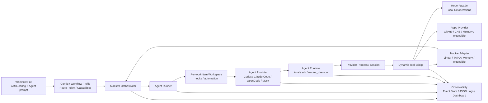

# Maestro

[](https://github.com/joosure/Maestro)
[](https://github.com/joosure/Maestro)
[](https://github.com/openai/symphony)

[English](./README.md) | [简体中文](./README.zh-CN.md) | [繁體中文](./README.zh-TW.md) | [日本語](./README.ja.md) | [한국어](./README.ko.md) | [Español](./README.es.md) | [Português (Brasil)](./README.pt-BR.md) | [Deutsch](./README.de.md) | [Français](./README.fr.md) | [Русский](./README.ru.md) | [Bahasa Indonesia](./README.id.md)

## The tracker-driven control plane for autonomous engineering agents.

Maestro turns your issue tracker into an execution layer for AI agents — dispatching work, managing runtimes, coordinating providers, tracking evidence, and making agentic engineering operable at team scale.

It is not another coding agent.

It is the orchestration platform that lets Codex, Claude Code, OpenCode, and future agents work from real project systems, real repositories, real workflows, and real operational constraints.

> **Symphony proved the pattern. Maestro builds the platform.**

---

## Why Maestro

OpenAI Symphony introduced a powerful idea: **manage the work, not the agent sessions**.

Instead of asking engineers to supervise coding agents one chat at a time, Symphony showed that project-management systems such as Linear can become the entry point for autonomous coding work.

Maestro takes that pattern further.

It generalizes the original `Linear + Codex` reference implementation into a **tracker-driven, provider-neutral orchestration platform** for modern engineering workflows.

In practical terms, Maestro helps teams move from:

```text
human-managed agent chats
```

to:

```text
tracker-driven agent operations
```

That difference matters. Demos can succeed with a single agent, a single issue, and a single repository. Production teams need scheduling, isolation, credential control, quota awareness, evidence, logs, reviews, state transitions, and failure recovery.

Maestro is built for that second world.

---

## What Maestro Does

Maestro coordinates the full lifecycle of an agentic engineering task:

```text
Ticket / Story / Issue
        ↓
Workflow Profile
        ↓
Agent Provider
        ↓
Runtime / Workspace / Tool Bridge
        ↓
Repo / Pull Request / Review / Evidence
        ↓
Tracker State Update / Audit Trail
```

It connects work systems, agent providers, code platforms, runtime environments, and observability into one operating layer.

| Layer | What Maestro Provides |
| --- | --- |
| Tracker | Linear, TAPD, Memory, and extensible adapters for Jira, YouTrack, Feishu Project, GitHub Issues, and more |
| Agent Provider | Codex, Claude Code, OpenCode, and extensible providers for future CLI or remote agents |
| Repo | Provider-neutral Git operations such as clone, branch, commit, diff, and push |
| Repo Provider | GitHub, CNB, Memory, and extensible support for GitLab, Gitea, Bitbucket, and Gerrit |
| Workflow | Reusable profiles for coding delivery, requirement analysis, refinement, review routing, and triage |
| Runtime | Local, SSH, and Worker Daemon execution modes |
| Tool Bridge | Dynamic provider-neutral tools exposed to agents |
| Governance | Accounts, credential store, lease, quota polling, redaction, and human gates |
| Observability | Structured events, JSON logs, event store, dashboard drilldown, and production evidence |

---

## The Problem Maestro Solves

Coding agents are becoming powerful. But powerful agents do not automatically become reliable engineering systems.

| Without Maestro | With Maestro |
| --- | --- |
| Agent work happens in isolated chat sessions | Work is dispatched from real trackers and linked to real issues |
| Every provider has its own session model | Providers are wrapped by a shared lifecycle contract |
| Agent output is hard to audit | Diffs, PRs, tool calls, logs, state transitions, and evidence are captured |
| Teams are locked into one tracker or one code platform | Trackers and repo providers are adapter-based |
| Workflows are hardcoded into scripts | Workflow Profile defines policy, state, routing, and deliverables |
| Credentials and quotas are ad hoc | Accounts, leases, quota polling, and redaction become platform concerns |
| Scaling requires manually supervising sessions | Worker Daemon enables capacity-aware execution and operational control |

Maestro’s thesis is simple:

> **The future is not one perfect coding agent. The future is an operating layer that can schedule, observe, and govern many agents across real engineering workflows.**

---

## Core Design Principles

### 1. Trackers are the control plane

Teams already run on project-management systems. Maestro does not hide work inside a private queue. It lets Linear, TAPD, Memory, and future trackers become the dispatch surface for autonomous work.

### 2. Agents are execution units

Codex, Claude Code, OpenCode, and future agents are treated as replaceable providers. Maestro standardizes the lifecycle the orchestration layer needs: session creation, turn execution, tool-call capture, evidence collection, quota awareness, and cleanup.

### 3. Workflow Profiles encode business intent

Coding, requirement analysis, refinement, review routing, and triage are different workflows. Maestro makes profiles first-class so teams can define when to dispatch, when to wait, when to stop, what evidence is required, and when humans must approve.

### 4. Evidence beats claims

“Done” is not enough. Maestro favors auditable artifacts: branch, commit, diff, PR, review note, CI result, tracker comment, tool call, event, and log.

### 5. Adapters prevent platform lock-in

Every external system enters through a contract. The orchestrator should not become a pile of branches tied to one provider. New integrations should arrive through adapters, contract tests, smoke tests, and explicit capability discovery.

---

## Architecture



### Primary Boundaries

| Boundary | Responsibility |
| --- | --- |
| `Workflow File` | Provides runtime configuration through YAML front matter and the Agent prompt through the Markdown body |
| `Workflow Profile` | Defines route policy, capabilities, completion contract, stop conditions, and human gates |
| `Tracker Adapter` | Reads candidate work items, syncs state, writes comments, and exposes tracker typed tools |
| `Orchestrator` | Handles polling, reconciliation, scheduling, retry, runtime state tracking, and terminal cleanup |
| `Agent Runner` | Creates the workspace for one work item, runs hooks, and starts and drives the Agent session |
| `Workspace` | Isolates each work item’s runtime directory, workspace automation, repository copy, and local evidence |
| `Agent Provider` | Starts, drives, streams, stops, and cleans up Codex / Claude Code / OpenCode / Mock sessions |
| `Agent Runtime` | Places the provider process on local, SSH, or Worker Daemon execution and resolves sandbox / executor context |
| `Repo` | Provider-neutral local Git operations: clone, branch, commit, diff, push |
| `Repo Provider` | Code-platform capabilities for GitHub, CNB, Memory, and extensions: PR / MR, reviews, checks, merge, comments, status updates |
| `Dynamic Tool Bridge` | Aggregates Tracker, Repo, and Repo Provider capabilities into session-scoped provider-neutral tools |
| `Observability` | Structured events, JSON logs, event store, redaction, dashboard, evidence, audit trail |

---

## Workflow Profiles

Maestro is not limited to “write code from an issue.” It can orchestrate multiple engineering workflows with the same platform layer.

| Profile | Purpose | Typical Evidence |
| --- | --- | --- |
| `coding_pr_delivery` | Convert a work item into code changes and a PR | branch, commit, diff, PR, CI result, review note |
| `requirement_analysis` | Turn a requirement into structured analysis | scope, risks, impact, acceptance criteria, task breakdown |
| `requirement_refinement` | Identify ambiguity before implementation | clarification questions, blockers, assumptions, refined acceptance criteria |
| `review_routing` | Route reviews to the right people or agents | reviewer suggestions, risk tags, checklist |
| `triage` | Classify and route work items | priority, owner, type, risk, next state |

This is where Maestro becomes more than an automation script. A profile is the operational definition of what the agent should do, what it must not do, what evidence it must produce, and when a human must take over.

---

## Example Configuration Shape

The current implementation uses YAML front matter in a workflow Markdown file for runtime configuration, while the Markdown body is the Agent prompt. This is a shape example showing the current field locations, not a complete runnable configuration:

```yaml
workflow:
  profile:
    kind: coding_pr_delivery  # coding_pr_delivery | requirement_analysis | requirement_refinement | review_routing | triage
tracker:
  kind: linear                # linear | tapd | memory
repo:
  provider:
    kind: github              # github | cnb | memory
agent_provider:
  kind: codex                 # codex | claude_code | opencode | mock
agent_runtime:
  placement: local            # local | ssh | worker_daemon
```

Agent provider kind values are canonical runtime strings. Current built-ins are
`codex`, `claude_code`, `opencode`, and `mock`; supported aliases are normalized
by the Elixir provider-kind owner before registry lookup.

Canonical tracker, repo-provider, and agent-provider kind strings are owned by
the Elixir `Tracker.Kinds`, `RepoProvider.Kinds`, and `AgentProvider.Kinds`
modules so registries, defaults, and documentation stay aligned.

A production deployment can vary those dimensions independently. For example:

```text
TAPD + Claude Code + CNB + Worker Daemon + requirement_analysis
Linear + Codex + GitHub + Local Runtime + coding_pr_delivery
Memory + Mock Agent + Memory Repo Provider + Contract Tests
```

---

## Quick Start

Clone the repository:

```bash
git clone https://github.com/joosure/Maestro.git
cd Maestro
```

Prepare the pinned Erlang / Elixir toolchain first. `mise` is recommended; versions are pinned in `elixir/mise.toml`:

```bash
cd elixir
mise trust
mise install
cd ..
```

Install dependencies and run the test suite. If the current shell has the `mise` toolchain active, you can use `make` directly:

```bash
make -C elixir deps
make -C elixir test
```

You can also run `mise exec -- mix setup` and `mise exec -- mix test` from `elixir/`.

### Try a workflow template

Build the CLI and start the local memory/mock workflow from `elixir/`:

```bash
make -C elixir build
cd elixir
./bin/symphony \
  --i-understand-that-this-will-be-running-without-the-usual-guardrails \
  --template memory/no_repo/mock \
  --port 4000
```

This starts the service with the `memory/no_repo/mock` template and exposes the optional dashboard/API on `http://localhost:4000`. It uses the in-memory tracker, in-memory repo provider, and mock agent provider, so no Linear, GitHub, Codex, Claude Code, OpenCode, or CNB credentials are required.

To connect a real tracker, repository, and agent runtime, configure the required credentials first and switch the template:

```bash
export LINEAR_API_KEY=...
export LINEAR_PROJECT_SLUG=...
export SOURCE_REPO_URL=https://github.com/owner/repo.git
export SOURCE_REPO_BASE_BRANCH=main
export SOURCE_REPO_PROVIDER_REPOSITORY=owner/repo

command -v codex
gh auth status

./bin/symphony \
  --i-understand-that-this-will-be-running-without-the-usual-guardrails \
  --template linear/github/codex \
  --port 4000
```

`SOURCE_REPO_BRANCH_WORK_PREFIX` and `SOURCE_REPO_PROVIDER_REQUIRED_PR_LABEL` are optional. `SYMPHONY_WORKSPACE_ROOT` may be omitted for the local quick start; before connecting a real tracker, a real repository, or a full-flow validation, set it explicitly to an isolated workspace root so workspaces do not land in local developer paths and are easy to clean up. See [workflow template aliases](./elixir/priv/workflow_templates/README.md) and [runtime configuration](./elixir/README.md) before connecting a real tracker or repository.

Before opening a pull request, run the same local gates used by CI:

```bash
make -C elixir all
make -C elixir secret-scan
```

`make -C elixir secret-scan` runs `gitleaks`, `trufflehog`, and
`detect-secrets` through `scripts/secret-scan.sh`. CI runs the same gate on
pushes to `main` and pull requests.

Use the lowest-risk path for local experimentation:

- Configure `tracker.kind: memory` and `repo.provider.kind: memory` when you want to exercise orchestration without external credentials.
- Use `mix tracker.smoke --template memory/no_repo/mock --issue local-memory-1 --json` from `elixir/` to validate tracker smoke wiring before using real tracker credentials.
- Use the built-in `mock` agent provider for local no-credential validation; keep additional fake or simulated adapters limited to tests or extension work through the adapter registry. The built-in real agent providers are `codex`, `claude_code`, and `opencode`.
- Move to Linear/TAPD, GitHub/CNB, or destructive smoke tests only after the memory path is stable.

> Public branding uses **Maestro**. Some early module names, CLI entrypoints, or environment variables still use `symphony`; treat those as compatibility names while the branding and platform boundaries continue to stabilize.

---

## Extension Model

Maestro is designed to grow through contracts instead of hardcoded branches.

### Add a Tracker Adapter

Implement the tracker contract for:

- listing candidate work items;
- reading title, description, labels, state, owner, and metadata;
- claiming or locking work;
- writing comments and evidence;
- mapping states from a particular provider into Maestro’s workflow model;
- passing contract tests and live smoke tests.

### Add an Agent Provider

Implement the provider contract for:

- session creation;
- prompt and context injection;
- turn execution;
- streaming events;
- tool-call capture;
- evidence extraction;
- cancellation and cleanup;
- capability reporting such as sandbox, tools, approval, quota, and context window.

### Add a Repo Provider

Implement the repo-provider contract for:

- PR / MR creation;
- review comments;
- checks and statuses;
- merge gates;
- branch protection detection;
- evidence links;
- idempotent updates.

### Add a Workflow Profile

Define:

- trigger states;
- dispatch policy;
- input context;
- agent instructions;
- allowed tools;
- required evidence;
- stop conditions;
- human approval gates;
- tracker transitions.

---

## Observability and Evidence

Maestro treats observability as part of the product, not as an afterthought.

Each run should be explainable through:

- dispatch decision;
- workflow profile;
- selected provider;
- runtime and worker;
- session and turn history;
- tool calls;
- stdout / stderr / structured event stream;
- workspace and repository changes;
- PR or review artifacts;
- tracker comments and state changes;
- redacted logs;
- final evidence summary.

This makes Maestro useful not only for automation, but also for evaluation, debugging, governance, and production rollout.

---

## Project Status

Maestro is in active platformization.

It is suitable for:

- studying tracker-driven agent orchestration;
- building adapter prototypes;
- validating workflow profiles;
- running memory-provider or local test loops;
- experimenting with real providers in controlled environments.

It should be hardened before:

- unrestricted production execution;
- destructive repository operations;
- high-privilege credentials;
- multi-tenant worker pools;
- unattended merge or deploy automation.

The guiding rule is:

> **Automate boldly. Gate carefully. Preserve evidence.**

---

## Who Maestro Is For

Maestro is useful for:

- engineering teams evaluating Codex, Claude Code, OpenCode, or future coding agents;
- platform teams building internal AI engineering infrastructure;
- DevTools teams creating agent operations workflows;
- product and engineering organizations that want agents to work from existing trackers;
- researchers studying agent reliability, evidence, and orchestration;
- open-source maintainers who want structured agent-driven contribution flows.

---

## Attribution

Maestro started as a fork of [OpenAI Symphony](https://github.com/openai/symphony). The original Symphony reference implementation focuses on Linear-driven Codex orchestration. Maestro extends that idea into a broader platform architecture across trackers, agent providers, repository providers, workflow profiles, runtimes, tools, and evidence.

---

## Repository

- GitHub: <https://github.com/joosure/Maestro>
- Origin project: <https://github.com/openai/symphony>

---

## License

Maestro is licensed under the GNU Affero General Public License version 3 (AGPL-3.0-only). Portions derived from OpenAI Symphony retain their Apache-2.0 attribution and notice requirements. Review `LICENSE`, `NOTICE`, `LICENSES/Apache-2.0.txt`, `MODIFICATIONS.md`, `SOURCE.md`, and `THIRD_PARTY_LICENSES.md` before using or distributing Maestro.
