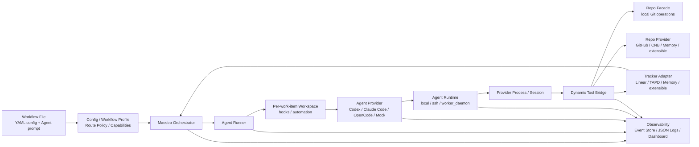

# Maestro

[](https://github.com/joosure/Maestro)
[](https://github.com/joosure/Maestro)
[](https://github.com/openai/symphony)

[English](./README.md) | [简体中文](./README.zh-CN.md) | [繁體中文](./README.zh-TW.md) | [日本語](./README.ja.md) | [한국어](./README.ko.md) | [Español](./README.es.md) | [Português (Brasil)](./README.pt-BR.md) | [Deutsch](./README.de.md) | [Français](./README.fr.md) | [Русский](./README.ru.md) | [Bahasa Indonesia](./README.id.md)

## O plano de controle para agentes autônomos de engenharia.

Maestro transforma seu issue tracker em uma camada de execução para AI agents: despacha trabalho, gerencia runtimes, coordena providers, rastreia evidence e torna agentic engineering operável em escala de equipe.

Não é mais um coding agent.

É a plataforma de orquestração que permite que Codex, Claude Code, OpenCode e futuros agentes trabalhem a partir de sistemas reais de projeto, repositórios reais, workflows reais e restrições operacionais reais.

> **Symphony provou o padrão. Maestro constrói a plataforma.**

---

## Por que Maestro

OpenAI Symphony apresentou uma ideia poderosa: **gerenciar o trabalho, não as sessões de agentes**.

Em vez de pedir que engenheiros supervisionem coding agents um chat por vez, Symphony mostrou que sistemas de gestão de projetos como Linear podem se tornar o ponto de entrada para trabalho de coding autônomo.

Maestro leva esse padrão adiante.

Ele generaliza a implementação de referência original `Linear + Codex` em uma **plataforma de orquestração tracker-driven e provider-neutral** para workflows modernos de engenharia.

Na prática, Maestro ajuda equipes a passar de:

```text
human-managed agent chats
```

para:

```text
tracker-driven agent operations
```

Essa diferença importa. Demos podem funcionar com um agente, uma issue e um repositório. Equipes de produção precisam de scheduling, isolation, credential control, quota awareness, evidence, logs, reviews, state transitions e failure recovery.

Maestro foi construído para esse segundo mundo.

---

## O que Maestro faz

Maestro coordena todo o ciclo de vida de uma agentic engineering task:

```text
Ticket / Story / Issue
        ↓
Workflow Profile
        ↓
Agent Provider
        ↓
Runtime / Workspace / Tool Bridge
        ↓
Repo / Pull Request / Review / Evidence
        ↓
Tracker State Update / Audit Trail
```

Ele conecta sistemas de trabalho, agent providers, plataformas de código, ambientes runtime e observability em uma única camada operacional.

| Camada | O que Maestro fornece |
| --- | --- |
| Tracker | Linear, TAPD, Memory e adapters extensíveis para Jira, YouTrack, Feishu Project, GitHub Issues e outros |
| Agent Provider | Codex, Claude Code, OpenCode e providers extensíveis para futuros agentes CLI ou remotos |
| Repo | Operações Git provider-neutral como clone, branch, commit, diff e push |
| Repo Provider | GitHub, CNB, Memory e suporte extensível para GitLab, Gitea, Bitbucket e Gerrit |
| Workflow | Profiles reutilizáveis para coding delivery, requirement analysis, refinement, review routing e triage |
| Runtime | Modos de execução Local, SSH e Worker Daemon |
| Tool Bridge | Dynamic tools provider-neutral expostas a agentes |
| Governance | Accounts, credential store, lease, quota polling, redaction e human gates |
| Observability | Structured events, JSON logs, event store, dashboard drilldown e production evidence |

---

## O problema que Maestro resolve

Coding agents estão ficando poderosos. Mas agentes poderosos não se tornam automaticamente sistemas de engenharia confiáveis.

| Sem Maestro | Com Maestro |
| --- | --- |
| Trabalho do agente acontece em sessões de chat isoladas | Trabalho é despachado de trackers reais e ligado a issues reais |
| Cada provider tem seu próprio modelo de sessão | Providers são envolvidos por um lifecycle contract compartilhado |
| A saída do agente é difícil de auditar | Diffs, PRs, tool calls, logs, state transitions e evidence são capturados |
| Equipes ficam presas a um tracker ou plataforma de código | Trackers e repo providers são adapter-based |
| Workflows ficam hardcoded em scripts | Workflow Profile define policy, state, routing e deliverables |
| Credenciais e quotas são ad hoc | Accounts, leases, quota polling e redaction viram concerns de plataforma |
| Escalar exige supervisionar sessões manualmente | Worker Daemon permite execução capacity-aware e controle operacional |

A tese de Maestro é simples:

> **O futuro não é um coding agent perfeito. O futuro é uma camada operacional capaz de schedule, observe e govern muitos agentes através de workflows reais de engenharia.**

---

## Princípios de design

### 1. Trackers são o plano de controle

Equipes já trabalham em sistemas de gestão de projetos. Maestro não esconde trabalho em uma fila privada. Ele permite que Linear, TAPD, Memory e futuros trackers sejam a superfície de dispatch para trabalho autônomo.

### 2. Agents são unidades de execução

Codex, Claude Code, OpenCode e futuros agentes são tratados como providers substituíveis. Maestro padroniza o lifecycle de que a camada de orquestração precisa: session creation, turn execution, tool-call capture, evidence collection, quota awareness e cleanup.

### 3. Workflow Profiles codificam intenção de negócio

Coding, requirement analysis, refinement, review routing e triage são workflows diferentes. Maestro torna profiles first-class para que equipes definam quando dispatch, wait ou stop, que evidence é exigida e quando humanos precisam assumir.

### 4. Evidence vence claims

"Done" não basta. Maestro privilegia artifacts auditáveis: branch, commit, diff, PR, review note, CI result, tracker comment, tool call, event e log.

### 5. Adapters evitam lock-in de plataforma

Todo sistema externo entra por um contract. O orchestrator não deve virar uma pilha de branches ligada a um único provider. Novas integrações devem chegar por adapters, contract tests, smoke tests e capability discovery explícito.

---

## Arquitetura



### Fronteiras principais

| Fronteira | Responsabilidade |
| --- | --- |
| `Workflow File` | Fornece configuração runtime por YAML front matter e o Agent prompt pelo corpo Markdown |
| `Workflow Profile` | Define route policy, capabilities, completion contract, stop conditions e human gates |
| `Tracker Adapter` | Lê candidate work items, sincroniza state, escreve comments e expõe tracker typed tools |
| `Orchestrator` | Cuida de polling, reconciliation, scheduling, retry, runtime state tracking e terminal cleanup |
| `Agent Runner` | Cria o workspace para um work item, executa hooks, inicia e conduz a Agent session |
| `Workspace` | Isola o runtime directory de cada work item, workspace automation, repository copy e local evidence |
| `Agent Provider` | Start, drive, stream, stop e cleanup de sessões Codex / Claude Code / OpenCode / Mock |
| `Agent Runtime` | Posiciona o provider process em local, SSH ou Worker Daemon e resolve sandbox / executor context |
| `Repo` | Operações Git locais provider-neutral: clone, branch, commit, diff, push |
| `Repo Provider` | Capacidades de plataformas de código para GitHub, CNB, Memory e extensões: PR / MR, reviews, checks, merge, comments, status updates |
| `Dynamic Tool Bridge` | Agrega capacidades de Tracker, Repo e Repo Provider em tools provider-neutral limitadas à sessão |
| `Observability` | Structured events, JSON logs, event store, redaction, dashboard, evidence, audit trail |

---

## Workflow Profiles

Maestro não se limita a "escrever código a partir de uma issue". Ele pode orquestrar vários workflows de engenharia com a mesma camada de plataforma.

| Profile | Propósito | Evidence típica |
| --- | --- | --- |
| `coding_pr_delivery` | Converter um work item em code changes e PR | branch, commit, diff, PR, CI result, review note |
| `requirement_analysis` | Transformar um requirement em análise estruturada | scope, risks, impact, acceptance criteria, task breakdown |
| `requirement_refinement` | Identificar ambiguidade antes da implementação | clarification questions, blockers, assumptions, refined acceptance criteria |
| `review_routing` | Encaminhar reviews para pessoas ou agentes corretos | reviewer suggestions, risk tags, checklist |
| `triage` | Classificar e encaminhar work items | priority, owner, type, risk, next state |

É aqui que Maestro se torna mais que um script de automação. Um profile é a definição operacional do que o agente deve fazer, do que não deve fazer, que evidence deve produzir e quando deve devolver o controle a uma pessoa.

---

## Exemplo de formato de configuração

A implementação atual usa YAML front matter em um arquivo Markdown de workflow para a configuração runtime, enquanto o corpo Markdown é o Agent prompt. Este exemplo mostra os locais atuais dos campos centrais; não é uma configuração completa executável:

```yaml
workflow:
  profile:
    kind: coding_pr_delivery  # coding_pr_delivery | requirement_analysis | requirement_refinement | review_routing | triage
tracker:
  kind: linear                # linear | tapd | memory
repo:
  provider:
    kind: github              # github | cnb | memory
agent_provider:
  kind: codex                 # codex | claude_code | opencode | mock
agent_runtime:
  placement: local            # local | ssh | worker_daemon
```

Um deployment de produção pode variar essas dimensões de forma independente. Por exemplo:

```text
TAPD + Claude Code + CNB + Worker Daemon + requirement_analysis
Linear + Codex + GitHub + Local Runtime + coding_pr_delivery
Memory + Mock Agent + Memory Repo Provider + Contract Tests
```

---

## Início rápido

Clone o repositório:

```bash
git clone https://github.com/joosure/Maestro.git
cd Maestro
```

Prepare primeiro a toolchain Erlang / Elixir fixada no repositório. `mise` é recomendado; as versões ficam fixadas em `elixir/mise.toml`:

```bash
cd elixir
mise trust
mise install
cd ..
```

Instale dependências e execute a suíte de testes. Se o shell atual estiver com a toolchain de `mise` ativa, você pode usar `make` diretamente:

```bash
make -C elixir deps
make -C elixir test
```

Você também pode executar `mise exec -- mix setup` e `mise exec -- mix test` a partir de `elixir/`.

### Experimente um workflow template

Construa a CLI e inicie o workflow local memory/mock a partir de `elixir/`:

```bash
make -C elixir build
cd elixir
./bin/symphony \
  --i-understand-that-this-will-be-running-without-the-usual-guardrails \
  --template memory/no_repo/mock \
  --port 4000
```

Isso inicia o serviço com o template `memory/no_repo/mock` e expõe o dashboard/API opcional em `http://localhost:4000`. Ele usa o tracker em memória, o repo provider em memória e o mock agent provider, então não precisa de credenciais Linear, GitHub, Codex, Claude Code, OpenCode ou CNB.

Para conectar um tracker, repositório e agent runtime reais, configure primeiro as credenciais exigidas e troque o template:

```bash
export LINEAR_API_KEY=...
export LINEAR_PROJECT_SLUG=...
export SOURCE_REPO_URL=https://github.com/owner/repo.git
export SOURCE_REPO_BASE_BRANCH=main
export SOURCE_REPO_PROVIDER_REPOSITORY=owner/repo

command -v codex
gh auth status

./bin/symphony \
  --i-understand-that-this-will-be-running-without-the-usual-guardrails \
  --template linear/github/codex \
  --port 4000
```

`SOURCE_REPO_BRANCH_WORK_PREFIX` e `SOURCE_REPO_PROVIDER_REQUIRED_PR_LABEL` são opcionais. `SYMPHONY_WORKSPACE_ROOT` pode ser omitido no quick start local; antes de conectar um tracker real, um repositório real ou validar o fluxo completo, defina-o explicitamente para uma raiz de workspace isolada, evitando que workspaces caiam em caminhos locais do desenvolvedor e sejam difíceis de limpar. Consulte [workflow template aliases](./elixir/priv/workflow_templates/README.md) e [runtime configuration](./elixir/README.md) antes de conectar um tracker ou repositório real.

Antes de abrir um pull request, execute os mesmos gates locais usados pelo CI:

```bash
make -C elixir all
make -C elixir secret-scan
```

`make -C elixir secret-scan` executa `gitleaks`, `trufflehog` e
`detect-secrets` por meio de `scripts/secret-scan.sh`. O CI executa o mesmo gate em pushes para `main` e pull requests.

Para experimentação local, avance pelo caminho de menor risco:

- Configure `tracker.kind: memory` e `repo.provider.kind: memory` quando quiser validar a orquestração sem credenciais externas.
- Use fake ou simulated agent adapters apenas em testes ou trabalho de extensão pelo adapter registry; os agent providers integrados são `codex`, `claude_code` e `opencode`.
- Passe para Linear/TAPD, GitHub/CNB ou destructive smoke tests somente depois que o caminho memory estiver estável.

> O branding público usa **Maestro**. Versões iniciais ainda podem conter module names, CLI entrypoints ou environment variables herdadas de `symphony`. Trate isso como nomes de compatibilidade enquanto o branding do projeto e as fronteiras de plataforma estabilizam.

---

## Modelo de extensão

Maestro foi desenhado para crescer por contracts, não por branches hardcoded.

### Adicionar um Tracker Adapter

Implemente o tracker contract para:

- listar candidate work items;
- ler title, description, labels, state, owner e metadata;
- fazer claim ou lock de work;
- escrever comments e evidence;
- mapear estados de cada provider para o workflow model de Maestro;
- passar contract tests e live smoke tests.

### Adicionar um Agent Provider

Implemente o provider contract para:

- session creation;
- prompt and context injection;
- turn execution;
- streaming events;
- tool-call capture;
- evidence extraction;
- cancellation and cleanup;
- capability reporting como sandbox, tools, approval, quota e context window.

### Adicionar um Repo Provider

Implemente o repo-provider contract para:

- PR / MR creation;
- review comments;
- checks and statuses;
- merge gates;
- branch protection detection;
- evidence links;
- idempotent updates.

### Adicionar um Workflow Profile

Defina:

- trigger states;
- dispatch policy;
- input context;
- agent instructions;
- allowed tools;
- required evidence;
- stop conditions;
- human approval gates;
- tracker transitions.

---

## Observability and Evidence

Maestro trata observability como parte do produto, não como algo posterior.

Cada run deve ser explicável por:

- dispatch decision;
- workflow profile;
- selected provider;
- runtime and worker;
- session and turn history;
- tool calls;
- stdout / stderr / structured event stream;
- workspace and repository changes;
- PR or review artifacts;
- tracker comments and state changes;
- redacted logs;
- final evidence summary.

Isso torna Maestro útil não apenas para automação, mas também para avaliação, debugging, governance e production rollout.

---

## Status do projeto

Maestro está em active platformization.

É adequado para:

- estudar tracker-driven agent orchestration;
- construir adapter prototypes;
- validar workflow profiles;
- executar memory-provider ou local test loops;
- experimentar providers reais em ambientes controlados.

Ele deve ser reforçado antes de:

- unrestricted production execution;
- destructive repository operations;
- high-privilege credentials;
- multi-tenant worker pools;
- unattended merge or deploy automation.

A regra guia é:

> **Automatize com coragem. Aplique gates com cuidado. Preserve evidence.**

---

## Para quem é Maestro

Maestro é útil para:

- engineering teams avaliando Codex, Claude Code, OpenCode ou futuros coding agents;
- platform teams construindo infraestrutura interna de AI engineering;
- DevTools teams criando agent operations workflows;
- organizações de produto e engenharia que querem agentes trabalhando a partir de trackers existentes;
- researchers estudando agent reliability, evidence e orchestration;
- open-source maintainers que querem contribution flows estruturados e agent-driven.

---

## Attribution

Maestro começou como um fork de [OpenAI Symphony](https://github.com/openai/symphony). A implementação de referência original do Symphony foca em Codex orchestration dirigida por Linear. Maestro amplia essa ideia para uma arquitetura de plataforma mais ampla que cobre trackers, agent providers, repository providers, workflow profiles, runtimes, tools e evidence.

---

## Repositório

- GitHub: <https://github.com/joosure/Maestro>
- Origin project: <https://github.com/openai/symphony>

---

## Licença

Maestro é licenciado sob a GNU Affero General Public License version 3 (AGPL-3.0-only). Partes derivadas do OpenAI Symphony mantêm os requisitos de attribution e notice da Apache-2.0. Revise `LICENSE`, `NOTICE`, `LICENSES/Apache-2.0.txt`, `MODIFICATIONS.md`, `SOURCE.md` e `THIRD_PARTY_LICENSES.md` antes de usar ou distribuir o Maestro.
