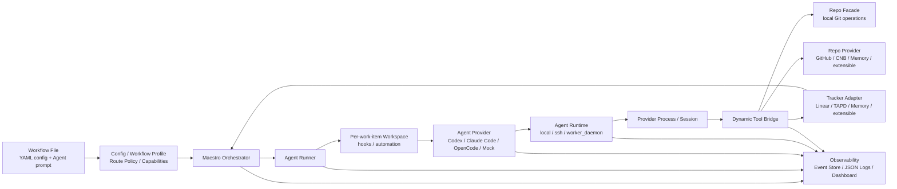

# Maestro

[](https://github.com/joosure/Maestro)
[](https://github.com/joosure/Maestro)
[](https://github.com/openai/symphony)

[English](./README.md) | [简体中文](./README.zh-CN.md) | [繁體中文](./README.zh-TW.md) | [日本語](./README.ja.md) | [한국어](./README.ko.md) | [Español](./README.es.md) | [Português (Brasil)](./README.pt-BR.md) | [Deutsch](./README.de.md) | [Français](./README.fr.md) | [Русский](./README.ru.md) | [Bahasa Indonesia](./README.id.md)

## Control plane для автономных инженерных агентов.

Maestro превращает issue tracker в слой выполнения для AI agents: распределяет работу, управляет runtimes, координирует providers, отслеживает evidence и делает agentic engineering пригодным для командной эксплуатации.

Это не еще один coding agent.

Это orchestration platform, позволяющая Codex, Claude Code, OpenCode и будущим агентам работать из реальных проектных систем, реальных repositories, реальных workflows и реальных операционных ограничений.

> **Symphony доказал паттерн. Maestro строит платформу.**

---

## Зачем нужен Maestro

OpenAI Symphony ввел сильную идею: **управлять работой, а не сессиями агентов**.

Вместо того чтобы заставлять инженеров по одному контролировать чаты coding agents, Symphony показал, что project-management systems вроде Linear могут стать точкой входа для автономной coding work.

Maestro развивает этот паттерн дальше.

Он обобщает исходную `Linear + Codex` reference implementation в **tracker-driven, provider-neutral orchestration platform** для современных engineering workflows.

Практически Maestro помогает командам перейти от:

```text
human-managed agent chats
```

к:

```text
tracker-driven agent operations
```

Эта разница важна. Демонстрации могут работать с одним агентом, одним issue и одним repository. Production teams нужны scheduling, isolation, credential control, quota awareness, evidence, logs, reviews, state transitions и failure recovery.

Maestro построен для этого второго мира.

---

## Что делает Maestro

Maestro координирует полный lifecycle agentic engineering task:

```text
Ticket / Story / Issue
        ↓
Workflow Profile
        ↓
Agent Provider
        ↓
Runtime / Workspace / Tool Bridge
        ↓
Repo / Pull Request / Review / Evidence
        ↓
Tracker State Update / Audit Trail
```

Он связывает work systems, agent providers, code platforms, runtime environments и observability в один operating layer.

| Слой | Что предоставляет Maestro |
| --- | --- |
| Tracker | Linear, TAPD, Memory и расширяемые adapters для Jira, YouTrack, Feishu Project, GitHub Issues и других систем |
| Agent Provider | Codex, Claude Code, OpenCode и расширяемые providers для будущих CLI или remote agents |
| Repo | Provider-neutral Git operations: clone, branch, commit, diff и push |
| Repo Provider | GitHub, CNB, Memory и расширяемая поддержка GitLab, Gitea, Bitbucket и Gerrit |
| Workflow | Переиспользуемые profiles для coding delivery, requirement analysis, refinement, review routing и triage |
| Runtime | Local, SSH и Worker Daemon execution modes |
| Tool Bridge | Provider-neutral dynamic tools, доступные агентам |
| Governance | Accounts, credential store, lease, quota polling, redaction и human gates |
| Observability | Structured events, JSON logs, event store, dashboard drilldown и production evidence |

---

## Какую проблему решает Maestro

Coding agents становятся мощнее. Но мощные агенты не становятся автоматически надежными инженерными системами.

| Без Maestro | С Maestro |
| --- | --- |
| Agent work происходит в изолированных chat sessions | Работа dispatchится из реальных trackers и связана с реальными issues |
| У каждого provider свой session model | Providers обернуты общим lifecycle contract |
| Agent output трудно auditить | Diffs, PRs, tool calls, logs, state transitions и evidence фиксируются |
| Команды привязаны к одному tracker или code platform | Trackers и repo providers основаны на adapters |
| Workflows hardcoded в scripts | Workflow Profile определяет policy, state, routing и deliverables |
| Credentials и quotas ad hoc | Accounts, leases, quota polling и redaction становятся platform concerns |
| Масштабирование требует ручного надзора за sessions | Worker Daemon дает capacity-aware execution и operational control |

Тезис Maestro прост:

> **Будущее - не один идеальный coding agent. Будущее - operating layer, который может schedule, observe и govern множество агентов в реальных engineering workflows.**

---

## Принципы дизайна

### 1. Trackers are the control plane

Команды уже работают в project-management systems. Maestro не прячет работу в private queue. Он позволяет Linear, TAPD, Memory и будущим trackers стать dispatch surface для автономной работы.

### 2. Agents are execution units

Codex, Claude Code, OpenCode и будущие agents рассматриваются как replaceable providers. Maestro стандартизирует lifecycle, нужный orchestration layer: session creation, turn execution, tool-call capture, evidence collection, quota awareness и cleanup.

### 3. Workflow Profiles encode business intent

Coding, requirement analysis, refinement, review routing и triage - разные workflows. Maestro делает profiles first-class, чтобы команды могли определить, когда dispatch, wait или stop, какая evidence нужна и когда должен вмешаться человек.

### 4. Evidence beats claims

"Done" недостаточно. Maestro предпочитает проверяемые artifacts: branch, commit, diff, PR, review note, CI result, tracker comment, tool call, event и log.

### 5. Adapters prevent platform lock-in

Каждая внешняя система входит через contract. Orchestrator не должен превращаться в набор branches, привязанных к одному provider. Новые integrations должны появляться через adapters, contract tests, smoke tests и explicit capability discovery.

---

## Архитектура



### Основные границы

| Граница | Ответственность |
| --- | --- |
| `Workflow File` | Дает runtime configuration через YAML front matter и Agent prompt через Markdown body |
| `Workflow Profile` | Определяет route policy, capabilities, completion contract, stop conditions и human gates |
| `Tracker Adapter` | Читает candidate work items, синхронизирует state, пишет comments и открывает tracker typed tools |
| `Orchestrator` | Управляет polling, reconciliation, scheduling, retry, runtime state tracking и terminal cleanup |
| `Agent Runner` | Создает workspace для одного work item, запускает hooks, стартует и ведет Agent session |
| `Workspace` | Изолирует runtime directory каждого work item, workspace automation, repository copy и local evidence |
| `Agent Provider` | Start, drive, stream, stop и cleanup Codex / Claude Code / OpenCode / Mock sessions |
| `Agent Runtime` | Размещает provider process в local, SSH или Worker Daemon и разрешает sandbox / executor context |
| `Repo` | Provider-neutral local Git operations: clone, branch, commit, diff, push |
| `Repo Provider` | Возможности code platforms для GitHub, CNB, Memory и расширений: PR / MR, reviews, checks, merge, comments, status updates |
| `Dynamic Tool Bridge` | Агрегирует возможности Tracker, Repo и Repo Provider в session-scoped provider-neutral tools |
| `Observability` | Structured events, JSON logs, event store, redaction, dashboard, evidence, audit trail |

---

## Workflow Profiles

Maestro не ограничен сценарием "написать код из issue". Он может orchestrate несколько engineering workflows через один platform layer.

| Profile | Назначение | Типичная Evidence |
| --- | --- | --- |
| `coding_pr_delivery` | Превратить work item в code changes и PR | branch, commit, diff, PR, CI result, review note |
| `requirement_analysis` | Превратить requirement в structured analysis | scope, risks, impact, acceptance criteria, task breakdown |
| `requirement_refinement` | Найти ambiguity до implementation | clarification questions, blockers, assumptions, refined acceptance criteria |
| `review_routing` | Направить reviews нужным людям или agents | reviewer suggestions, risk tags, checklist |
| `triage` | Классифицировать и route work items | priority, owner, type, risk, next state |

Именно здесь Maestro становится больше, чем automation script. Profile - это operational definition того, что agent должен делать, чего не должен делать, какую evidence должен производить и когда человек должен принять управление.

---

## Пример формы конфигурации

Текущая реализация использует YAML front matter в workflow Markdown file для runtime configuration, а Markdown body становится Agent prompt. Этот пример показывает текущие позиции основных полей; это не полная запускаемая конфигурация:

```yaml
workflow:
  profile:
    kind: coding_pr_delivery  # coding_pr_delivery | requirement_analysis | requirement_refinement | review_routing | triage
tracker:
  kind: linear                # linear | tapd | memory
repo:
  provider:
    kind: github              # github | cnb | memory
agent_provider:
  kind: codex                 # codex | claude_code | opencode | mock
agent_runtime:
  placement: local            # local | ssh | worker_daemon
```

Production deployment может независимо менять эти измерения. Например:

```text
TAPD + Claude Code + CNB + Worker Daemon + requirement_analysis
Linear + Codex + GitHub + Local Runtime + coding_pr_delivery
Memory + Mock Agent + Memory Repo Provider + Contract Tests
```

---

## Быстрый старт

Клонируйте repository:

```bash
git clone https://github.com/joosure/Maestro.git
cd Maestro
```

Сначала подготовьте закрепленную для repository toolchain Erlang / Elixir. Рекомендуется `mise`; версии закреплены в `elixir/mise.toml`:

```bash
cd elixir
mise trust
mise install
cd ..
```

Установите dependencies и запустите test suite. Если в текущем shell активна toolchain `mise`, можно использовать `make` напрямую:

```bash
make -C elixir deps
make -C elixir test
```

Также можно из `elixir/` запускать `mise exec -- mix setup` и `mise exec -- mix test`.

### Попробовать workflow template

Соберите CLI и запустите локальный memory/mock workflow из `elixir/`:

```bash
make -C elixir build
cd elixir
./bin/symphony \
  --i-understand-that-this-will-be-running-without-the-usual-guardrails \
  --template memory/no_repo/mock \
  --port 4000
```

Команда запускает service с template `memory/no_repo/mock` и открывает optional dashboard/API на `http://localhost:4000`. Она использует memory tracker, memory repo provider и mock agent provider, поэтому credentials для Linear, GitHub, Codex, Claude Code, OpenCode или CNB не нужны.

Чтобы подключить real tracker, repository и agent runtime, сначала настройте необходимые credentials и затем смените template:

```bash
export LINEAR_API_KEY=...
export LINEAR_PROJECT_SLUG=...
export SOURCE_REPO_URL=https://github.com/owner/repo.git
export SOURCE_REPO_BASE_BRANCH=main
export SOURCE_REPO_PROVIDER_REPOSITORY=owner/repo

command -v codex
gh auth status

./bin/symphony \
  --i-understand-that-this-will-be-running-without-the-usual-guardrails \
  --template linear/github/codex \
  --port 4000
```

`SOURCE_REPO_BRANCH_WORK_PREFIX` и `SOURCE_REPO_PROVIDER_REQUIRED_PR_LABEL` optional. `SYMPHONY_WORKSPACE_ROOT` можно опустить в local quick start; перед подключением real tracker, real repository или проверкой полного flow задайте его явно на изолированный workspace root, чтобы workspaces не попадали в локальные developer paths и их было легко очищать. Перед подключением real tracker или repository прочитайте [workflow template aliases](./elixir/priv/workflow_templates/README.md) и [runtime configuration](./elixir/README.md).

Перед открытием pull request запустите те же local gates, что использует CI:

```bash
make -C elixir all
make -C elixir secret-scan
```

`make -C elixir secret-scan` запускает `gitleaks`, `trufflehog` и
`detect-secrets` через `scripts/secret-scan.sh`. CI запускает тот же gate для pushes в `main` и pull requests.

Для local experimentation двигайтесь по пути с наименьшим риском:

- Настройте `tracker.kind: memory` и `repo.provider.kind: memory`, если нужно проверить orchestration без внешних credentials.
- Fake или simulated agent adapters используйте только в tests или extension work через adapter registry; встроенные agent providers — `codex`, `claude_code` и `opencode`.
- Переходите к Linear/TAPD, GitHub/CNB или destructive smoke tests только после стабилизации memory path.

> Публичный бренд использует **Maestro**. Ранние версии могут все еще содержать module names, CLI entrypoints или environment variables, унаследованные от `symphony`. Считайте их compatibility names, пока project branding и platform boundaries стабилизируются.

---

## Модель расширения

Maestro рассчитан на рост через contracts, а не через hardcoded branches.

### Добавить Tracker Adapter

Реализуйте tracker contract для:

- listing candidate work items;
- reading title, description, labels, state, owner и metadata;
- claiming or locking work;
- writing comments and evidence;
- mapping states from each provider into Maestro's workflow model;
- passing contract tests and live smoke tests.

### Добавить Agent Provider

Реализуйте provider contract для:

- session creation;
- prompt and context injection;
- turn execution;
- streaming events;
- tool-call capture;
- evidence extraction;
- cancellation and cleanup;
- capability reporting, например sandbox, tools, approval, quota и context window.

### Добавить Repo Provider

Реализуйте repo-provider contract для:

- PR / MR creation;
- review comments;
- checks and statuses;
- merge gates;
- branch protection detection;
- evidence links;
- idempotent updates.

### Добавить Workflow Profile

Определите:

- trigger states;
- dispatch policy;
- input context;
- agent instructions;
- allowed tools;
- required evidence;
- stop conditions;
- human approval gates;
- tracker transitions.

---

## Observability and Evidence

Maestro рассматривает observability как часть продукта, а не как дополнение после факта.

Каждый run должен быть объясним через:

- dispatch decision;
- workflow profile;
- selected provider;
- runtime and worker;
- session and turn history;
- tool calls;
- stdout / stderr / structured event stream;
- workspace and repository changes;
- PR or review artifacts;
- tracker comments and state changes;
- redacted logs;
- final evidence summary.

Это делает Maestro полезным не только для automation, но и для evaluation, debugging, governance и production rollout.

---

## Статус проекта

Maestro находится в active platformization.

Он подходит для:

- изучения tracker-driven agent orchestration;
- построения adapter prototypes;
- проверки workflow profiles;
- запуска memory-provider или local test loops;
- экспериментов с real providers в controlled environments.

Его нужно усилить перед:

- unrestricted production execution;
- destructive repository operations;
- high-privilege credentials;
- multi-tenant worker pools;
- unattended merge or deploy automation.

Главное правило:

> **Автоматизируйте смело. Ставьте gates осторожно. Сохраняйте evidence.**

---

## Для кого Maestro

Maestro полезен для:

- engineering teams, оценивающих Codex, Claude Code, OpenCode или будущих coding agents;
- platform teams, строящих внутреннюю AI engineering infrastructure;
- DevTools teams, создающих agent operations workflows;
- product and engineering organizations, которые хотят, чтобы agents работали из существующих trackers;
- researchers, изучающих agent reliability, evidence и orchestration;
- open-source maintainers, которым нужны structured agent-driven contribution flows.

---

## Attribution

Maestro начался как fork [OpenAI Symphony](https://github.com/openai/symphony). Исходная Symphony reference implementation сфокусирована на Linear-driven Codex orchestration. Maestro расширяет эту идею в более широкую platform architecture вокруг trackers, agent providers, repository providers, workflow profiles, runtimes, tools и evidence.

---

## Репозиторий

- GitHub: <https://github.com/joosure/Maestro>
- Origin project: <https://github.com/openai/symphony>

---

## Лицензия

Maestro распространяется по GNU Affero General Public License version 3 (AGPL-3.0-only). Части, производные от OpenAI Symphony, сохраняют требования Apache-2.0 к attribution и notice. Перед использованием или распространением Maestro проверьте `LICENSE`, `NOTICE`, `LICENSES/Apache-2.0.txt`, `MODIFICATIONS.md`, `SOURCE.md` и `THIRD_PARTY_LICENSES.md`.
