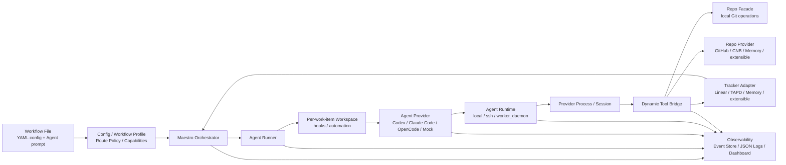

# Maestro

[](https://github.com/joosure/Maestro)
[](https://github.com/joosure/Maestro)
[](https://github.com/openai/symphony)

[English](./README.md) | [简体中文](./README.zh-CN.md) | [繁體中文](./README.zh-TW.md) | [日本語](./README.ja.md) | [한국어](./README.ko.md) | [Español](./README.es.md) | [Português (Brasil)](./README.pt-BR.md) | [Deutsch](./README.de.md) | [Français](./README.fr.md) | [Русский](./README.ru.md) | [Bahasa Indonesia](./README.id.md)

## 面向自治工程 Agent 的 Tracker 驱动控制平面。

Maestro 是一个面向工程团队的 Tracker 驱动 AI Agent 控制平面。它把工单系统、需求文档、代码仓库、Agent Provider、运行环境和交付证据连接起来，让 Codex、Claude Code、OpenCode 等 Coding Agent 可以从真实项目任务中自动接单、执行、提交和留痕。

它不是另一个 Coding Agent。

它要解决的是 Agent 进入团队生产环境之后真正困难的问题：任务从哪里来、由谁执行、跑在哪里、做到哪一步、结果是否可信、失败后如何恢复、交付过程如何审计。

> **Symphony 证明了工单可以驱动 Agent。Maestro 要构建的是一套真正可运营的 Agent 工程平台。**

---

## 为什么需要 Maestro

OpenAI Symphony 提出了一个关键理念：**管理工作，而不是管理一个个 Agent 会话**。

它证明了项目管理系统可以成为 Agent 执行工程任务的入口，而不是让工程师在一个个聊天窗口里手动监督 Agent。

Maestro 将这个模式继续向前推进。

它把原始的 `Linear + Codex` 参考实现，泛化为一个 **由 Tracker 驱动、对 Provider 中立、面向真实工程流程的 AI Agent 调度平台**。

换句话说，Maestro 想帮助团队完成这个转变：

```text
人工管理一个个 Agent 聊天会话
```

变成：

```text
由项目系统驱动的 Agent 工程平台
```

这不是语义差异，而是生产化差异。一次演示可以只依赖单个 Agent、单个 Issue 和单个仓库；真实团队需要调度、隔离、凭据、额度、审计、日志、评审、状态流转和失败恢复。

Maestro 就是为这种团队级、生产级使用场景设计的。

---

## Maestro 做什么

Maestro 编排一个 AI 工程任务的完整生命周期：

```text
Ticket / Story / Issue
        ↓
Workflow Profile
        ↓
Agent Provider
        ↓
Runtime / Workspace / Tool Bridge
        ↓
Repo / Pull Request / Review / Evidence
        ↓
Tracker State Update / Audit Trail
```

它把任务系统、Agent Provider、代码平台、运行环境和可观测性连接成一个统一的工程执行与运营层。

| 层级 | Maestro 提供的能力 |
| --- | --- |
| Tracker | Linear、TAPD、Memory，并可扩展 Jira、YouTrack、飞书项目、GitHub Issues 等 |
| Agent Provider | Codex、Claude Code、OpenCode，并可扩展未来 CLI Agent 或远端 Agent 服务 |
| Repo | provider-neutral 的 Git 操作，例如 clone、branch、commit、diff、push |
| Repo Provider | GitHub、CNB、Memory，并可扩展 GitLab、Gitea、Bitbucket、Gerrit 等 |
| Workflow | coding delivery、requirement analysis、refinement、review routing、triage 等可复用流程 |
| Runtime | local、SSH、Worker Daemon 等执行模式 |
| Tool Bridge | 面向 Agent 暴露 provider-neutral 的动态工具 |
| Governance | accounts、credential store、lease、quota polling、redaction、human gate |
| Observability | structured events、JSON logs、event store、dashboard drilldown、production evidence |

---

## Maestro 解决的问题

Coding Agent 已经越来越强，但强大的 Agent 并不会自动变成可靠的工程系统。

| 没有 Maestro | 使用 Maestro |
| --- | --- |
| Agent 工作散落在独立聊天会话中 | 工作从真实 Tracker 分发，并关联到真实 Issue / Story |
| 每个 Provider 都有自己的 session 形态 | 用统一生命周期 contract 包装不同 Provider |
| Agent 说“完成了”，但难以审计 | diff、PR、tool call、log、状态流转和 evidence 都可追踪 |
| 团队被单一 Tracker 或代码平台锁住 | Tracker 和 Repo Provider 都通过 Adapter 接入 |
| 流程逻辑写死在脚本里 | Workflow Profile 定义策略、状态、路由和交付物 |
| 凭据和额度管理分散 | accounts、lease、quota polling、redaction 进入平台治理 |
| 扩展执行能力依赖人工盯会话 | Worker Daemon 支持容量感知和运营控制 |

Maestro 的判断很简单：

> **未来不是某一个完美 Coding Agent 独自完成所有工作，而是团队拥有一套能够调度、追踪、治理多个 Agent 的工程运营体系。**

---

## 核心设计原则

### 1. Tracker 是任务入口

团队已经运行在项目管理系统之上。Maestro 不把任务藏进私有队列，而是让 Linear、TAPD、Memory 和未来更多 Tracker 成为 Agent 工作的调度入口。

### 2. Agent 是执行单元

Codex、Claude Code、OpenCode 和未来更多 Agent 都被视为可替换 Provider。Maestro 统一编排层真正需要的生命周期：创建 session、执行 turn、捕获 tool call、收集 evidence、感知 quota、清理运行状态。

### 3. Workflow Profile 承载业务意图

编码、需求分析、需求澄清、评审路由和任务分诊是不同流程。Maestro 将 profile 作为一等对象，定义什么时候 dispatch、什么时候 wait、什么时候 stop、需要什么 evidence、什么时候必须人工确认。

### 4. Evidence 优先于口头结果

Agent 说“完成了”不够。Maestro 关注的是可以审计的工程产物：branch、commit、diff、PR、review note、CI result、tracker comment、tool call、event 和 log。

### 5. Adapter 防止平台锁定

每个外部系统都通过 contract 接入。Orchestrator 不应该变成特定 provider 的分支逻辑堆叠。新的集成应该通过 adapter、contract test、smoke test 和 capability discovery 进入平台。

---

## 架构



### 主要边界

| 边界 | 职责 |
| --- | --- |
| `Workflow File` | 通过 YAML front matter 提供运行配置，并用 Markdown 正文提供 Agent prompt |
| `Workflow Profile` | 定义 route policy、capabilities、completion contract、停止条件和人工 gate |
| `Tracker Adapter` | 读取候选工作项、同步状态、写入评论、暴露 tracker typed tools |
| `Orchestrator` | polling、reconciliation、调度、重试、运行状态跟踪和终止清理 |
| `Agent Runner` | 为单个工作项创建 workspace、运行 hooks、启动并驱动 Agent session |
| `Workspace` | 隔离每个工作项的运行目录、workspace automation、仓库副本和本地证据 |
| `Agent Provider` | 启动、驱动、流式输出、停止和清理 Codex / Claude Code / OpenCode / Mock session |
| `Agent Runtime` | 将 provider 进程放置到 local、SSH 或 Worker Daemon，并解析 sandbox / executor context |
| `Repo` | provider-neutral 的本地 Git 操作：clone、branch、commit、diff、push |
| `Repo Provider` | GitHub、CNB、Memory 等代码平台能力：PR / MR、review、checks、merge、comments、status updates |
| `Dynamic Tool Bridge` | 将 Tracker、Repo 和 Repo Provider 能力聚合为 session-scoped provider-neutral tools |
| `Observability` | structured events、JSON logs、event store、redaction、dashboard、evidence、audit trail |

---

## Workflow Profiles

Maestro 不局限于“从 Issue 写代码”。它可以用同一套平台层编排多个工程流程。

| Profile | 目标 | 典型 Evidence |
| --- | --- | --- |
| `coding_pr_delivery` | 将工作项转化为代码变更和 PR | branch、commit、diff、PR、CI result、review note |
| `requirement_analysis` | 将需求转化为结构化分析 | scope、risk、impact、acceptance criteria、task breakdown |
| `requirement_refinement` | 在实现前识别模糊点 | clarification questions、blockers、assumptions、refined acceptance criteria |
| `review_routing` | 为需求或 PR 推荐合适 reviewer | reviewer suggestions、risk tags、checklist |
| `triage` | 对工作项进行分类和路由 | priority、owner、type、risk、next state |

Profile 是 Maestro 从自动化脚本走向平台的关键。它定义 Agent 应该做什么、不应该做什么、必须交付什么证据，以及什么时候应该交还给人。

---

## 配置形态示例

当前实现通过 workflow Markdown 文件的 YAML front matter 配置运行时，Markdown 正文作为 Agent prompt。下面是核心维度与当前字段位置的示意，不是完整可运行配置：

```yaml
workflow:
  profile:
    kind: coding_pr_delivery  # coding_pr_delivery | requirement_analysis | requirement_refinement | review_routing | triage
tracker:
  kind: linear                # linear | tapd | memory
repo:
  provider:
    kind: github              # github | cnb | memory
agent_provider:
  kind: codex                 # codex | claude_code | opencode | mock
agent_runtime:
  placement: local            # local | ssh | worker_daemon
```

这些维度可以独立组合。例如：

```text
TAPD + Claude Code + CNB + Worker Daemon + requirement_analysis
Linear + Codex + GitHub + Local Runtime + coding_pr_delivery
Memory + Mock Agent + Memory Repo Provider + Contract Tests
```

---

## 快速开始

克隆仓库：

```bash
git clone https://github.com/joosure/Maestro.git
cd Maestro
```

先准备仓库固定的 Erlang / Elixir 工具链。推荐使用 `mise`，版本由 `elixir/mise.toml` 固定：

```bash
cd elixir
mise trust
mise install
cd ..
```

安装依赖并运行测试。如果当前 shell 已激活 `mise` 工具链，可以直接使用 `make`：

```bash
make -C elixir deps
make -C elixir test
```

也可以从 `elixir/` 目录使用 `mise exec -- mix setup` 和 `mise exec -- mix test`。

### 快速体验 workflow template

构建 CLI，并从 `elixir/` 启动本地 memory/mock workflow：

```bash
make -C elixir build
cd elixir
./bin/symphony \
  --i-understand-that-this-will-be-running-without-the-usual-guardrails \
  --template memory/no_repo/mock \
  --port 4000
```

这会使用 `memory/no_repo/mock` template 启动服务，并在 `http://localhost:4000` 暴露可选 dashboard/API。它使用内存 Tracker、内存 repo provider 和 mock agent provider，不需要 Linear、GitHub、Codex、Claude Code、OpenCode 或 CNB 凭证。

如果要接入真实 Tracker、仓库和 agent runtime，先配置所需凭证，再切换 template：

```bash
export LINEAR_API_KEY=...
export LINEAR_PROJECT_SLUG=...
export SOURCE_REPO_URL=https://github.com/owner/repo.git
export SOURCE_REPO_BASE_BRANCH=main
export SOURCE_REPO_PROVIDER_REPOSITORY=owner/repo

command -v codex
gh auth status

./bin/symphony \
  --i-understand-that-this-will-be-running-without-the-usual-guardrails \
  --template linear/github/codex \
  --port 4000
```

`SOURCE_REPO_BRANCH_WORK_PREFIX` 和 `SOURCE_REPO_PROVIDER_REQUIRED_PR_LABEL` 是可选项。`SYMPHONY_WORKSPACE_ROOT` 在本地 quick start 中可以省略；接入真实 Tracker、真实仓库或进行完整流程验证前，建议显式设置到隔离的 workspace 根目录，避免工作区落在开发者本机路径中且难以清理。接入真实 Tracker 或仓库前，请先阅读 [workflow template aliases](./elixir/priv/workflow_templates/README.md) 和 [runtime configuration](./elixir/README.md)。

提交 PR 前，先运行和 CI 一致的本地门禁：

```bash
make -C elixir all
make -C elixir secret-scan
```

`make -C elixir secret-scan` 会通过 `scripts/secret-scan.sh` 运行
`gitleaks`、`trufflehog` 和 `detect-secrets`。CI 会在提交到 `main` 和 PR
时运行同一套扫描门禁。

本地实验建议按风险从低到高推进：

- 在需要无外部凭证验证编排流程时，配置 `tracker.kind: memory` 和 `repo.provider.kind: memory`。
- fake/simulated agent adapter 只通过 adapter registry 用于测试或扩展开发；当前内置 agent provider 是 `codex`、`claude_code` 和 `opencode`。
- memory 路径稳定后，再接入 Linear/TAPD、GitHub/CNB 或 destructive smoke tests。

> 对外品牌使用 **Maestro**。早期版本中，部分模块名、CLI 入口或环境变量可能仍沿用 `symphony` 命名；可以将其视为兼容命名，后续会随品牌和平台边界稳定逐步整理。

---

## 扩展模型

Maestro 倾向于通过 contract 扩展，而不是通过硬编码分支扩展。

### 新增 Tracker Adapter

需要实现：

- 拉取候选工作项；
- 读取标题、描述、标签、状态、负责人和 metadata；
- claim 或 lock 工作项；
- 写入评论和 evidence；
- 将特定 provider 的状态映射到 Maestro workflow model；
- 通过 contract tests 和 live smoke tests。

### 新增 Agent Provider

需要实现：

- 创建 session；
- 注入 prompt 和 context；
- 执行 turn；
- 流式输出事件；
- 捕获 tool call；
- 提取 evidence；
- 取消和清理；
- 报告 sandbox、tools、approval、quota、context window 等 capability。

### 新增 Repo Provider

需要实现：

- PR / MR 创建；
- review comments；
- checks 和 statuses；
- merge gates；
- branch protection 检测；
- evidence links；
- 幂等更新。

### 新增 Workflow Profile

需要定义：

- trigger states；
- dispatch policy；
- input context；
- agent instructions；
- allowed tools；
- required evidence；
- stop conditions；
- human approval gates；
- tracker transitions。

---

## 可观测性与 Evidence

Maestro 将可观测性视为产品能力，而不是事后补丁。

每次运行都应该能回答：

- 为什么 dispatch；
- 使用哪个 workflow profile；
- 选择了哪个 provider；
- 运行在哪个 runtime / worker；
- session 和 turn 的历史是什么；
- 调用了哪些 tool；
- stdout / stderr / structured event stream 是什么；
- workspace 和仓库发生了什么变化；
- 是否生成 PR、review 或其他交付物；
- Tracker 状态和评论如何变化；
- 日志是否经过 redaction；
- 最终 evidence summary 是什么。

这让 Maestro 不只是自动化工具，也能用于评估、排障、治理和生产 rollout。

---

## 项目状态

Maestro 正处于积极的平台化阶段。

适合用于：

- 研究 tracker-driven agent orchestration；
- 构建 adapter 原型；
- 验证 workflow profile；
- 运行 memory-provider 或本地测试闭环；
- 在受控环境下接入真实 provider。

在以下场景需要进一步生产加固：

- 无限制生产执行；
- destructive repository operations；
- 高权限凭据；
- 多租户 worker pool；
- 无人值守 merge 或 deploy 自动化。

基本原则是：

> **大胆自动化，谨慎加 gate，完整保留 evidence。**

---

## Maestro 适合谁

Maestro 适合：

- 正在评估 Codex、Claude Code、OpenCode 或未来 Coding Agent 的工程团队；
- 构建内部 AI 工程基础设施的平台团队；
- 设计 Agent Ops 工作流的 DevTools 团队；
- 希望让 Agent 基于现有 Tracker 工作的产品和研发组织；
- 研究 Agent 可靠性、证据链和编排体系的研究者；
- 希望建立结构化 Agent 贡献流程的开源维护者。

---

## 来源说明

Maestro 始于 [OpenAI Symphony](https://github.com/openai/symphony) 的 fork。原始 Symphony reference implementation 聚焦于 Linear 驱动的 Codex 编排。Maestro 将这一思路扩展为覆盖 Tracker、Agent Provider、Repo Provider、Workflow Profile、Runtime、Tool Bridge 和 Evidence 的平台架构。

---

## 仓库

- GitHub: <https://github.com/joosure/Maestro>
- Origin project: <https://github.com/openai/symphony>

---

## License

Maestro 使用 GNU Affero General Public License version 3 (AGPL-3.0-only) 授权。源自 OpenAI Symphony 的部分保留 Apache-2.0 署名和 notice 要求。使用或分发 Maestro 前，请检查 `LICENSE`、`NOTICE`、`LICENSES/Apache-2.0.txt`、`MODIFICATIONS.md`、`SOURCE.md` 和 `THIRD_PARTY_LICENSES.md`。
