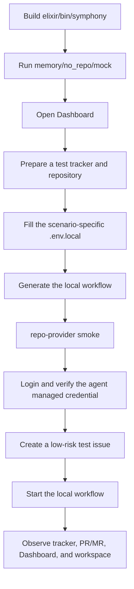

# Newcomer End-to-End Run Guide

This guide is for newcomers running Maestro / Symphony Elixir Runtime for the first time. Follow it step by step to:

1. Run `memory/no_repo/mock` locally without external dependencies and see the Dashboard.
2. Run a real `TAPD + CNB + CodeBuddy Code` workflow.
3. Run a real `Linear + GitHub + OpenCode` workflow.

> The current product name is **Maestro**, but specific CLI, module names, and environment variables remain `symphony` / `SYMPHONY_*` compatible naming. Please continue to use these actual names when running commands.

> Prefer Docker/Compose instead of a local Elixir toolchain? Use the [Container Deployment Guide](../../../docs/deployment/container.md). It runs the same mock and real workflow families, but uses repository-root `.env` and Compose profiles; container paths with `credential_ref` run managed credential login + verify automatically before serving instead of requiring the local `mise exec ./bin/symphony accounts ...` steps first.

## Who should use this guide?

Use this guide if you want to run the project locally and see a realistic end-to-end result. Maestro has real onboarding complexity because:

- It is not a single CLI demo. It is a control plane that connects a tracker, code repository, agent provider, workspace automation, PR/MR provider, and Dashboard.
- The real process requires multiple external system credentials: TAPD/Linear, CNB/GitHub, CodeBuddy Code/OpenCode.
- A real workflow performs real clone, branch, push, PR/MR, tracker state transition, and comment writes. Do not run it before permissions and scope are clear.
- TAPD's raw status, Linear status name, repository default branch, PR/MR permissions, Agent credentials, and local CLI availability will all affect the startup results.

Therefore, it is recommended that newcomers advance in the order of "low-risk mock -> real read-only/smoke test -> real work items".

If you're not sure which path to start with, start by choosing one of the following:

| Goal | Where to go | External systems needed |
| --- | --- | --- |
| See the Dashboard and orchestration behavior first | Section 2 `memory/no_repo/mock` | No |
| Use TAPD + CNB and verify CodeBuddy Code | Section 4 Option 1 | Yes: TAPD, CNB, CodeBuddy Code |
| Use Linear + GitHub and verify OpenCode | Section 5 Option 2 | Yes: Linear, GitHub, OpenCode |

During the first real verification, choose only one path to run through, and do not mix TAPD/CNB environment variables with Linear/GitHub environment variables.

## 0. Risk and Permission Boundaries

A real workflow is trusted runtime configuration and may perform these write operations:

- Modify TAPD / Linear ticket status and comments.
- Clone the target repository and create a working branch.
- Push the branch to CNB/GitHub.
- Create or update PR/MR.
- Execute land/merge flow when approval conditions are met.
- Start the local Agent CLI and expose dynamic tools to the Agent.

Strongly recommended:

- Use dedicated test projects, test workspaces, test repositories, and low-privilege tokens.
- Point the workflow's `workspace.root` to an isolated directory. Both recommended workflows use the common variable `SYMPHONY_WORKSPACE_ROOT`.
- The first real ticket only makes small documentation or test file changes.
- Do not use a high-privilege personal account for destructive workflow runs.

## 1. Local Prerequisites

### 1.1 Install Required Tools

Required:

- `git`
- `bash`
- [mise](https://mise.jdx.dev/)
- Elixir/Erlang: Install via `mise.toml` in the repository

Real repository providers also require:

- GitHub: `gh` CLI and complete `gh auth login` or configure `GH_TOKEN` / `GITHUB_TOKEN`
- CNB: `CNB_TOKEN` with access to the target repository

Agent providers also require:

- CodeBuddy Code: locally executable `codebuddy`
- OpenCode: locally executable `opencode`

### 1.2 Clone, install dependencies, and build CLI

```bash
git clone https://github.com/joosure/Maestro.git maestro
cd maestro/elixir

mise trust
mise install
mise exec -- mix setup
mise exec -- mix build
```

After a successful build, the CLI is located at:

```text
elixir/bin/symphony
```

You can confirm first:

```bash
mise exec -- ./bin/symphony --help
```

> Note: When the real workflow is running, Maestro will copy a set of automation scripts to the workspace of each issue. These scripts may need to call the `symphony` CLI again when performing operations such as clone, branch, commit, push, and creating PR/MR. Newcomers usually do not need additional configuration when running locally; if they later encounter a script prompt that `symphony` cannot be found, choose one of the following methods: add `elixir/bin` to `PATH`, or set `SYMPHONY_CLI` to point to `elixir/bin/symphony` in the current repository.

## 2. Run Mock First to See the Dashboard

This step does not require Linear, TAPD, GitHub, CNB, CodeBuddy, OpenCode or model tokens.

```bash
cd maestro/elixir

mise exec -- ./bin/symphony \
  --i-understand-that-this-will-be-running-without-the-usual-guardrails \
  --template memory/no_repo/mock \
  --port 4000
```

Open:

```text
http://localhost:4000
```

You should see the Dashboard. Similar output will also appear in the terminal:

```text
Dashboard: http://127.0.0.1:4000/
MEM-1 [classifying]
Local memory/mock workflow completed one ...
```

You can also use the API to do a quick confirmation:

```text
http://localhost:4000/api/v1/state
```

If JSON is returned and fields such as `mock`, `memory`, `MEM-1` or `recent_events` can be seen, it means that the local mock workflow is already running. After verification, press `Ctrl+C` to stop the service and release the `4000` port.

This process uses:

| Dimensions | value |
| --- | --- |
| tracker | `memory` |
| Repo Provider | `memory` |
| agent provider | `mock` |
| Template | `memory/no_repo/mock` |

If this step fails to start, do not connect to the real system yet and check first:

- `mise install` was successful.
- `mise exec -- mix build` generated the `bin/symphony.escript` payload used by `bin/symphony`.
- Port `4000` is not already occupied.

## 3. Common Preparation for Real Workflows

### 3.1 Prepare an Isolated Workspace

It is recommended that each set of integrations use an independent workspace root:

```bash
mkdir -p "$HOME/maestro-workspaces/tapd-cnb-codebuddy"
mkdir -p "$HOME/maestro-workspaces/linear-github-opencode"
```

The workspace stores each issue's runtime directory, copied automation scripts, cloned target repository, and runtime evidence.

### 3.2 Prepare a Test Repository

It is recommended that the test repository meets:

- You have the permissions to clone, push, and create PR/MR.
- The default branch is explicit, such as `main`.
- CI will not perform high-risk deployments.
- The first test task only changes the README or adds a small file.

### 3.3 Core Terms Quick Reference

| Term | Newcomer-friendly meaning |
| --- | --- |
| `workflow` | A local runtime configuration describing how the tracker, repository, agent, state transitions, and automation policy are combined |
| `template` | A reusable workflow template in the repository; initialization scripts generate your local workflow from it |
| `workspace root` | The local root directory where each issue gets an isolated workspace and target repository clone |
| `managed credential` | Agent API key/token hosted locally by Maestro; workflow only references the credential id and does not directly write the key |
| `repo-provider smoke` | Minimal authentication check of the repository platform; by default, it only verifies that the token is available, no clone, no push, no PR creation |
| `raw status` | Internal status value returned by TAPD/Linear API; newcomers usually only need to look at the page status name, which is converted by the initialization script |
| `route policy` | Workflow rules that decide whether a state should dispatch implementation, wait for review, merge, or finish |
| `change proposal reconciliation` | Background review-stage processing that checks whether the associated PR/MR satisfies checks, mergeability, and other gates |
| `gate` | Conditions that must be met before automatic transition, such as PR checks passed, PR can be merged, approval required, etc. |

### 3.4 Pre-run checklist

This table only helps you confirm whether the external system entry points are ready before starting a real integration. You do not need to memorize every configuration name here; Sections 4 and 5 show exactly where to fill them in.

| You need to confirm first | why needed | How to verify |
| --- | --- | --- |
| The issue system can be accessed | Maestro needs to read issues, change status, and write comments | The initialization script can connect to TAPD / Linear and identify test projects |
| The code repository can be accessed | Maestro needs to clone, push, and create PR/MR | Run repo-provider smoke first, or at least confirm that this machine can clone/push the test repository |
| Agent CLI executable | The real code implementation is done by the local Agent CLI | `codebuddy --version` or `opencode --version` prints a version |
| Agent credentials logged in | Agent runtime requires model/API credentials | `accounts login` was executed once, `accounts verify` passed |
| Workspace root writable | Each issue will create an isolation directory and clone repository here | The directory exists and is writable; it is recommended to put it in `$HOME/maestro-workspaces/...` |
| Local workflow has been generated | When the main service starts, it needs to read this local runtime configuration. | The initialization script generates `quickstart/WORKFLOW.*.local.md`, and the main service startup also uses the same file. |

For the two supported paths, the actual configuration names are:

- TAPD + CNB + CodeBuddy Code: `TAPD_API_USER`, `TAPD_API_PASSWORD`, `TAPD_WORKSPACE_ID`, `CNB_TOKEN`, `SOURCE_REPO_URL`, `SYMPHONY_WORKSPACE_ROOT`, and `CODEBUDDY_API_KEY` used when logging into CodeBuddy for the first time.
- Linear + GitHub + OpenCode: `LINEAR_API_KEY`, `LINEAR_PROJECT_SLUG`, `SOURCE_REPO_URL`, `SYMPHONY_WORKSPACE_ROOT`, `ZAI_API_KEY`. GitHub recommends using `gh auth login` first.

Workspace root is a local directory, not a remote platform concept. Newcomers should use the directories shown in this guide and write them into the scenario-specific `.env.*.local` file:

```env
SYMPHONY_WORKSPACE_ROOT="$HOME/maestro-workspaces/tapd-cnb-codebuddy"
# Or use this for the Linear scenario:
SYMPHONY_WORKSPACE_ROOT="$HOME/maestro-workspaces/linear-github-opencode"
```

### 3.5 Recommended path to get started



## 4. Option 1: TAPD + CNB + CodeBuddy Code

### 4.1 Expected Result

After startup, Maestro will:

1. Poll the Story/work items in active status in the TAPD workspace.
2. Dispatch work items that match the route policy to CodeBuddy Code.
3. Clone the CNB repository to `repo/` in the isolated workspace.
4. Perform tasks with CodeBuddy Code.
5. Use dynamic tools to update TAPD workpad/comment, create branches, commits, push, and create or update CNB MR/PR.
6. Display issues, sessions, events and evidence in Dashboard.

### 4.2 Prepare TAPD page status

Prepare a low-risk test space/test project in TAPD first; do not start directly in a production space. To run the `coding_pr_delivery` flow recommended by this guide, newcomers should first create or select a dedicated Story/requirement type in that test space and configure a fixed workflow.

This TAPD workflow needs to cover the state semantics used by Maestro `coding_pr_delivery`. Newcomers are advised to directly configure the following fixed TAPD page status names, and leave the internal mapping to the initialization script for processing:

| TAPD page status | Understandable meaning for newcomers | What would Maestro do? |
| --- | --- | --- |
| 需求池 | Backlog/Candidate Pool/Unscheduled | Manual triage stage; Maestro does not automatically scan or modify |
| 待开发 | Confirmed to be queued and ready to enter development | Maestro will prepare to enter `开发中` after polling |
| 开发中 | In development | Maestro will dispatch CodeBuddy Code |
| 评审中 | Manual review/waiting for PR to meet merge conditions | Maestro does not dispatch new implementation tasks; it will automatically check the associated PR and transition to `合并中` after satisfying the gate. |
| 合并中 | Prepare to merge/publish | Maestro executes the land/merge flow and transitions to `已完成` after a successful merge |
| 返工 | Rework | Maestro dispatches CodeBuddy Code again |
| 已完成 | Done | End of process |
| 已拒绝 | 已拒绝 | The workflow is complete and Maestro will not dispatch it again. |

The Quickstart path must be configured with these flows. `需求池` is the manual entry, and `待开发` means that the manual entry has been confirmed and can be handed over to Maestro:

```text
需求池 -> 待开发 -> 开发中 -> 评审中 -> 合并中 -> 已完成
评审中 -> 返工 -> 评审中
评审中 -> 已拒绝
合并中 -> 返工
```

Important: `需求池` is not part of Maestro's automatic scan range. Maestro only takes over after a human moves the requirement to `待开发`. After the issue enters `评审中`, Maestro stops dispatching implementation work and instead uses change proposal reconciliation to check the associated CNB PR. When PR checks pass, the PR is mergeable, and the configured workflow gates are satisfied, Maestro automatically transitions the issue to `合并中`, runs the merge flow, and finally transitions it to `已完成`. TAPD APIs and Maestro workflow files use internal status values; the initialization script handles that mapping, so newcomers do not need to look them up manually.

In other words, newcomers only need to configure the status display names and transitions in TAPD. After `../scripts/tapd-workflow-init` runs, it reads TAPD API status information and converts the page display names into the values required by the local Maestro workflow. You do not need to query or fill in those internal values manually.

Also configure the recommended transitions on the TAPD process/workflow configuration page; do not only create the status display names. The quickstart path requires status display names to exactly match the table above, and the recommended transitions must be allowed between those statuses. Otherwise, `../scripts/tapd-workflow-init` reports an error and asks you to fix the TAPD workflow configuration. `需求池` is the manual entry point and is not scanned automatically by Maestro; `待开发` is the entry point for Maestro's automated loop.

### 4.3 Fill in `.env.tapd.local`

Once your TAPD test workflow is ready, save connection information and secrets in a scenario-specific local env file. This avoids writing secrets into shell history and prevents the TAPD/CNB and Linear/GitHub workflows from overwriting each other's shared variables. The repository provides a committable template file, `.env.example`, which lists common environment variables but does not contain real secrets. While still in the `elixir/` directory, create the TAPD local env file if it does not already exist:

```bash
[ -f .env.tapd.local ] || cp .env.example .env.tapd.local
# Then edit .env.tapd.local; only fill variables needed for TAPD + CNB + CodeBuddy Code.
```

This guide recommends splitting local env files by scenario: use `.env.tapd.local` for TAPD/CNB/CodeBuddy Code and `.env.linear.local` for Linear/GitHub/OpenCode. This keeps shared variable names such as `SOURCE_REPO_URL`, `SOURCE_REPO_PROVIDER_REPOSITORY`, `SOURCE_REPO_BASE_BRANCH`, `SOURCE_REPO_BRANCH_WORK_PREFIX`, and `SYMPHONY_WORKSPACE_ROOT` from being mixed in one file, which makes copy-and-run quickstart commands clearer for newcomers.

This process recommends filling in `.env.tapd.local` with environment variables that will be reused later. Contains at least the required fields for TAPD, CNB, workspace, and submission identity:

```env
TAPD_API_USER="<tapd api user>"
TAPD_API_PASSWORD="<tapd api password>"
TAPD_WORKSPACE_ID="<tapd workspace id>"

CNB_TOKEN="<cnb token>"
SOURCE_REPO_URL="https://cnb.cool/<org>/<team>/<repo>"
SYMPHONY_WORKSPACE_ROOT="$HOME/maestro-workspaces/tapd-cnb-codebuddy"

CNB_GIT_USER_NAME="Maestro CNB"
CNB_GIT_USER_EMAIL="maestro-cnb@example.invalid"
```

Optional settings:

```env
# TAPD comment author; defaults to the authenticated API user when unset.
TAPD_COMMENT_AUTHOR="<display name or api user>"

# Set this only when the target repository default branch is not main.
SOURCE_REPO_BASE_BRANCH="main"

# Usually inferred from SOURCE_REPO_URL; set only when you need an override.
SOURCE_REPO_PROVIDER_REPOSITORY="<org>/<team>/<repo>"

# Work branch prefix; when unset, the runtime default is used.
SOURCE_REPO_BRANCH_WORK_PREFIX="maestro/"

# Needed only for the first 4.6 accounts login; not needed after login/verify succeeds.
CODEBUDDY_API_KEY="<codebuddy api key>"
```

`.env.example` should be submitted to git to facilitate subsequent maintenance of the environment variable list; `.env.tapd.local` is a personal local key file and will be ignored by the `.env.*` rule in `elixir/.gitignore`, so do not submit it.

### 4.4 Generate TAPD local workflow

The most common pitfall of TAPD is the "status value": the raw status of different workspaces/requirement types may be different, some are in English, and some are numbers generated by the platform. These values ​​​​are not friendly to newcomers, and it is not recommended to understand them manually at the beginning.

The newcomer path only needs to run the initialization script once. It reads `.env.tapd.local`, checks the TAPD status configuration, and generates the local workflow file used by the main service. If you are still in the `elixir/` directory you entered earlier, run:

```bash
../scripts/tapd-workflow-init \
  --env-file ./.env.tapd.local \
  --template tapd/cnb/codebuddy_code \
  --output ./quickstart/WORKFLOW.tapd-cnb-codebuddy.local.md
```

On success, you get `./quickstart/WORKFLOW.tapd-cnb-codebuddy.local.md`. On failure, follow the error message and return to the TAPD process/workflow configuration page to fix the status name, Story type, or transition relationship.

For the newcomer quickstart, the generated local workflow disables the PR approval gate (`workflow.reconciliation.change_proposal.gates.approval_required: false`) so the first smoke Story can move through the full automated loop once checks and mergeability are ready. Built-in templates stay conservative for reusable workflows. When using this path against a real production repository, regenerate with `--require-pr-approval` or set that gate back to `true`.

The first run only requires confirmation that the file has been generated and will be used when starting the main service in the next step. Details of internal state mapping are left in Section 7.5 as advanced troubleshooting items; see Section 8.2 for script parameters and manual template paths.

### 4.5 Prepare CNB

Section 4.3 already requires that CNB and repository variables be written to `.env.tapd.local`. Here we mainly confirm the token permissions and repository URL format. `SOURCE_REPO_URL` should be the HTTP(S) CNB repository URL, such as `https://cnb.cool/<org>/<team>/<repo>`; CNB addresses usually do not have `.git`, and HTTPS clone URLs with `.git` can also be logically compatible with repository path derivation. Do not fill in the SSH address when using CNB token auth. When starting, the hook will configure git extraHeader with `CNB_TOKEN` to support clone and subsequent push; CNB repo-provider typed tools will also use the same token to query, create or update PR/MR, and read the check results.

When creating a CNB token, grant the following permissions:

| Permission | Recommendation | Purpose |
| --- | --- | --- |
| `repo-code:rw` | Required | Clone / fetch the target repository and push the working branch created by Maestro |
| `repo-pr:rw` | Required | Query, create, and update PR/MR; automatic merge also relies on PR/MR write permission and repository merge permission |
| `repo-notes:rw` | Required | Read and write PR/MR comments for processing review comments or recording automated information |
| `repo-commit-status:r` | Required | Read commit status/checks to determine PR/MR check results |
| `repo-cnb-detail:r` | Required | Read CNB repository/build related details |
| `repo-cnb-history:r` | Required | Read CNB build/pipeline history |
| `account-profile:r` | Required | Read the current token account information for authentication/smoke/audit information confirmation |
| `repo-cnb-trigger:rw` | Optional | Grant only when you need to trigger or rerun CNB builds/pipelines |
| `repo-issue:r` | Optional | Grant only when repo-provider smoke or extended capabilities need to read CNB issues |

You can run repo-provider smoke first. `./bin/symphony` itself does not accept `--env-file`. If `CNB_TOKEN` is in `.env.tapd.local`, load that file into the current shell first. The smoke command calls CNB `/user` to verify that the token works. By default, it does not clone, push, or create PR/MR:

```bash
set -a
. ./.env.tapd.local
set +a

mise exec -- ./bin/symphony repo-provider smoke \
  --provider cnb \
  --json
```


### 4.6 Prepare CodeBuddy Code managed credential

Confirm that the CLI is available:

```bash
codebuddy --version
```

Log in to the Maestro managed credential store. The managed credential here is the Agent credential hosted locally by Maestro: write the CodeBuddy API key into Maestro's credential storage, and then temporarily materialize it into the environment variables required by CodeBuddy when running the agent to avoid writing the model/API key directly into workflow YAML.

By default, the template looks for a CodeBuddy credential named `default`. Newcomers do not need to change the workflow; run the command below once to log in to `default`.

If this is the first time to log in to CodeBuddy managed credential, and `CODEBUDDY_API_KEY` has been written to `.env.tapd.local`, load the current shell first:

```bash
set -a
. ./.env.tapd.local
set +a
```

Then log in once and write the CodeBuddy API key to the Maestro local credential store. When the main service runs the agent later, it will read this `default` credential; after successful login and verify, there is no need to continue to fill in or load `CODEBUDDY_API_KEY` when starting the main service.

```bash
# Run only for the first login; skip if accounts verify already passes.
mise exec -- ./bin/symphony accounts login codebuddy_code default \
  --internet-environment public \
  --token-env CODEBUDDY_API_KEY \
  ./quickstart/WORKFLOW.tapd-cnb-codebuddy.local.md
```

Optional but recommended: Verify that the local credentials and the `codebuddy` CLI are available.

```bash
mise exec -- ./bin/symphony accounts verify codebuddy_code default \
  ./quickstart/WORKFLOW.tapd-cnb-codebuddy.local.md
```

If your CodeBuddy account requires an intranet or IOA environment, change `--internet-environment public` to `internal` or `ioa` when logging in; keep `public` when in doubt.

The CodeBuddy Code workflow generated by this quickstart explicitly configures `model: glm-5.1`. You should see a similar configuration under `agent_provider.options` in `./quickstart/WORKFLOW.tapd-cnb-codebuddy.local.md`:

```yaml
agent_provider:
  kind: codebuddy_code
  options:
    command_argv: ["codebuddy"]
    model: glm-5.1
    credential_ref: "credential://codebuddy_code/default"
```

After Maestro starts a CodeBuddy session, it will read the model facts returned by the provider and check whether the configured model is consistent with the actual session model; if not, a clear model mismatch error will be reported. This is not to hardcode CodeBuddy's full support model in the document, but to align the expected model of this quickstart with the actual model at runtime.

### 4.7 Start TAPD + CNB + CodeBuddy Code

Before starting, confirm that Section 4.6 `accounts login codebuddy_code default` has succeeded at least once. The main service may not call CodeBuddy immediately at startup, but when an agent is later dispatched, it looks for this `default` credential from the workflow; if it is missing, agent startup fails.

`./bin/symphony` reads the current process environment variable and does not directly receive `--env-file`. If you have just loaded `.env.tapd.local` in the same shell, there is no need to repeat it; if you open a new terminal, load it once:

```bash
set -a
. ./.env.tapd.local
set +a
```

The newcomer's main path is started using the local workflow file generated in Section 4.4:

```bash
mise exec -- ./bin/symphony \
  --i-understand-that-this-will-be-running-without-the-usual-guardrails \
  ./quickstart/WORKFLOW.tapd-cnb-codebuddy.local.md \
  --port 4000
```

> NOTE: The last parameter in the `accounts login` / `accounts verify` commands also recommends using this local workflow file. In this way, the credential store written by the account is the same set of configurations read when the main service is running.

### 4.8 TAPD Test Story Suggestion

Create a low-risk TAPD Story, such as:

```text
Title: Verify the Maestro CodeBuddy flow: add a smoke document
Description:
Add docs/maestro-smoke.md to the repository with one line: "Maestro smoke test".
Acceptance:
- Create an isolated branch
- Commit the change
- Create a CNB MR/PR
- Record the execution summary and verification result in the TAPD workpad
```

Put the status to `待开发` on the TAPD page. The initialization script will map `待开发` to the raw status used internally by the workflow; newcomers do not need to manually fill in the internal status value returned by the TAPD API. After polling, Maestro will switch the issue to `开发中` and dispatch according to the configuration.

## 5. Option 2: Linear + GitHub + OpenCode

### 5.1 Expected Result

After startup, Maestro handles a Linear issue in this sequence:

1. Poll the active issues in the specified Linear project: `Todo` / `In Progress` / `Merging`.
2. If the issue is still `Todo`, it will automatically switch to `In Progress` first, indicating that it will enter unattended execution.
3. Create an isolation workspace for this issue, and clone the target GitHub repository to `repo/` under the workspace.
4. Start the OpenCode server, send each turn through OpenCode's synchronous `/session/:id/message` endpoint, and use SSE only for runtime events such as permissions, progress and errors while OpenCode works in `repo/`.
5. Continuously update the same Linear workpad through dynamic tools to record plans, progress, verification results and blocking reasons.
6. Create working branches, commits, pushes, and create or update GitHub PRs.
7. When the issue reaches `In Review`, it is handed over to manual review. After approval, a human moves it to `Merging`, and Maestro runs the merge/land flow. Unlike the TAPD quickstart in Section 4, this Linear quickstart does not demonstrate automatic advancement from `In Review` to `Merging` by default.
8. Display issue, session, turn, event and workspace evidence in Dashboard.

### 5.2 Prepare Linear local configuration

First prepare a low-risk test workspace/team/project in Linear. Do not start directly in a production project. To run the `coding_pr_delivery` flow recommended by this guide, newcomers should first make sure the test Team workflow covers the following state semantics.

Linear's built-in template uses English status names by default; newcomers are advised to configure according to the following table to avoid modifying workflow YAML at the beginning:

| Linear status | Understandable meaning for newcomers | What would Maestro do? |
| --- | --- | --- |
| `Backlog` | Candidate Pool/Unscheduled | Not automatically processed; manual confirmation is required before moving to `Todo` |
| `Todo` | Queued for processing | After Maestro polls, it will first switch to `In Progress` |
| `In Progress` | In development | Maestro dispatches OpenCode |
| `In Review` | Manual review/awaiting confirmation | Maestro does not dispatch new implementation tasks; this Linear quickstart does not automatically advance to `Merging`, so a human must move it after review approval |
| `Merging` | Ready to merge | Maestro can execute the land/merge flow |
| `Done` | Done | End of process |
| `Canceled` / `Duplicate` and other cancellation terminal states | Terminal states such as canceled or duplicate; use whichever exists in your Team | The workflow is complete and Maestro will not dispatch it again. |

The Quickstart path only needs to run through one main line:

```text
Backlog -> Todo -> In Progress -> In Review -> Merging -> Done
Todo/In Progress/In Review/Merging -> Canceled/Duplicate and other cancellation terminal states
```

`Backlog` is listed deliberately, but it is not handed over to Maestro for automatic processing. `Backlog` represents a candidate task that has not yet been approved for automated execution. The template requires Maestro not to modify it; Maestro only takes over after a human moves the issue from `Backlog` to `Todo`. In other words, newcomers should confirm two things in the Linear UI: first, the Team workflow has the mainline states `Backlog`, `Todo`, `In Progress`, `In Review`, `Merging`, and `Done`; second, the workflow allows the mainline transitions. `Canceled` / `Duplicate` are cancellation terminal states. The script warns when they are missing, but Quickstart does not require both to exist. `../scripts/linear-workflow-init` automatically reads and checks the status names from the Team associated with the project.

After preparing the Linear test project, while still in the `elixir/` directory, use the Linear-specific local env file `.env.linear.local`. If you have not created it before, copy it from `.env.example` first. This file contains only local secrets and variables for the Linear/GitHub/OpenCode workflow, is ignored by the `.env.*` rule, and should not be committed:

```bash
[ -f .env.linear.local ] || cp .env.example .env.linear.local
# Then edit .env.linear.local; do not share one env file with the TAPD/CNB workflow.
```

If you have written `.env.tapd.local` for the TAPD/CNB process, do not append Linear/GitHub/OpenCode variables to it. The two workflows share variable names such as `SOURCE_REPO_URL`, `SOURCE_REPO_PROVIDER_REPOSITORY`, `SOURCE_REPO_BASE_BRANCH`, `SOURCE_REPO_BRANCH_WORK_PREFIX`, and `SYMPHONY_WORKSPACE_ROOT`. Keeping them in one file makes scenario switching confusing; newcomers should keep them separated as `.env.tapd.local` and `.env.linear.local`.

When using the `gh` keyring, this process must at least fill in:

```env
LINEAR_API_KEY="<linear api key>"
# Copy the full slug after /project/ from the Linear Project page URL; see the example below.
LINEAR_PROJECT_SLUG="<linear project slug>"

SOURCE_REPO_URL="https://github.com/<owner>/<repo>.git"
SYMPHONY_WORKSPACE_ROOT="$HOME/maestro-workspaces/linear-github-opencode"

# The default OpenCode example uses the Zhipu/ZAI GLM model; the variable name must match what the OpenCode provider reads.
ZAI_API_KEY="<zai api key>"
```

`LINEAR_PROJECT_SLUG` is the URL slug of the Linear project, not the team key, nor the issue number. Open `Projects` on the left side of Linear, enter your test project, and copy the complete part after `/project/` in the browser address. For example:

```text
https://linear.app/acme/project/maestro-smoke-test-1a2b3c4d
```

Fill in the corresponding:

```env
LINEAR_PROJECT_SLUG="maestro-smoke-test-1a2b3c4d"
```

Optional settings:

```env
# Set this only when the target repository default branch is not main.
SOURCE_REPO_BASE_BRANCH="main"

# Usually inferred from SOURCE_REPO_URL; set only when you need an override.
SOURCE_REPO_PROVIDER_REPOSITORY="<owner>/<repo>"

# Work branch prefix; when unset, the runtime default is used.
SOURCE_REPO_BRANCH_WORK_PREFIX="maestro/"

# Set this only when PRs must have a specific label; otherwise omit it or leave it empty.
SOURCE_REPO_PROVIDER_REQUIRED_PR_LABEL=""
```

If the status name used by your Linear Team is different from the one in the above table, it is recommended to change the status of the test team to the name in the above table when connecting for the first time to ensure that the end-to-end process can run through first. After the process runs through, copy the generated local workflow file and adjust it according to your actual status; see Section 8.3 for advanced field descriptions.

The repository also provides an independent one-time initialization script to reduce manual verification work for newcomers. It reads `.env.linear.local`, checks the Linear project and status configuration, and generates the local workflow file used by the main service. By default, the generated workflow uses the OpenCode ZAI credential described in Section 5.4 and does not require the Team to create a separate `Rework` status.

If you are still in the `elixir/` directory, run:

```bash
../scripts/linear-workflow-init \
  --env-file ./.env.linear.local \
  --template linear/github/opencode \
  --output ./quickstart/WORKFLOW.linear-github-opencode.local.md
```

On success, you get `./quickstart/WORKFLOW.linear-github-opencode.local.md`. On failure, follow the error message and return to the Linear Team workflow settings page to fix the status name, project, or permissions. The script does not modify the Linear workflow by default.

The first run only requires confirmation of this: the file has been generated, and both the OpenCode credential login / verify in Section 5.4 and the main service startup in Section 5.5 are using the same local workflow file. See Section 8.3 for advanced parameters and manual adjustment methods.

### 5.3 Prepare GitHub

It is recommended that newcomers use the `gh` keyring for their main path and do not write the GitHub token into `.env.linear.local`:

```bash
# Option A: recommended for newcomers on a local machine: use the gh keyring.
command -v gh
gh auth login
gh auth status
```

If `gh auth login` cannot be used, write the GitHub Personal Access Token into `.env.linear.local`:

```env
GH_TOKEN="<github personal access token>"
# Or
GITHUB_TOKEN="<github personal access token>"
```

Just fill in one of `GH_TOKEN` and `GITHUB_TOKEN`; for local development, it is recommended to use `GH_TOKEN` first to avoid confusion with `GITHUB_TOKEN` agreed with other tools.

Common paths to obtain tokens:

- Fine-grained token: avatar in the upper right corner of GitHub → `Settings` → `Developer settings` → `Personal access tokens` → `Fine-grained tokens` → `Generate new token`.
- Classic token: avatar in the upper right corner of GitHub → `Settings` → `Developer settings` → `Personal access tokens` → `Tokens (classic)` → `Generate new token`.

It is recommended to check and confirm GitHub token permissions in advance:

- classic token: Private repositories usually require `repo` scope; if a public repository only operates public repo, `public_repo` can be used, but it is easier for newcomers to use `repo` to get through.
- fine-grained token：
  - Repository access: Select only the target repository.
  - Contents: `Read and write`, used for repository write operations such as pushing branches after cloning and creating commit references.
  - Pull requests: `Read and write` to create or update a PR.
  - Metadata: `Read-only`, required by GitHub by default.
  - Commit statuses:`Read-only`, used to read status check/commit status.
  - Checks:`Read-only`, used to read GitHub Checks.
  - Issues: If `SOURCE_REPO_PROVIDER_REQUIRED_PR_LABEL` is configured, set it to `Read and write`, because the GitHub PR label has the issue label capability; it usually does not need to be granted if the PR label is not changed.

You can do repo-provider smoke first. This command will read the GitHub login status or `GH_TOKEN` / `GITHUB_TOKEN` in the current shell. By default, it only performs authentication detection and does not clone, push or create PR:

```bash
set -a
. ./.env.linear.local
set +a

mise exec -- ./bin/symphony repo-provider smoke \
  --provider github \
  --json
```

### 5.4 Prepare OpenCode managed credential

Confirm that the CLI is available:

```bash
opencode --version
```

Newcomers should first run the default built-in template model: `zai-coding-plan/glm-5.1`, the GLM model used by the OpenCode Zhipu/ZAI example. If you ran `../scripts/linear-workflow-init` in Section 5.2, it generated `./quickstart/WORKFLOW.linear-github-opencode.local.md` and automatically added `credential_ref: "credential://opencode/zai"`.

You should see a configuration similar to the following under `agent_provider.options` in `./quickstart/WORKFLOW.linear-github-opencode.local.md`. This snippet is only for confirming the generated result; newcomers do not need to edit it manually:

```yaml
agent_provider:
  kind: opencode
  options:
    command_argv: ["opencode", "serve", "--hostname", "127.0.0.1", "--port", "0"]
    agent: build
    model: zai-coding-plan/glm-5.1
    credential_ref: "credential://opencode/zai"
    read_timeout_ms: 120000
    turn_timeout_ms: 600000
    stall_timeout_ms: 300000
```

If this is the first time to log in to OpenCode managed credential, and `ZAI_API_KEY` has been written to `.env.linear.local`, load the current shell first:

```bash
set -a
. ./.env.linear.local
set +a
```

Then log in once and write the ZAI token to the Maestro local credential store. When the main service runs OpenCode later, it will read this `zai` credential; after successful login and verify, there is no need to continue to fill in or load `ZAI_API_KEY` when starting the main service.

```bash
mise exec -- ./bin/symphony accounts login opencode zai \
  --env-name ZAI_API_KEY \
  --token-env ZAI_API_KEY \
  ./quickstart/WORKFLOW.linear-github-opencode.local.md
```

Optional but recommended: Verify that the local credentials and the `opencode` CLI are available.

```bash
mise exec -- ./bin/symphony accounts verify opencode zai \
  ./quickstart/WORKFLOW.linear-github-opencode.local.md
```

If you do not use Zhipu/ZAI and instead use OpenRouter, Anthropic, or Google, run the default ZAI path first and change it afterward. Section 8 explains how to replace the provider, model name, credential id, and token env.

### 5.5 Start Linear + GitHub + OpenCode

Before starting, confirm that Section 5.4 `accounts login opencode zai` has succeeded at least once, and that you start the same local workflow file. The main service may not call OpenCode immediately at startup, but when an agent is later dispatched, it looks up the corresponding credential from the workflow; if it is missing, agent startup fails.

`./bin/symphony` reads the current process environment variable and does not directly receive `--env-file`. If you have just loaded `.env.linear.local` in the same shell, there is no need to repeat it; if you open a new terminal, load it once:

```bash
set -a
. ./.env.linear.local
set +a
```

Start local workflow:

```bash
mise exec -- ./bin/symphony \
  --i-understand-that-this-will-be-running-without-the-usual-guardrails \
  ./quickstart/WORKFLOW.linear-github-opencode.local.md \
  --port 4000
```

Keep this process attached while validating the workflow. The main service is a resident process: an empty queue should still keep the Dashboard/API port listening and continue polling. For local validation, use a foreground terminal, `tmux`/`screen`, or a real supervisor. Do not treat `nohup ./bin/symphony ... &` launched from a transient automation shell as proof of long-running service behavior.

### 5.6 Linear Test Issue Suggestion

Create a low-risk Linear issue, for example:

```text
Title: Verify the Maestro OpenCode flow: add a smoke document
Status: Todo
Description:
Add docs/maestro-opencode-smoke.md to the repository with one line: "Maestro OpenCode smoke test".
Acceptance:
- Automatically move from Todo to In Progress
- Create an isolated branch
- Commit the change
- Create a GitHub PR
- Record the execution summary and verification result in the Linear workpad
```

After startup, Maestro will poll for the `Todo` issue and begin execution.

The first handoff is complete when the issue reaches `In Review`, the GitHub PR is attached to Linear, and the workpad records the execution and verification summary. That is the manual review boundary, not the end of the full Linear quickstart flow.

To validate the complete flow, keep the same main service running:

1. Review the PR in GitHub.
2. If the PR is acceptable, move the Linear issue from `In Review` to `Merging`.
3. Confirm that Maestro runs the land/merge flow, the PR becomes merged, and the Linear issue moves to `Done`.
4. After the issue reaches `Done`, confirm that the service remains running and the Dashboard/API shows no active agent for that issue.

For log-level confirmation, a just-completed issue may briefly emit `issue_reconcile_deferred` with `terminal_completion_grace`. This means the orchestrator is giving the provider turn a bounded window to return after the tracker already reached a terminal state. It is healthy when followed by `opencode_turn_completed`, `agent_turn_completed`, cleanup completion, and an empty running slot.

## 6. How to confirm "seeing actual results"

### 6.1 Dashboard

Add `--port 4000` at startup and open:

```text
http://localhost:4000
```

Highlights:

- Current issue list.
- issue detail page.
- session/turn history.
- Structured events.
- Tracker state.
- Workspace path.

You can also access the API:

```text
http://localhost:4000/api/v1/state
```

For command-line status summaries, parse the API response only after `curl`
succeeds. A local monitoring command failure is not itself a Symphony service
failure.

```bash
state_json=$(mktemp)
if curl -fsS --max-time 3 http://127.0.0.1:4000/api/v1/state -o "$state_json"; then
  python3 -c 'import json,sys; data=json.load(open(sys.argv[1])); print(sorted(data.keys()))' "$state_json"
else
  echo "state_api_unavailable"
fi
rm -f "$state_json"
```

### 6.2 Tracker

Confirm in TAPD/Linear:

- Whether the issue status changes according to the route policy.
- Whether Workpad/Comments appears.
- Whether the Agent execution summary, verification results, and blocker are recorded.
- Whether PR/MR links are associated.

### 6.3 Repository Platform

Confirm in CNB/GitHub:

- Whether a working branch is created.
- Is there a commit?
- Whether a PR/MR was created or updated.
- Whether CI/check status is read.
- TAPD option: after PR checks pass and the PR is mergeable, whether the issue automatically transitions from `评审中` to `合并中`.
- Linear option: whether it first stops at `In Review` with a PR attached, then merges the PR and moves the issue to `Done` after a human moves it to `Merging`.

### 6.4 Local workspace

Enter the configured workspace root and you should be able to see the directory created by the issue. The target repository is usually in each issue workspace:

```text
repo/
```

## 7. Troubleshooting common problems

### 7.1 The acknowledgment flag is missing during startup

Real workflow requires explicit confirmation:

```bash
--i-understand-that-this-will-be-running-without-the-usual-guardrails
```

This is because templates may have extensive file, repository, tracker and provider permissions.

### 7.2 `symphony` not found

The workspace helper needs to find escript. Solution:

```bash
export SYMPHONY_CLI="$(pwd)/bin/symphony"
```

Or add `elixir/bin` to `PATH`.

### 7.3 GitHub PR operation failed

Check:

```bash
command -v gh
gh auth status
mise exec -- ./bin/symphony repo-provider smoke --provider github --json
```

Confirm that the token has read and write, PR, and checks read permissions for the target repository.

### 7.4 CNB clone or push failed

Check:

- Whether `CNB_TOKEN` is set.
- Whether `SOURCE_REPO_URL` is an HTTP(S) CNB clone URL.
- Whether the token has read and write permissions for the target repository.
- If `SOURCE_REPO_PROVIDER_REPOSITORY` is explicitly set, confirm whether it is consistent with the CNB repository path; if not set, it will be automatically derived from `SOURCE_REPO_URL`.

### 7.5 TAPD did not dispatch issues

Priority checks:

- Is `TAPD_WORKSPACE_ID` correct?
- Whether this Story on the TAPD page has been moved from `需求池` to `待开发`; `需求池` will not be automatically scanned by Maestro.
- Whether `../scripts/tapd-workflow-init --env-file ./.env.tapd.local --output ./quickstart/WORKFLOW.tapd-cnb-codebuddy.local.md` has already been run.
- Whether the main service is started with the generated `./quickstart/WORKFLOW.tapd-cnb-codebuddy.local.md` instead of the old file or other configuration.
- Whether `tapd-workflow-init` reported a missing state name, missing transition edge, workspace id mismatch, or undetermined Story type.
- If there are multiple Story types in the workspace, confirm whether `TAPD_WORKITEM_TYPE_ID` / `workitem_type_id` points to the current test Story type.

For advanced troubleshooting, inspect the workflow's internal state mapping:

- Whether `tracker.lifecycle.active_states` contains the TAPD raw status corresponding to page status such as `待开发` / `开发中`.
- Whether `tracker.lifecycle.terminal_states` contains the TAPD raw status corresponding to final states such as `已完成` and `已拒绝`.
- Whether `tracker.lifecycle.state_phase_map` covers all raw status that will appear in the process.
- Whether `tracker.lifecycle.raw_state_by_route_key` maps route keys such as `planning` / `developing` / `review` / `merging` to the real TAPD raw status.

Note: The left side of `raw_state_by_route_key` is the Maestro fixed route key, and the right side is the TAPD raw status. Do not confuse route key `review` with lifecycle stage `human_review`; the typical relationship is `review -> status_5 -> human_review`.

### 7.6 Linear does not dispatch issues

Priority checks:

- Is `LINEAR_PROJECT_SLUG` correct?
- Whether the issue is under the project.
- Whether the issue status is the active state of Quickstart local workflow: `Todo`, `In Progress`, `Merging`.
- Does `LINEAR_API_KEY` have read and write permissions for issues, comments and projects.

### 7.7 CodeBuddy Code credential verification failed

Check:

```bash
codebuddy --version
mise exec -- ./bin/symphony accounts list codebuddy_code ./quickstart/WORKFLOW.tapd-cnb-codebuddy.local.md
mise exec -- ./bin/symphony accounts verify codebuddy_code default ./quickstart/WORKFLOW.tapd-cnb-codebuddy.local.md
```

Confirm that the account id is `default` because the template refers to `credential://codebuddy_code/default`.

### 7.8 OpenCode can verify, but the runtime model fails

`accounts verify opencode <id>` mainly verifies the credential shape, secret materialization, and `opencode --version`; it does not necessarily prove that the upstream model provider accepts the token. Suggested checks:

- Perform a minimal non-interactive request using OpenCode itself.
- Confirm that `model` matches the provider to which the token belongs.
- Configure the correct `credential_ref` in the custom workflow.

## 8. Advanced Configuration Notes

### 8.1 OpenCode uses non-ZAI provider

The Section 5 newcomer path uses Zhipu/ZAI and `credential://opencode/zai` by default. After the default path works, you can replace it with OpenRouter, Anthropic, or Google:

- `--credential-ref credential://opencode/openrouter`, `--credential-ref credential://opencode/anthropic` or `--credential-ref credential://opencode/google` can be used when running the 5.2 initialization script; you can also manually modify `credential_ref` in the workflow after generation.
- Change `model` to the model name corresponding to the provider. For example, OpenRouter can use `openrouter/...`, Anthropic can use `anthropic/...`, and Google can use `google/...`.
- The account id and env name in the login command are also changed to `openrouter` / `OPENROUTER_API_KEY`, `anthropic` / `ANTHROPIC_API_KEY`, or `google` / `GOOGLE_GENERATIVE_AI_API_KEY` accordingly.

### 8.2 Manually Render a Local TAPD Workflow

The newcomer path should first use `../scripts/tapd-workflow-init` to generate a local workflow. The initialization script expands bundled template partials into one local runtime configuration, so the local file does not continue to depend on `_partials/`. Only consider manually rendering and editing the template when your TAPD workflow shape cannot be covered by the script and you already understand `tracker.lifecycle.*` and `raw_state_by_route_key`:

```bash
mkdir -p ./quickstart
mise exec -- mix symphony.workflow.render \
  --with-front-matter-source \
  tapd/cnb/codebuddy_code \
  > ./quickstart/WORKFLOW.tapd-cnb-codebuddy.local.md
```

After manual modification, it is still recommended to use the generated local workflow file to complete `accounts login`, `accounts verify` and main service startup to avoid inconsistency between the credential store and the runtime configuration.

`tapd-workflow-init` is a one-time configuration generation script, not the main service entry point. It reads the status display names, internal raw statuses, and available transitions returned by the TAPD API, then maps the statuses required by this guide: `需求池`, `待开发`, `开发中`, `评审中`, `合并中`, `返工`, `已完成`, and `已拒绝`. If the Story type can be inferred automatically or specified through `TAPD_WORKITEM_TYPE_ID`, the script verifies transitions for that type; if a status or transition edge is missing, it reports an error and asks you to fix the TAPD process/workflow configuration.

By default, the script writes the local quickstart workflow with `approval_required: false` under `workflow.reconciliation.change_proposal.gates`. This is only a newcomer-friendly smoke setting. Use `--require-pr-approval` when you want the generated file to require PR approval before automatic reconciliation can move the Story into `合并中`.

The script is expected to probe TAPD in read-only mode and does not modify the TAPD workflow by default. Whether TAPD workflow changes are possible depends on TAPD API permissions, enterprise workspace configuration, and API availability. Because those changes are risky, they are not part of the default newcomer quickstart path.

### 8.3 Advanced parameters of Linear initialization script

The newcomer path does not require these parameters. `linear-workflow-init` is a one-time configuration generation script, not the main service entry point. It reads the status names of the Team associated with the Linear project, checks the quickstart-expected `Backlog`, `Todo`, `In Progress`, `In Review`, `Merging`, and `Done` states, warns if optional terminal states such as `Canceled` or `Duplicate` are missing, and generates a local workflow file from the built-in template.

By default, the generated Linear workflow does three things:

- Uses `credential://opencode/zai` for the OpenCode managed credential in Section 5.4. If you do not use ZAI, replace the provider as described in Section 8.1.
- Does not require the Linear Team to create a `Rework` status. Review feedback returns to the main developing/review flow. Use `--include-rework` below only when your Team already has a separate `Rework` status.
- Treats a GitHub repository with no configured checks as acceptable for the quickstart review handoff by setting `workflow.profile.options.readiness.review_handoff.change_proposal_checks.mode: not_required` in the generated local workflow. Production workflows should keep change proposal checks required unless your trusted workflow policy says otherwise.

These generated differences are profile-owned quickstart options. The script writes them through centralized profile option blocks, while the built-in template remains the reusable baseline.

After running through the default process, if your Linear Team needs more complex status configuration, consider:

- `--include-rework`: keep a separate `Rework` status mapping and prompt instructions in the generated workflow for Linear Teams that already have a `Rework` status and want review rework to use its own branch.
- `--allow-missing-terminal-aliases`: when a Team has only a small number of terminal states, make the script's warning about missing optional terminal states such as `Canceled` / `Duplicate` better match the actual configuration.
- Manual adjustment of `tracker.lifecycle`: only used when the team status name cannot be changed to the quickstart recommended status and the initialization script prompts insufficient information.

### 8.4 Start Directly from a Built-in Template

The newcomer path always uses the local workflow file generated by the initialization script. Only consider starting directly with `--template tapd/cnb/codebuddy_code` or `--template linear/github/opencode` if you do not use managed credentials, have not modified tracker state configuration, and have confirmed that the built-in template fully fits the current environment.

## 9. Command Quick Reference

If the mock service in Section 2 is still occupying the `4000` port, return to the terminal and press `Ctrl+C` to stop it, and then start the real workflow.

### TAPD + CNB + CodeBuddy Code

```bash
cd maestro/elixir

[ -f .env.tapd.local ] || cp .env.example .env.tapd.local
# Edit .env.tapd.local and fill at least the variables needed for TAPD/CNB/CodeBuddy Code:
# TAPD_API_USER="<tapd api user>"
# TAPD_API_PASSWORD="<tapd api password>"
# TAPD_WORKSPACE_ID="<tapd workspace id>"
# CNB_TOKEN="<cnb token>"
# SOURCE_REPO_URL="https://cnb.cool/<org>/<team>/<repo>"
# SYMPHONY_WORKSPACE_ROOT="$HOME/maestro-workspaces/tapd-cnb-codebuddy"
# CNB_GIT_USER_NAME="Maestro CNB"
# CNB_GIT_USER_EMAIL="maestro-cnb@example.invalid"
# Needed for the first accounts login codebuddy_code default; no longer needed after login/verify succeeds.
# CODEBUDDY_API_KEY="<codebuddy api key>"

set -a
. ./.env.tapd.local
set +a

mise exec -- mix build

../scripts/tapd-workflow-init \
  --env-file ./.env.tapd.local \
  --template tapd/cnb/codebuddy_code \
  --output ./quickstart/WORKFLOW.tapd-cnb-codebuddy.local.md

mise exec -- ./bin/symphony repo-provider smoke \
  --provider cnb \
  --json

# Run only for the first login; skip if accounts verify already passes.
mise exec -- ./bin/symphony accounts login codebuddy_code default \
  --internet-environment public \
  --token-env CODEBUDDY_API_KEY \
  ./quickstart/WORKFLOW.tapd-cnb-codebuddy.local.md

mise exec -- ./bin/symphony accounts verify codebuddy_code default \
  ./quickstart/WORKFLOW.tapd-cnb-codebuddy.local.md

# Before starting: create a test TAPD Story and set its page status to 待开发.
mise exec -- ./bin/symphony \
  --i-understand-that-this-will-be-running-without-the-usual-guardrails \
  ./quickstart/WORKFLOW.tapd-cnb-codebuddy.local.md \
  --port 4000
```

### Linear + GitHub + OpenCode

```bash
cd maestro/elixir

[ -f .env.linear.local ] || cp .env.example .env.linear.local
# Edit .env.linear.local and fill at least the variables needed for Linear/GitHub/OpenCode:
# LINEAR_API_KEY="<linear api key>"
# LINEAR_PROJECT_SLUG="<linear project slug>"
# SOURCE_REPO_URL="https://github.com/<owner>/<repo>.git"
# SYMPHONY_WORKSPACE_ROOT="$HOME/maestro-workspaces/linear-github-opencode"
# ZAI_API_KEY="<zai api key>"
# The main GitHub path uses gh auth login; if you do not use the gh keyring, set GH_TOKEN or GITHUB_TOKEN.

set -a
. ./.env.linear.local
set +a

mise exec -- mix build

gh auth login
gh auth status
opencode --version

../scripts/linear-workflow-init \
  --env-file ./.env.linear.local \
  --template linear/github/opencode \
  --output ./quickstart/WORKFLOW.linear-github-opencode.local.md

mise exec -- ./bin/symphony repo-provider smoke \
  --provider github \
  --json

# Run only for the first login; skip if accounts verify already passes.
mise exec -- ./bin/symphony accounts login opencode zai \
  --env-name ZAI_API_KEY \
  --token-env ZAI_API_KEY \
  ./quickstart/WORKFLOW.linear-github-opencode.local.md

mise exec -- ./bin/symphony accounts verify opencode zai \
  ./quickstart/WORKFLOW.linear-github-opencode.local.md

# Before starting: create a test Linear issue and set its status to Todo.
mise exec -- ./bin/symphony \
  --i-understand-that-this-will-be-running-without-the-usual-guardrails \
  ./quickstart/WORKFLOW.linear-github-opencode.local.md \
  --port 4000
```

## 10. Read next

- [Elixir Runtime README](../../README.md)
- [Operations Guide](../operations.md)
- [Repo Provider Guide](../repo_provider.md)
- [Workflow Templates](../../priv/workflow_templates/README.md)
- [OpenCode Provider](../agent_providers/opencode.md)
- [Agent Credential Operations](../agent_providers/credential_ops.md)
