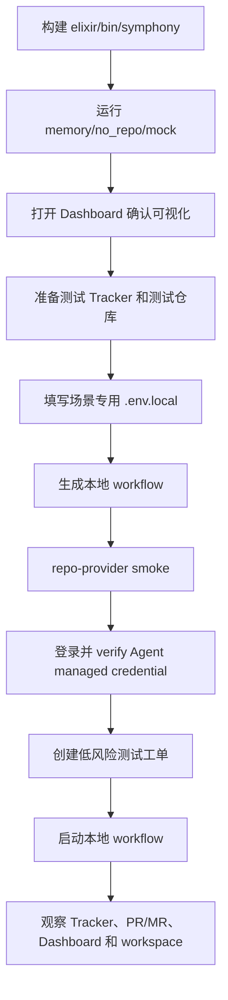

# 新人端到端运行指引

这份文档面向第一次接触 Maestro / Symphony Elixir Runtime 的新人，目标是让使用者可以按步骤完成：

1. 在本机先跑通无外部依赖的 `memory/no_repo/mock`，看到 Dashboard 和编排效果。
2. 接入真实的 `TAPD + CNB + CodeBuddy Code`。
3. 接入真实的 `Linear + GitHub + OpenCode`。

> 当前产品名是 **Maestro**，但具体 CLI、模块名和环境变量仍保留 `symphony` / `SYMPHONY_*` 兼容命名。运行命令时请继续使用这些实际名称。

> 如果你更想用 Docker/Compose，而不是安装本机 Elixir 工具链，请看[容器部署指南](../../../docs/deployment/container.zh-CN.md)。它覆盖同一组 mock 和真实 workflow 路径，但使用仓库根目录 `.env` 与 Compose profile；带 `credential_ref` 的容器路径会在服务启动前自动执行 managed credential login + verify，而不是要求你先手动跑本节的 `mise exec ./bin/symphony accounts ...`。

## 是否需要这份指引？

需要。这个项目对新人“直接运行上手看实际效果”确实有门槛，主要原因是：

- 它不是单一 CLI Demo，而是一个连接 Tracker、代码仓库、Agent Provider、workspace automation、PR/MR provider 和 Dashboard 的控制平面。
- 真实流程需要多个外部系统凭据：TAPD / Linear、CNB / GitHub、CodeBuddy Code / OpenCode。
- 真实 workflow 会执行真实的 clone、branch、push、PR/MR、tracker 状态流转和评论写入，不能在未准备好权限边界时随手运行。
- TAPD 的 raw status、Linear 状态名、仓库默认分支、PR/MR 权限、Agent 凭据和本地 CLI 可用性都会影响启动结果。

因此建议新人按“低风险 mock -> 真实只读/烟测 -> 真实工作项”的顺序推进。

如果你还不确定该从哪条路径开始，先按下面选择：

| 你的目标 | 该走哪一段 | 需要外部系统吗 |
| --- | --- | --- |
| 只想先看到 Dashboard 和编排效果 | 第 2 节 `memory/no_repo/mock` | 不需要 |
| 公司流程是 TAPD + CNB，需要验证 CodeBuddy Code | 第 4 节方案一 | 需要 TAPD、CNB、CodeBuddy Code |
| 公司流程是 Linear + GitHub，需要验证 OpenCode | 第 5 节方案二 | 需要 Linear、GitHub、OpenCode |

第一次真实验证时只选一条方案跑通，不要同时混配 TAPD/CNB 和 Linear/GitHub 的环境变量。

## 0. 风险与权限边界

真实 workflow 属于受信任环境配置，可能执行以下写操作：

- 修改 TAPD / Linear 工单状态与评论。
- clone 目标仓库并创建工作分支。
- push 分支到 CNB / GitHub。
- 创建或更新 PR / MR。
- 在审批满足条件时执行 land / merge flow。
- 启动本地 Agent CLI，并把动态工具暴露给 Agent。

强烈建议：

- 使用专门的测试项目、测试工作区、测试仓库和低权限 token。
- 将 workflow 的 `workspace.root` 指向隔离目录。两套推荐模板都使用通用变量 `SYMPHONY_WORKSPACE_ROOT`。
- 第一条真实工单只做小的文档或测试文件改动。
- 不要用个人高权限主账号直接跑 destructive flow。

## 1. 本机基础环境

### 1.1 安装必要工具

必须：

- `git`
- `bash`
- [mise](https://mise.jdx.dev/)
- Elixir / Erlang：通过仓库内 `mise.toml` 安装

真实仓库 provider 还需要：

- GitHub：`gh` CLI，并完成 `gh auth login` 或配置 `GH_TOKEN` / `GITHUB_TOKEN`
- CNB：可访问目标仓库的 `CNB_TOKEN`

Agent provider 还需要：

- CodeBuddy Code：本机可执行 `codebuddy`
- OpenCode：本机可执行 `opencode`

### 1.2 克隆、安装依赖、构建 CLI

```bash
git clone https://github.com/joosure/Maestro.git maestro
cd maestro/elixir

mise trust
mise install
mise exec -- mix setup
mise exec -- mix build
```

构建成功后，CLI 位于：

```text
elixir/bin/symphony
```

可以先确认：

```bash
mise exec -- ./bin/symphony --help
```

> 说明：真实 workflow 运行时，Maestro 会把一组自动化脚本复制到每个工单的 workspace 中。这些脚本在执行 clone、branch、commit、push、创建 PR/MR 等操作时，可能需要再次调用 `symphony` CLI。新人本地运行时通常不需要额外配置；如果后续遇到脚本提示找不到 `symphony`，再任选一种方式处理：把 `elixir/bin` 加到 `PATH`，或设置 `SYMPHONY_CLI` 指向当前仓库的 `elixir/bin/symphony`。

## 2. 第一次先跑 mock，看 Dashboard 效果

这一步不需要 Linear、TAPD、GitHub、CNB、CodeBuddy、OpenCode 或模型 token。

```bash
cd maestro/elixir

mise exec -- ./bin/symphony \
  --i-understand-that-this-will-be-running-without-the-usual-guardrails \
  --template memory/no_repo/mock \
  --port 4000
```

打开：

```text
http://localhost:4000
```

你应该能看到 Dashboard。终端中也会出现类似输出：

```text
Dashboard: http://127.0.0.1:4000/
MEM-1 [classifying]
Local memory/mock workflow completed one ...
```

也可以用 API 做一次快速确认：

```text
http://localhost:4000/api/v1/state
```

如果返回 JSON，并且其中能看到 `mock`、`memory`、`MEM-1` 或 `recent_events` 等字段，就说明本地 mock workflow 已经跑起来了。验证结束后按 `Ctrl+C` 停止服务，释放 `4000` 端口。

这个流程使用：

| 维度 | 值 |
| --- | --- |
| Tracker | `memory` |
| Repo Provider | `memory` |
| Agent Provider | `mock` |
| Template | `memory/no_repo/mock` |

如果这一步都无法启动，先不要接真实系统，优先检查：

- `mise install` 是否成功。
- `mise exec -- mix build` 是否生成 `bin/symphony` 使用的 `bin/symphony.escript` payload。
- 端口 `4000` 是否被占用。

## 3. 真实流程通用准备

### 3.1 准备隔离 workspace

建议每套集成使用独立 workspace root：

```bash
mkdir -p "$HOME/maestro-workspaces/tapd-cnb-codebuddy"
mkdir -p "$HOME/maestro-workspaces/linear-github-opencode"
```

workspace 会保存每个工单的运行目录、自动化脚本副本、clone 下来的目标仓库和运行证据。

### 3.2 准备一个测试仓库

建议测试仓库满足：

- 你拥有 clone、push、创建 PR/MR 的权限。
- 默认分支明确，例如 `main`。
- CI 不会执行高风险部署。
- 第一条测试任务只改 README 或新增一个小文件。

### 3.3 核心术语速查

| 术语 | 新人可以先这样理解 |
| --- | --- |
| `workflow` | 一份本地运行配置，描述 Tracker、仓库、Agent、状态流转和自动化策略如何组合 |
| `template` | 仓库内置的 workflow 模板；初始化脚本会基于 template 生成你的本地 workflow 文件 |
| `workspace root` | 本机工作目录根路径；每条工单会在这里创建隔离目录并 clone 目标仓库 |
| `managed credential` | Maestro 本地托管的 Agent API key / token；workflow 只引用凭据 id，不直接写密钥 |
| `repo-provider smoke` | 仓库平台的最小认证检查；默认只验证 token 可用，不 clone、不 push、不创建 PR |
| `raw status` | TAPD / Linear API 返回的内部状态值；新人通常只需要看页面状态名，由初始化脚本转换 |
| `route policy` | workflow 中决定某个状态下该派发实现、等待评审、合并还是结束的规则 |
| `Coding PR Delivery reconciliation` | Coding PR Delivery extension 在评审阶段自动核对已关联 PR/MR 是否满足 checks、可合并等 gate 的后台处理 |
| `gate` | 自动流转前必须满足的条件，例如 PR checks 通过、PR 可合并、需要 approval 等 |

### 3.4 运行前检查表

这张表只帮你确认“真实集成启动前，外部系统入口是否都准备好了”。不用在这里记住所有配置名；每套方案的具体填写位置会在第 4 节和第 5 节展开。

| 你需要先确认 | 为什么需要 | 怎么验证 |
| --- | --- | --- |
| 工单系统能访问 | Maestro 需要读取工单、改状态、写评论 | 初始化脚本能连上 TAPD / Linear，并能识别测试项目 |
| 代码仓库能访问 | Maestro 需要 clone、push、创建 PR/MR | 先跑 repo-provider smoke，或至少确认本机可以 clone/push 测试仓库 |
| Agent CLI 可执行 | 真正的代码实现由本机 Agent CLI 完成 | `codebuddy --version` 或 `opencode --version` 能输出版本号 |
| Agent 凭据已登录 | Agent 运行时需要模型/API 凭据 | `accounts login` 执行过一次，`accounts verify` 通过 |
| Workspace root 可写 | 每条工单会在这里创建隔离目录和 clone 仓库 | 目录存在且可写；建议放到 `$HOME/maestro-workspaces/...` |
| 本地 workflow 已生成 | 主服务启动时需要读取这份本地运行配置 | 初始化脚本生成 `quickstart/WORKFLOW.*.local.md`，主服务启动也使用同一个文件 |

对应到两套方案，实际配置名是：

- TAPD + CNB + CodeBuddy Code：`TAPD_API_USER`、`TAPD_API_PASSWORD`、`TAPD_WORKSPACE_ID`、`CNB_TOKEN`、`SOURCE_REPO_URL`、`SYMPHONY_WORKSPACE_ROOT`，以及首次登录 CodeBuddy 时使用的 `CODEBUDDY_API_KEY`。
- Linear + GitHub + OpenCode：`LINEAR_API_KEY`、`LINEAR_PROJECT_SLUG`、`SOURCE_REPO_URL`、`SYMPHONY_WORKSPACE_ROOT`、`ZAI_API_KEY`，GitHub 推荐先用 `gh auth login`。

Workspace root 是本机目录，不是远端平台概念。新人建议直接使用文档中的目录，并写入对应场景的 `.env.*.local` 文件：

```env
SYMPHONY_WORKSPACE_ROOT="$HOME/maestro-workspaces/tapd-cnb-codebuddy"
# 或在 Linear 场景使用：
SYMPHONY_WORKSPACE_ROOT="$HOME/maestro-workspaces/linear-github-opencode"
```

### 3.5 推荐上手路径



## 4. 方案一：TAPD + CNB + CodeBuddy Code

### 4.1 目标效果

运行后 Maestro 会：

1. 轮询 TAPD workspace 中处于 active status 的 Story / work item。
2. 将符合 route policy 的工作项派发给 CodeBuddy Code。
3. 在隔离 workspace 中 clone CNB 仓库到 `repo/`。
4. 通过 CodeBuddy Code 执行任务。
5. 使用动态工具更新 TAPD workpad / 评论、创建分支、提交、push，并创建或更新 CNB MR / PR。
6. 在 Dashboard 中展示 issue、session、event 和 evidence。

### 4.2 准备 TAPD 页面状态

先在 TAPD 中准备一个低风险的测试空间 / 测试项目，不要一开始直接使用生产空间。为了跑通本文推荐的 `coding_pr_delivery` 流程，建议新人先在这个测试空间里新建或选择一个专用 Story / 需求类型，并配置一套固定工作流。

这套 TAPD 工作流需要覆盖 Maestro `coding_pr_delivery` 会用到的状态语义。新人建议直接按下面这些固定 TAPD 页面状态名配置，内部映射交给初始化脚本处理：

| TAPD 页面状态 | 对新人可理解的含义 | Maestro 会怎么处理 |
| --- | --- | --- |
| 需求池 | Backlog / 候选池 / 未排期 | 人工梳理阶段；Maestro 不自动扫描、不自动修改 |
| 待开发 | 已确认排队，准备进入开发 | Maestro 轮询到后会准备进入 `开发中` |
| 开发中 | 开发中 | Maestro 会派发 CodeBuddy Code 执行 |
| 评审中 | 人工评审 / 等待 PR 满足合并条件 | Maestro 不派发新实现任务；会自动核对已关联的 PR，满足 gate 后流转到 `合并中` |
| 合并中 | 准备合并 / 发布 | Maestro 执行 land/merge flow，合并成功后流转到 `已完成` |
| 返工 | 返工 | Maestro 会重新派发 CodeBuddy Code |
| 已完成 | 已完成 | 流程结束 |
| 已拒绝 | 已拒绝 | 流程结束，Maestro 不再派发 |

Quickstart 路径必须配置这些流转。`需求池` 是人工入口，`待开发` 才表示人工已经确认可以交给 Maestro：

```text
需求池 -> 待开发 -> 开发中 -> 评审中 -> 合并中 -> 已完成
评审中 -> 返工 -> 评审中
评审中 -> 已拒绝
合并中 -> 返工
```

这里需要特别注意：`需求池` 不会写进 Maestro 自动扫描范围；只有人工把需求移入 `待开发` 状态后，Maestro 才会按 workflow 接手。进入 `评审中` 后，Maestro 不会再派发新的实现任务，而是由 Coding PR Delivery reconciliation 自动核对已关联的 CNB PR；当 PR checks 通过、PR 可合并，并且 workflow 配置的 gate 都满足后，Maestro 会自动把需求流转到 `合并中`，继续执行合并并最终进入 `已完成`。TAPD API 和 Maestro workflow 文件内部会使用另一套状态值，这层映射会由初始化脚本自动处理，不要求新人手工查。

也就是说：新人只需要在 TAPD 页面上把状态显示名和流转配置好；运行 `../scripts/tapd-workflow-init` 后，脚本会读取 TAPD API 返回的状态信息，并把页面显示名转换成 Maestro 本地 workflow 需要的配置值。你不需要手工查询或填写这些内部状态值。

请同时在 TAPD 的流程 / 工作流配置页面配置上面推荐的流转关系，而不只是创建这些状态显示名。Quickstart 路径默认要求状态显示名与上表一致，且状态之间允许上面推荐的流转。为了提高容错性，初始化脚本也支持**智能启发式模糊匹配 (Heuristic Fallback)**。例如，如果你的状态名为“开始开发”、“测试中”、“待处理”、“完成”等包含关键字的名称，脚本会自动匹配到相应的流程阶段。如果发生冲突（例如两个阶段匹配到同一状态）或无法唯一确定时，脚本会报错阻断，你可以使用 `--interactive` 选项运行脚本来进行交互式映射确认，或者回到 TAPD 工作流配置页面修正。`需求池` 是人工入口，不交给 Maestro 自动扫描；`待开发` 是 Maestro 自动化闭环的入口。

### 4.3 填写 `.env.tapd.local`

准备好 TAPD 测试工作流后，使用场景专用的本地 env 文件保存连接信息和密钥。这样可以避免把密钥写进命令行历史，也避免 TAPD/CNB 与 Linear/GitHub 两套流程共用变量时互相覆盖。仓库提供了可提交的模板文件 `.env.example`，里面列出所有常用环境变量，但不包含真实密钥。仍在 `elixir/` 目录时，如果还没有 TAPD 场景的本地 env 文件，先复制一份再填写：

```bash
[ -f .env.tapd.local ] || cp .env.example .env.tapd.local
# 然后编辑 .env.tapd.local；只填写 TAPD + CNB + CodeBuddy Code 这一套流程需要的变量
```

本文建议按场景拆分本地 env 文件：TAPD/CNB/CodeBuddy Code 使用 `.env.tapd.local`，Linear/GitHub/OpenCode 使用 `.env.linear.local`。这样 `SOURCE_REPO_URL`、`SOURCE_REPO_PROVIDER_REPOSITORY`、`SOURCE_REPO_BASE_BRANCH`、`SOURCE_REPO_BRANCH_WORK_PREFIX`、`SYMPHONY_WORKSPACE_ROOT` 这类两套流程都会用到的变量不会混在同一个文件里，尤其适合新人照着命令复制运行。

本流程建议在 `.env.tapd.local` 中填写后续会复用的环境变量。至少包含 TAPD、CNB、workspace 和提交身份必填项：

```env
TAPD_API_USER="<tapd api user>"
TAPD_API_PASSWORD="<tapd api password>"
TAPD_WORKSPACE_ID="<tapd workspace id>"

CNB_TOKEN="<cnb token>"
SOURCE_REPO_URL="https://cnb.cool/<org>/<team>/<repo>"
SYMPHONY_WORKSPACE_ROOT="$HOME/maestro-workspaces/tapd-cnb-codebuddy"

CNB_GIT_USER_NAME="Maestro CNB"
CNB_GIT_USER_EMAIL="maestro-cnb@example.invalid"
```

按需再补充可选项：

```env
# TAPD 评论作者；不设置时使用认证 API 用户
TAPD_COMMENT_AUTHOR="<display name or api user>"

# 目标仓库默认分支不是 main 时再设置
SOURCE_REPO_BASE_BRANCH="main"

# 通常会从 SOURCE_REPO_URL 自动推导；只有需要覆盖时才设置
SOURCE_REPO_PROVIDER_REPOSITORY="<org>/<team>/<repo>"

# 工作分支前缀；不设置时使用运行时默认前缀
SOURCE_REPO_BRANCH_WORK_PREFIX="maestro/"

# 仅首次执行 4.6 accounts login 时需要；login/verify 成功后不需要长期保留
CODEBUDDY_API_KEY="<codebuddy api key>"
```

`.env.example` 应提交到 git，方便后续维护环境变量清单；`.env.tapd.local` 属于个人本地密钥文件，会被 `elixir/.gitignore` 中的 `.env.*` 规则忽略，不要提交。

### 4.4 生成 TAPD 本地 workflow

TAPD 最容易踩坑的是“状态值”：不同 workspace / 需求类型的 raw status 可能不一样，有些是英文，有些是平台生成的编号。这些值对新人不友好，也不建议一开始手工理解。

新人主路径只需要运行一次初始化脚本，让它读取 `.env.tapd.local`，检查 TAPD 状态配置，并生成后续主服务要使用的本地 workflow 文件。如果你仍在前面进入的 `elixir/` 目录中，运行：

```bash
../scripts/tapd-workflow-init \
  --env-file ./.env.tapd.local \
  --template tapd/cnb/codebuddy_code \
  --output ./quickstart/WORKFLOW.tapd-cnb-codebuddy.local.md
```

成功时你会得到 `./quickstart/WORKFLOW.tapd-cnb-codebuddy.local.md`；失败时优先按报错回到 TAPD 流程 / 工作流配置页面修正状态名、Story 类型或流转关系。

为了让新人第一次 smoke Story 更快看到完整自动化闭环，脚本生成的本地 workflow 会把 PR 审批门禁设为关闭：`workflow.reconciliation.change_proposal.gates.approval_required: false`。内置模板本身仍保持保守默认。真实生产仓库建议用 `--require-pr-approval` 重新生成，或把该 gate 改回 `true`。

首次运行只需要确认这件事：文件已生成，并且下一步启动主服务时使用的就是这个文件。内部状态映射细节放到第 7.5 节作为高级排查项；脚本参数和手工模板路径见第 8.2 节。

### 4.5 准备 CNB

第 4.3 节已经要求把 CNB 和仓库变量写入 `.env.tapd.local`。这里主要确认 token 权限和仓库地址格式。`SOURCE_REPO_URL` 应是 HTTP(S) CNB 仓库地址，例如 `https://cnb.cool/<org>/<team>/<repo>`；CNB 地址通常不带 `.git`，带 `.git` 的 HTTPS clone URL 也可以被仓库路径推导逻辑兼容。使用 CNB token auth 时不要填 SSH 地址。启动时 hook 会用 `CNB_TOKEN` 配置 git extraHeader，以支持 clone 和后续 push；CNB repo-provider typed tools 还会用同一个 token 查询、创建或更新 PR/MR，并读取检查结果。

新人创建 CNB token 时按下面权限勾选：

| 权限 | 建议 | 用途 |
| --- | --- | --- |
| `repo-code:rw` | 必选 | clone / fetch 目标仓库，并 push Maestro 创建的工作分支 |
| `repo-pr:rw` | 必选 | 查询、创建、更新 PR/MR；自动合并也依赖 PR/MR 写权限和仓库合并权限 |
| `repo-notes:rw` | 必选 | 读取和写入 PR/MR 评论，用于处理评审意见或记录自动化信息 |
| `repo-commit-status:r` | 必选 | 读取 commit status / checks，用于判断 PR/MR 检查结果 |
| `repo-cnb-detail:r` | 必选 | 读取 CNB 仓库 / 构建相关详情 |
| `repo-cnb-history:r` | 必选 | 读取 CNB 构建 / 流水线历史 |
| `account-profile:r` | 必选 | 读取当前 token 账号资料，用于认证 / smoke / 审计信息确认 |
| `repo-cnb-trigger:rw` | 可选 | 需要触发或重跑 CNB 构建 / 流水线时再勾选 |
| `repo-issue:r` | 可选 | repo-provider smoke 或扩展能力需要读取 CNB issue 时再勾选 |

可先做 repo-provider smoke。`./bin/symphony` 本身不接收 `--env-file`，如果你把 `CNB_TOKEN` 写在前面的 `.env.tapd.local`，先在当前 shell 加载它；该 smoke 会调用 CNB `/user` 接口验证 token 是否可用，默认不 clone、不 push、不创建 PR/MR：

```bash
set -a
. ./.env.tapd.local
set +a

mise exec -- ./bin/symphony repo-provider smoke \
  --provider cnb \
  --json
```


### 4.6 准备 CodeBuddy Code managed credential

确认 CLI 可用：

```bash
codebuddy --version
```

登录 Maestro managed credential store。这里的 managed credential 是 Maestro 本地托管的 Agent 凭据：把 CodeBuddy API key 写入 Maestro 的凭据存储，运行 agent 时再临时物化成 CodeBuddy 需要的环境变量，避免把模型/API 密钥直接写进 workflow YAML。

模板默认会找一份名为 `default` 的 CodeBuddy 凭据。新人不需要改 workflow，直接按下面命令登录 `default` 即可。

如果这是第一次登录 CodeBuddy managed credential，且 `CODEBUDDY_API_KEY` 已写入 `.env.tapd.local`，先加载当前 shell：

```bash
set -a
. ./.env.tapd.local
set +a
```

然后登录一次，把 CodeBuddy API key 写入 Maestro 本地凭据存储。后面主服务运行 agent 时会读取这份 `default` 凭据；登录和 verify 成功后，后续启动主服务不需要继续填写或加载 `CODEBUDDY_API_KEY`。

```bash
# 首次登录才执行；已 accounts verify 通过可跳过。
mise exec -- ./bin/symphony accounts login codebuddy_code default \
  --internet-environment public \
  --token-env CODEBUDDY_API_KEY \
  ./quickstart/WORKFLOW.tapd-cnb-codebuddy.local.md
```

可选但推荐：校验这份本地凭据和 `codebuddy` CLI 是否可用。

```bash
mise exec -- ./bin/symphony accounts verify codebuddy_code default \
  ./quickstart/WORKFLOW.tapd-cnb-codebuddy.local.md
```

如果你的 CodeBuddy 账号需要内网或 IOA 环境，登录时把 `--internet-environment public` 改成 `internal` 或 `ioa`；不确定时保持 `public`。

本 quickstart 生成的 CodeBuddy Code workflow 会显式配置 `model: glm-5.1`。在 `./quickstart/WORKFLOW.tapd-cnb-codebuddy.local.md` 的 `agent_provider.options` 下应能看到类似配置：

```yaml
agent_provider:
  kind: codebuddy_code
  options:
    command_argv: ["codebuddy"]
    model: glm-5.1
    credential_ref: "credential://codebuddy_code/default"
```

Maestro 启动 CodeBuddy session 后会读取 provider 返回的模型事实，并检查配置模型与实际 session 模型是否一致；如果不一致，会报明确的模型不匹配错误。这里不是在文档里硬编码 CodeBuddy 的全量支持模型，只是让本 quickstart 的期望模型和运行时实际模型对齐。

### 4.7 启动 TAPD + CNB + CodeBuddy Code

启动前请确认 4.6 的 `accounts login codebuddy_code default` 已成功执行过一次。主服务启动本身可能不立刻调用 CodeBuddy，但后续派发 agent 时会按模板查找这份 `default` 凭据；缺少它会导致 agent 启动失败。

`./bin/symphony` 读取当前进程环境变量，不直接接收 `--env-file`。如果你刚刚已在同一个 shell 里加载过 `.env.tapd.local`，不用重复；如果新开了终端，先加载一次：

```bash
set -a
. ./.env.tapd.local
set +a
```

新人主路径使用第 4.4 节生成的本地 workflow 文件启动：

```bash
mise exec -- ./bin/symphony \
  --i-understand-that-this-will-be-running-without-the-usual-guardrails \
  ./quickstart/WORKFLOW.tapd-cnb-codebuddy.local.md \
  --port 4000
```

> 注意：`accounts login` / `accounts verify` 命令中的最后一个参数也建议使用这个本地 workflow 文件。这样账号写入的 credential store 与主服务运行时读取的是同一套配置。

### 4.8 TAPD 测试工单建议

创建一条低风险 TAPD Story，例如：

```text
标题：验证 Maestro CodeBuddy 流程：新增 smoke 文档
描述：
请在仓库中新增 docs/maestro-smoke.md，内容包括一行 “Maestro smoke test”。
验收：
- 生成独立分支
- 提交改动
- 创建 CNB MR/PR
- 在 TAPD workpad 中记录执行摘要和验证结果
```

将状态放到 TAPD 页面上的 `待开发`。初始化脚本会把 `待开发` 映射成 workflow 内部使用的 raw status；新人不需要手工填写 TAPD API 返回的内部状态值。Maestro 轮询后会按配置将需求切到 `开发中` 并 dispatch。

## 5. 方案二：Linear + GitHub + OpenCode

### 5.1 目标效果

运行后 Maestro 会按下面的节奏处理一条 Linear issue：

1. 轮询指定 Linear project 中处于 active 状态的 issue：`Todo` / `In Progress` / `Merging`。
2. 如果 issue 还是 `Todo`，先自动切到 `In Progress`，表示进入无人值守执行。
3. 为这条 issue 创建隔离 workspace，并把目标 GitHub 仓库 clone 到 workspace 下的 `repo/`。
4. 启动 OpenCode server，每轮通过 OpenCode 同步 `/session/:id/message` 接口提交并等待结果；SSE 只用于权限、进度、错误等运行事件，OpenCode 在 `repo/` 中完成实现、修改、验证和提交准备。
5. 通过动态工具持续更新同一条 Linear workpad，记录计划、进度、验证结果和阻塞原因。
6. 创建工作分支、提交、push，并创建或更新 GitHub PR。
7. 到 `In Review` 时交给人工评审；通过后人工移到 `Merging`，Maestro 执行合并/land 流程。和第 4 节 TAPD quickstart 不同，本文 Linear quickstart 默认不演示自动从 `In Review` 推进到 `Merging`。
8. 在 Dashboard 中展示 issue、session、turn、event 和 workspace 证据。

### 5.2 准备 Linear 本地配置

先在 Linear 中准备一个低风险的测试 workspace / team / project，不要一开始直接使用生产项目。为了跑通本文推荐的 `coding_pr_delivery` 流程，建议新人先让这个测试 team 的 workflow 覆盖下面这些状态语义。

Linear 内置模板默认使用英文状态名；新人建议先按下表配置，避免一开始修改 workflow YAML：

| Linear 状态 | 对新人可理解的含义 | Maestro 会怎么处理 |
| --- | --- | --- |
| `Backlog` | 候选池 / 未排期 | 不自动处理；需人工确认后移到 `Todo` |
| `Todo` | 已排队等待处理 | Maestro 轮询到后会先切到 `In Progress` |
| `In Progress` | 开发中 | Maestro 会派发 OpenCode 执行 |
| `In Review` | 人工评审 / 等待确认 | Maestro 不派发新实现任务；本文 Linear quickstart 不会自动推进到 `Merging`，需要人工评审通过后手动移动 |
| `Merging` | 准备合并 | Maestro 可执行 land/merge flow |
| `Done` | 已完成 | 流程结束 |
| `Canceled` / `Duplicate` 等取消类终态 | 取消或重复等终态；按 Team 实际存在的状态即可 | 流程结束，Maestro 不再派发 |

Quickstart 路径只需要跑通一条主线：

```text
Backlog -> Todo -> In Progress -> In Review -> Merging -> Done
Todo/In Progress/In Review/Merging -> Canceled/Duplicate 等取消类终态
```

这里特意把 `Backlog` 放在流程说明里，但不把它交给 Maestro 自动处理：`Backlog` 表示还没决定是否要自动执行的候选任务，模板要求 Maestro 不修改它；只有人工把 issue 从 `Backlog` 移到 `Todo` 后，Maestro 才会接手。也就是说，新人配置 Linear 页面时重点确认两件事：第一，team workflow 中有主线状态 `Backlog`、`Todo`、`In Progress`、`In Review`、`Merging`、`Done`；第二，状态之间允许完成主线闭环。`Canceled` / `Duplicate` 属于取消类终态，脚本会提示缺失情况，但 Quickstart 不要求两者同时存在。后面的 `../scripts/linear-workflow-init` 会自动读取 project 关联 team 的状态名并做检查。

准备好 Linear 测试 project 后，仍在 `elixir/` 目录时，使用 Linear 场景专用的本地 env 文件 `.env.linear.local`。如果你前面没有创建过它，先从 `.env.example` 复制一份。本文件只放 Linear/GitHub/OpenCode 这一套流程的本机密钥和变量，会被 `.env.*` 规则忽略，不要提交：

```bash
[ -f .env.linear.local ] || cp .env.example .env.linear.local
# 然后编辑 .env.linear.local；不要和 TAPD/CNB 流程共用同一个 env 文件
```

如果你已经为 TAPD/CNB 流程写过 `.env.tapd.local`，不要把它直接拿来追加 Linear/GitHub/OpenCode 变量。两套流程会共用 `SOURCE_REPO_URL`、`SOURCE_REPO_PROVIDER_REPOSITORY`、`SOURCE_REPO_BASE_BRANCH`、`SOURCE_REPO_BRANCH_WORK_PREFIX`、`SYMPHONY_WORKSPACE_ROOT` 等变量名，放在同一个文件里容易在切换场景时混淆；新人更推荐明确拆成 `.env.tapd.local` 和 `.env.linear.local`。

使用 `gh` keyring 时，本流程至少填写：

```env
LINEAR_API_KEY="<linear api key>"
# 从 Linear Project 页面 URL 的 /project/ 后面复制完整 slug，示例见下方说明
LINEAR_PROJECT_SLUG="<linear project slug>"

SOURCE_REPO_URL="https://github.com/<owner>/<repo>.git"
SYMPHONY_WORKSPACE_ROOT="$HOME/maestro-workspaces/linear-github-opencode"

# OpenCode 默认示例使用智谱/ZAI 的 GLM 模型；变量名必须和 OpenCode provider 配置读取的 env 名一致
ZAI_API_KEY="<zai api key>"
```

`LINEAR_PROJECT_SLUG` 是 Linear project 的 URL slug，不是 team key，也不是 issue 编号。打开 Linear 左侧 `Projects`，进入你的测试 project，复制浏览器地址中 `/project/` 后面的完整部分即可。例如：

```text
https://linear.app/acme/project/maestro-smoke-test-1a2b3c4d
```

对应填写：

```env
LINEAR_PROJECT_SLUG="maestro-smoke-test-1a2b3c4d"
```

按需再补充可选项：

```env
# 目标仓库默认分支不是 main 时再设置
SOURCE_REPO_BASE_BRANCH="main"

# 通常会从 SOURCE_REPO_URL 自动推导；只有需要覆盖时才设置
SOURCE_REPO_PROVIDER_REPOSITORY="<owner>/<repo>"

# 工作分支前缀；不设置时使用运行时默认前缀
SOURCE_REPO_BRANCH_WORK_PREFIX="maestro/"

# 要求 PR 带某个 label 时再设置；不需要则不要设置或留空
SOURCE_REPO_PROVIDER_REQUIRED_PR_LABEL=""
```

如果你的 Linear Team 使用的状态名称和上表不同，首次接入时建议先把测试 Team 的状态改成上表名称，确保端到端流程可以先跑通。等流程跑通后，再复制生成的本地 workflow 文件，并按你的实际状态调整；高级字段说明见第 8.3 节。

仓库也提供了一个独立的一次性初始化脚本，用来降低新人手工核对成本。它会读取 `.env.linear.local`，检查 Linear project 和状态配置，并生成后续主服务要使用的本地 workflow 文件。默认生成结果会使用第 5.4 节的 OpenCode ZAI 凭据，并且不要求 Team 创建独立的 `Rework` 状态。

如果你仍在 `elixir/` 目录中，运行：

```bash
../scripts/linear-workflow-init \
  --env-file ./.env.linear.local \
  --template linear/github/opencode \
  --output ./quickstart/WORKFLOW.linear-github-opencode.local.md
```

成功时你会得到 `./quickstart/WORKFLOW.linear-github-opencode.local.md`；失败时优先按报错回到 Linear Team workflow 设置页修正状态名、project 或权限。脚本不会默认修改 Linear 后台工作流。

首次运行只需要确认这件事：文件已生成，并且第 5.4 的 OpenCode credential login / verify 和第 5.5 的主服务启动都使用同一个本地 workflow 文件。高级参数和手工调整方式见第 8.3 节。

### 5.3 准备 GitHub

新人主路径推荐使用 `gh` keyring，不把 GitHub token 写入 `.env.linear.local`：

```bash
# 方式 A：推荐本机新人使用 gh keyring
command -v gh
gh auth login
gh auth status
```

如果不能使用 `gh auth login`，再把 GitHub Personal Access Token 写入 `.env.linear.local`：

```env
GH_TOKEN="<github personal access token>"
# 或
GITHUB_TOKEN="<github personal access token>"
```

`GH_TOKEN` 和 `GITHUB_TOKEN` 两者填一个即可；本地开发建议优先用 `GH_TOKEN`，避免和其他工具约定的 `GITHUB_TOKEN` 混淆。

获取 token 的常见路径：

- Fine-grained token：GitHub 右上角头像 → `Settings` → `Developer settings` → `Personal access tokens` → `Fine-grained tokens` → `Generate new token`。
- Classic token：GitHub 右上角头像 → `Settings` → `Developer settings` → `Personal access tokens` → `Tokens (classic)` → `Generate new token`。

GitHub token 权限建议提前对照确认：

- classic token：私有仓库通常需要 `repo` scope；公开仓库如果只操作 public repo，可用 `public_repo`，但新人更容易用 `repo` 跑通。
- fine-grained token：
  - Repository access：只选择目标仓库。
  - Contents：`Read and write`，用于 clone 后 push 分支、创建提交引用等仓库写操作。
  - Pull requests：`Read and write`，用于创建或更新 PR。
  - Metadata：`Read-only`，GitHub 默认必带。
  - Commit statuses：`Read-only`，用于读取状态检查/commit status。
  - Checks：`Read-only`，用于读取 GitHub Checks。
  - Issues：如果配置了 `SOURCE_REPO_PROVIDER_REQUIRED_PR_LABEL`，设为 `Read and write`，因为 GitHub PR label 走 issue label 能力；不改 PR label 时通常可以不授予。

可先做 repo-provider smoke。这个命令会读取当前 shell 中的 GitHub 登录状态或 `GH_TOKEN` / `GITHUB_TOKEN`，默认只做认证探测，不 clone、不 push、不创建 PR：

```bash
set -a
. ./.env.linear.local
set +a

mise exec -- ./bin/symphony repo-provider smoke \
  --provider github \
  --json
```

### 5.4 准备 OpenCode managed credential

确认 CLI 可用：

```bash
opencode --version
```

推荐新人先按内置模板的默认模型跑通：`zai-coding-plan/glm-5.1`，也就是 OpenCode 使用智谱/ZAI 的 GLM 模型。如果你已经在 5.2 运行过 `../scripts/linear-workflow-init`，它会生成 `./quickstart/WORKFLOW.linear-github-opencode.local.md` 并自动加入 `credential_ref: "credential://opencode/zai"`。

在 `./quickstart/WORKFLOW.linear-github-opencode.local.md` 的 `agent_provider.options` 下应能看到类似下面配置。这段只用于确认生成结果，不需要新人手工编辑：

```yaml
agent_provider:
  kind: opencode
  options:
    command_argv: ["opencode", "serve", "--hostname", "127.0.0.1", "--port", "0"]
    agent: build
    model: zai-coding-plan/glm-5.1
    credential_ref: "credential://opencode/zai"
    read_timeout_ms: 120000
    turn_timeout_ms: 600000
    stall_timeout_ms: 300000
```

如果这是第一次登录 OpenCode managed credential，且 `ZAI_API_KEY` 已写入 `.env.linear.local`，先加载当前 shell：

```bash
set -a
. ./.env.linear.local
set +a
```

然后登录一次，把 ZAI token 写入 Maestro 本地凭据存储。后面主服务运行 OpenCode 时会读取这份 `zai` 凭据；登录和 verify 成功后，后续启动主服务不需要继续填写或加载 `ZAI_API_KEY`。

```bash
mise exec -- ./bin/symphony accounts login opencode zai \
  --env-name ZAI_API_KEY \
  --token-env ZAI_API_KEY \
  ./quickstart/WORKFLOW.linear-github-opencode.local.md
```

可选但推荐：校验这份本地凭据和 `opencode` CLI 是否可用。

```bash
mise exec -- ./bin/symphony accounts verify opencode zai \
  ./quickstart/WORKFLOW.linear-github-opencode.local.md
```

如果你不用智谱/ZAI，而是 OpenRouter、Anthropic 或 Google，先按默认 ZAI 路径跑通后再改。替换 provider、模型名、credential id 和 token env 的说明见第 8 节高级配置补充。

### 5.5 启动 Linear + GitHub + OpenCode

启动前请确认 5.4 的 `accounts login opencode zai` 已成功执行过一次，并且你最终启动的是同一个本地 workflow 文件。主服务启动本身可能不立刻调用 OpenCode，但后续派发 agent 时会按 workflow 查找对应凭据；缺少它会导致 agent 启动失败。

`./bin/symphony` 读取当前进程环境变量，不直接接收 `--env-file`。如果你刚刚已在同一个 shell 里加载过 `.env.linear.local`，不用重复；如果新开了终端，先加载一次：

```bash
set -a
. ./.env.linear.local
set +a
```

启动本地 workflow：

```bash
mise exec -- ./bin/symphony \
  --i-understand-that-this-will-be-running-without-the-usual-guardrails \
  ./quickstart/WORKFLOW.linear-github-opencode.local.md \
  --port 4000
```

验证流程时保持这个进程前台运行。主服务是常驻进程：即使队列为空，也应该继续监听 Dashboard/API 端口并持续轮询。本地验证建议使用前台终端、`tmux` / `screen` 或真实 supervisor。不要把从临时自动化 shell 中启动的 `nohup ./bin/symphony ... &` 当成长时间运行行为的证明。

### 5.6 Linear 测试 issue 建议

创建一条低风险 Linear issue，例如：

```text
标题：验证 Maestro OpenCode 流程：新增 smoke 文档
状态：Todo
描述：
请在仓库中新增 docs/maestro-opencode-smoke.md，内容包括一行 “Maestro OpenCode smoke test”。
验收：
- 自动从 Todo 进入 In Progress
- 生成独立分支
- 提交改动
- 创建 GitHub PR
- Linear workpad 记录执行摘要和验证结果
```

启动后，Maestro 会轮询到 `Todo` issue 并开始执行。

issue 到达 `In Review`、GitHub PR 已关联到 Linear、workpad 记录了执行摘要和验证结果时，只表示第一段开发交接完成。这里是人工评审边界，不是 Linear quickstart 的完整终点。

要验证完整闭环，保持同一个主服务继续运行：

1. 在 GitHub 中评审 PR。
2. 如果 PR 可以接受，把 Linear issue 从 `In Review` 手动移到 `Merging`。
3. 确认 Maestro 执行 land / merge flow，PR 变为 merged，Linear issue 进入 `Done`。
4. issue 到达 `Done` 后，确认服务仍在运行，并且 Dashboard/API 中这条 issue 不再有 active agent。

日志级确认时，刚完成的 issue 可能短暂出现 `issue_reconcile_deferred`，并带有 `terminal_completion_grace`。这表示 tracker 已经进入终态后，orchestrator 给 provider turn 一个有界窗口自然返回。只要后面接着出现 `opencode_turn_completed`、`agent_turn_completed`、cleanup 完成，并且 running slot 为空，这就是健康行为。

## 6. 如何确认“看到实际效果”

### 6.1 Dashboard

启动时加 `--port 4000` 后打开：

```text
http://localhost:4000
```

重点看：

- 当前 issue 列表。
- issue detail 页面。
- session / turn 历史。
- structured events。
- tracker state。
- workspace 路径。

也可以访问 API：

```text
http://localhost:4000/api/v1/state
```

命令行状态摘要应先确认 `curl` 成功，再解析 API 返回的 JSON。本地监控命令失败本身不等于 Symphony 主服务失败。

```bash
state_json=$(mktemp)
if curl -fsS --max-time 3 http://127.0.0.1:4000/api/v1/state -o "$state_json"; then
  python3 -c 'import json,sys; data=json.load(open(sys.argv[1])); print(sorted(data.keys()))' "$state_json"
else
  echo "state_api_unavailable"
fi
rm -f "$state_json"
```

### 6.2 Tracker

在 TAPD / Linear 中确认：

- 工单状态是否按 route policy 变化。
- 是否出现 Workpad / 评论。
- 是否记录了 Agent 执行摘要、验证结果、blocker。
- 是否关联了 PR / MR 链接。

### 6.3 仓库平台

在 CNB / GitHub 中确认：

- 是否创建了工作分支。
- 是否有 commit。
- 是否创建或更新了 PR / MR。
- CI / check 状态是否被读取。
- TAPD 方案：PR checks 通过且 PR 可合并后，是否自动从 `评审中` 流转到 `合并中`。
- Linear 方案：是否先带着已关联 PR 停在 `In Review` 等待人工评审，再在人工移到 `Merging` 后合并 PR 并进入 `Done`。

### 6.4 本地 workspace

进入配置的 workspace root，应该能看到按工单创建的目录。目标仓库通常在每个 issue workspace 的：

```text
repo/
```

## 7. 常见问题排查

### 7.1 启动时报缺少 acknowledgement flag

真实 workflow 需要显式确认：

```bash
--i-understand-that-this-will-be-running-without-the-usual-guardrails
```

这是因为模板可能拥有广泛文件、仓库、tracker 和 provider 权限。

### 7.2 找不到 `symphony`

workspace helper 需要找到 escript。解决方式：

```bash
export SYMPHONY_CLI="$(pwd)/bin/symphony"
```

或把 `elixir/bin` 加入 `PATH`。

### 7.3 GitHub PR 操作失败

检查：

```bash
command -v gh
gh auth status
mise exec -- ./bin/symphony repo-provider smoke --provider github --json
```

确认 token 有目标仓库读写、PR、checks 读取权限。

### 7.4 CNB clone 或 push 失败

检查：

- `CNB_TOKEN` 是否设置。
- `SOURCE_REPO_URL` 是否是 HTTP(S) CNB clone URL。
- token 是否有目标仓库读写权限。
- 如果显式设置了 `SOURCE_REPO_PROVIDER_REPOSITORY`，确认它是否与 CNB 仓库路径一致；未设置时会从 `SOURCE_REPO_URL` 自动推导。

### 7.5 TAPD 没有派发工单

优先检查：

- `TAPD_WORKSPACE_ID` 是否正确。
- TAPD 页面上这条 Story 是否已经从 `需求池` 移到 `待开发`；`需求池` 不会被 Maestro 自动扫描。
- 是否已经运行过 `../scripts/tapd-workflow-init --env-file ./.env.tapd.local --output ./quickstart/WORKFLOW.tapd-cnb-codebuddy.local.md`。
- 主服务启动时是否使用了生成的 `./quickstart/WORKFLOW.tapd-cnb-codebuddy.local.md`，而不是旧文件或其它配置。
- `tapd-workflow-init` 是否报告过状态名缺失、流转边缺失、workspace id 不匹配或 Story 类型无法判断。
- 如果 workspace 中有多个 Story 类型，确认 `TAPD_WORKITEM_TYPE_ID` / `workitem_type_id` 是否指向当前测试 Story 的类型。

高级排查再看 workflow 内部状态映射：

- `tracker.lifecycle.active_states` 是否包含 `待开发` / `开发中` 等页面状态对应的 TAPD raw status。
- `tracker.lifecycle.terminal_states` 是否包含 `已完成`、`已拒绝` 等终态对应的 TAPD raw status。
- `tracker.lifecycle.state_phase_map` 是否覆盖所有会出现在流程里的 raw status。
- `tracker.lifecycle.raw_state_by_route_key` 是否把 `planning` / `developing` / `review` / `merging` 等 route key 映射到了真实 TAPD raw status。

注意：`raw_state_by_route_key` 左侧是 Maestro 固定 route key，右侧才是 TAPD raw status。不要把 route key `review` 和生命周期阶段 `human_review` 混为一谈；典型关系是 `review -> status_5 -> human_review`。

### 7.6 Linear 没有派发 issue

优先检查：

- `LINEAR_PROJECT_SLUG` 是否正确。
- issue 是否在该 project 下。
- issue 状态是否是 Quickstart 本地 workflow 的 active state：`Todo`、`In Progress`、`Merging`。
- `LINEAR_API_KEY` 是否有读写 issue、评论和 project 的权限。

### 7.7 CodeBuddy Code credential 验证失败

检查：

```bash
codebuddy --version
mise exec -- ./bin/symphony accounts list codebuddy_code ./quickstart/WORKFLOW.tapd-cnb-codebuddy.local.md
mise exec -- ./bin/symphony accounts verify codebuddy_code default ./quickstart/WORKFLOW.tapd-cnb-codebuddy.local.md
```

确认账号 id 是 `default`，因为模板引用的是 `credential://codebuddy_code/default`。

### 7.8 OpenCode 可以 verify，但运行时模型失败

`accounts verify opencode <id>` 主要验证 credential 形态、secret 物化和 `opencode --version`，不一定证明上游模型 provider 接受 token。建议：

- 用 OpenCode 自身执行一次最小非交互请求。
- 确认 `model` 与 token 所属 provider 匹配。
- 在自定义 workflow 中配置正确的 `credential_ref`。

## 8. 高级配置补充

### 8.1 OpenCode 使用非 ZAI provider

第 5 节新人主路径默认使用智谱/ZAI 和 `credential://opencode/zai`。如果你已经跑通默认路径，再替换成 OpenRouter、Anthropic 或 Google：

- 运行 5.2 初始化脚本时可用 `--credential-ref credential://opencode/openrouter`、`--credential-ref credential://opencode/anthropic` 或 `--credential-ref credential://opencode/google`；也可以生成后手工修改 workflow 中的 `credential_ref`。
- 把 `model` 改成对应 provider 的模型名，例如 OpenRouter 可使用 `openrouter/...`，Anthropic 可使用 `anthropic/...`，Google 可使用 `google/...`。
- 登录命令中的账号 id 和 env 名也相应改成 `openrouter` / `OPENROUTER_API_KEY`、`anthropic` / `ANTHROPIC_API_KEY`，或 `google` / `GOOGLE_GENERATIVE_AI_API_KEY`。

### 8.2 TAPD 手工生成本地 workflow

新人主路径应该先用 `../scripts/tapd-workflow-init` 生成本地 workflow。初始化脚本会把内置模板片段展开成一份本地运行配置，避免本地文件继续依赖 `_partials/`。只有当你的 TAPD 工作流形态无法被脚本覆盖、且你已经理解 `tracker.lifecycle.*` 和 `raw_state_by_route_key` 时，才考虑手工渲染模板后修改：

```bash
mkdir -p ./quickstart
mise exec -- mix symphony.workflow.render \
  --with-front-matter-source \
  tapd/cnb/codebuddy_code \
  > ./quickstart/WORKFLOW.tapd-cnb-codebuddy.local.md
```

手工修改后仍建议用生成的本地 workflow 文件完成 `accounts login`、`accounts verify` 和主服务启动，避免 credential store 与运行时配置不一致。

`tapd-workflow-init` 是一次性配置生成脚本，不是主服务运行入口。它会读取 TAPD API 返回的状态显示名、内部 raw status 和可用流转关系，按本文约定的 `需求池`、`待开发`、`开发中`、`评审中`、`合并中`、`返工`、`已完成`、`已拒绝` 做检测和映射。若能自动推断或通过 `TAPD_WORKITEM_TYPE_ID` 指定 Story 类型，脚本会按该类型校验流转；如果缺少状态或流转边，脚本会报错并提示回到 TAPD 流程 / 工作流配置页面修正。

为了适应不同的工作流习惯，脚本支持**智能启发式模糊匹配 (Heuristic Fallback)**。如果你的 TAPD 状态没有严格采用上表的默认名称，但包含了相关的业务关键字（例如使用“开始开发”代替“开发中”，使用“完成”代替“已完成”），脚本在发现精确匹配缺失时会自动进行补全。
需要注意，如果：
- 同一个状态被模糊匹配到了多个路由；
- 某个路由下匹配出多个含糊的候选状态（存在歧义）；
- 启发式匹配出的状态配置无法正常校验；

非交互模式下的脚本将报错阻断。建议你传入 `--interactive` 参数来启动**交互模式**，通过终端交互逐个输入并确认 Backlog 状态以及各流程节点的映射关系。

默认情况下，脚本会在本地 quickstart workflow 的 `workflow.reconciliation.change_proposal.gates` 下写入 `approval_required: false`。这只是新人 smoke 设置。需要 PR 审批通过后才允许自动流转到 `合并中` 时，使用 `--require-pr-approval` 重新生成。

脚本预期只读探测 TAPD，不默认修改 TAPD 后台工作流。是否能直接改 TAPD 工作流取决于 TAPD API 权限、企业空间配置和接口开放范围，而且有破坏性风险，不适合作为新人 quickstart 的默认路径。

### 8.3 Linear 初始化脚本高级参数

新人主路径不需要这些参数。`linear-workflow-init` 是一次性配置生成脚本，不是主服务运行入口。它会读取 Linear project 关联 team 的状态名，检查 quickstart 期望的 `Backlog`、`Todo`、`In Progress`、`In Review`、`Merging`、`Done`，提醒可选终态 `Canceled`、`Duplicate` 是否缺失，并基于内置模板生成本地 workflow 文件。

脚本默认生成的 Linear workflow 会做三件事：

- 使用 `credential://opencode/zai`，对应第 5.4 节的 OpenCode managed credential；如果你不用 ZAI，按第 8.1 节替换 provider。
- 不要求 Linear Team 创建 `Rework` 状态。评审反馈会回到主线开发 / 评审流程；只有你的 Team 已经有独立的 `Rework` 状态时，才需要下面的 `--include-rework`。
- 对没有配置 GitHub checks 的仓库，生成的本地 quickstart workflow 会通过 `workflow.profile.options.readiness.review_handoff.change_proposal_checks.mode: not_required` 明确声明 quickstart 评审交接可以继续。生产 workflow 仍建议保持 change proposal checks 必需，除非你的可信 workflow policy 明确允许跳过。

这些生成期差异都属于 profile-owned quickstart options。脚本会通过集中定义的 profile option block 写入这些配置，内置模板仍保持可复用的 baseline。

跑通默认流程后，如果你的 Linear Team 需要更复杂的状态配置，再考虑：

- `--include-rework`：在生成的 workflow 中保留独立的 `Rework` 状态映射和提示词，用于 Linear Team 已经有 `Rework` 状态、并希望把评审返工单独分支处理的流程。
- `--allow-missing-terminal-aliases`：当 Team 只保留少量终态时，让脚本对缺少 `Canceled` / `Duplicate` 等可选终态的提示更贴近实际配置。
- 手工调整 `tracker.lifecycle`：仅在团队状态名无法改成 quickstart 推荐状态、且初始化脚本提示的信息不足时使用。

### 8.4 直接使用内置模板启动

新人主路径始终使用初始化脚本生成的本地 workflow 文件。只有当你不使用 managed credential、没有修改 Tracker 状态配置，并且确认内置模板完全适合当前环境时，才考虑直接用 `--template tapd/cnb/codebuddy_code` 或 `--template linear/github/opencode` 启动。

## 9. 两套命令速查

如果第 2 节的 mock 服务还在占用 `4000` 端口，先回到那个终端按 `Ctrl+C` 停止，再启动真实 workflow。

### TAPD + CNB + CodeBuddy Code

```bash
cd maestro/elixir

[ -f .env.tapd.local ] || cp .env.example .env.tapd.local
# 编辑 .env.tapd.local，至少填写当前 TAPD/CNB/CodeBuddy Code 流程需要的变量：
# TAPD_API_USER="<tapd api user>"
# TAPD_API_PASSWORD="<tapd api password>"
# TAPD_WORKSPACE_ID="<tapd workspace id>"
# CNB_TOKEN="<cnb token>"
# SOURCE_REPO_URL="https://cnb.cool/<org>/<team>/<repo>"
# SYMPHONY_WORKSPACE_ROOT="$HOME/maestro-workspaces/tapd-cnb-codebuddy"
# CNB_GIT_USER_NAME="Maestro CNB"
# CNB_GIT_USER_EMAIL="maestro-cnb@example.invalid"
# 首次 accounts login codebuddy_code default 时需要；已 login/verify 过可不再填写。
# CODEBUDDY_API_KEY="<codebuddy api key>"

set -a
. ./.env.tapd.local
set +a

mise exec -- mix build

../scripts/tapd-workflow-init \
  --env-file ./.env.tapd.local \
  --template tapd/cnb/codebuddy_code \
  --output ./quickstart/WORKFLOW.tapd-cnb-codebuddy.local.md

mise exec -- ./bin/symphony repo-provider smoke \
  --provider cnb \
  --json

# 首次登录才执行；已 accounts verify 通过可跳过。
mise exec -- ./bin/symphony accounts login codebuddy_code default \
  --internet-environment public \
  --token-env CODEBUDDY_API_KEY \
  ./quickstart/WORKFLOW.tapd-cnb-codebuddy.local.md

mise exec -- ./bin/symphony accounts verify codebuddy_code default \
  ./quickstart/WORKFLOW.tapd-cnb-codebuddy.local.md

# 启动前：创建测试 TAPD Story，并把页面状态设为 待开发。
mise exec -- ./bin/symphony \
  --i-understand-that-this-will-be-running-without-the-usual-guardrails \
  ./quickstart/WORKFLOW.tapd-cnb-codebuddy.local.md \
  --port 4000
```

### Linear + GitHub + OpenCode

```bash
cd maestro/elixir

[ -f .env.linear.local ] || cp .env.example .env.linear.local
# 编辑 .env.linear.local，至少填写当前 Linear/GitHub/OpenCode 流程需要的变量：
# LINEAR_API_KEY="<linear api key>"
# LINEAR_PROJECT_SLUG="<linear project slug>"
# SOURCE_REPO_URL="https://github.com/<owner>/<repo>.git"
# SYMPHONY_WORKSPACE_ROOT="$HOME/maestro-workspaces/linear-github-opencode"
# ZAI_API_KEY="<zai api key>"
# GitHub 主路径使用 gh auth login；如果不用 gh keyring，再填写 GH_TOKEN 或 GITHUB_TOKEN。

set -a
. ./.env.linear.local
set +a

mise exec -- mix build

gh auth login
gh auth status
opencode --version

../scripts/linear-workflow-init \
  --env-file ./.env.linear.local \
  --template linear/github/opencode \
  --output ./quickstart/WORKFLOW.linear-github-opencode.local.md

mise exec -- ./bin/symphony repo-provider smoke \
  --provider github \
  --json

# 首次登录才执行；已 accounts verify 通过可跳过。
mise exec -- ./bin/symphony accounts login opencode zai \
  --env-name ZAI_API_KEY \
  --token-env ZAI_API_KEY \
  ./quickstart/WORKFLOW.linear-github-opencode.local.md

mise exec -- ./bin/symphony accounts verify opencode zai \
  ./quickstart/WORKFLOW.linear-github-opencode.local.md

# 启动前：创建测试 Linear issue，并把状态设为 Todo。
mise exec -- ./bin/symphony \
  --i-understand-that-this-will-be-running-without-the-usual-guardrails \
  ./quickstart/WORKFLOW.linear-github-opencode.local.md \
  --port 4000
```

## 10. 下一步阅读

- [Elixir Runtime README](../../README.md)
- [Operations Guide](../operations.md)
- [Repo Provider Guide](../repo_provider.md)
- [Workflow Templates](../../priv/workflow_templates/README.md)
- [OpenCode Provider](../agent_providers/opencode.md)
- [Agent Credential Operations](../agent_providers/credential_ops.md)
